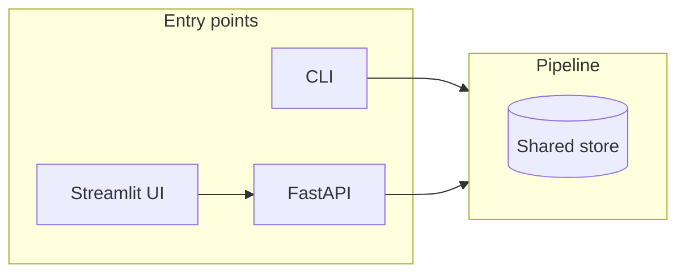
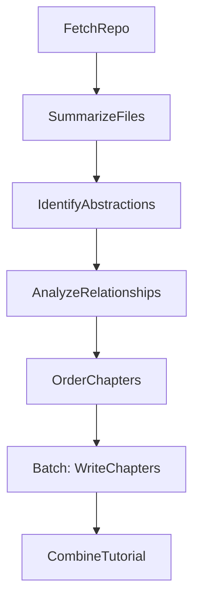

# Code-IQ

Generate a structured tutorial (index, chapters, Mermaid diagram) from a GitHub repo or local directory. Aimed at developer onboarding: point at a codebase and get an auto-generated guide to its core abstractions, relationships, and how they work together.

**Input:** GitHub repository URL or local directory; optional project name and language.  
**Output:** A project-named directory with `index.md` (summary + relationship diagram + chapter links) and one Markdown chapter per core abstraction (`01_*.md`, `02_*.md`, …).

---

## Architecture

Code-IQ is built on [Pocket Flow](https://github.com/The-Pocket/PocketFlow) (graph + shared store). Entry points:



The pipeline is a linear workflow plus a batch step for chapters:



| Step | Description |
|------|-------------|
| **FetchRepo** | Crawl GitHub (API or clone fallback) or local directory; load source files into shared store. |
| **SummarizeFiles** | For large codebases, summarize file set so the LLM can pick representative files; always keep README if present. |
| **IdentifyAbstractions** | LLM identifies ~5–10 core abstractions, descriptions, and related file indices. |
| **AnalyzeRelationships** | LLM produces project summary and relationship graph (from/to/label between abstractions). |
| **OrderChapters** | LLM determines tutorial order (indices) by importance and dependencies. |
| **WriteChapters** | BatchNode: for each abstraction in order, LLM writes one chapter (with prior chapters as context). |
| **CombineTutorial** | Writes output dir: `index.md` (summary + Mermaid diagram + chapter links) and `01_*.md` … files. |

Shared store schema and node contracts are in [docs/design.md](docs/design.md).

---

## Requirements

- **Python 3.11+** (enforced in `pyproject.toml` and `.python-version`)

## Setup

Create a virtual environment with Python 3.11+ and install dependencies:

```bash
# If you have an existing .venv from Python 3.9, remove it first: rm -rf .venv
python3.11 -m venv .venv   # or python3 -m venv .venv where python3 is 3.11+
source .venv/bin/activate   # or .venv\Scripts\activate on Windows
pip install -r requirements.txt
```

### Docker

Build and run the CLI in a container (pass env vars for LLM and optional `GITHUB_TOKEN`):

```bash
docker build -t code-iq .
docker run --rm -e GEMINI_API_KEY="$GEMINI_API_KEY" -v "$(pwd)/out:/app/output" code-iq --repo-url https://github.com/owner/repo --output-dir /app/output
```

Use `--local-dir` by mounting a host directory and passing the path inside the container (e.g. `-v /path/on/host:/data` and `--local-dir /data`).

## Environment variables

Variables can be set in the shell or in a **`.env`** file in the project root (loaded automatically via `python-dotenv`). Do not commit `.env`; it is listed in `.gitignore`.

### LLM

The pipeline uses `call_llm` (see [utils/call_llm.py](utils/call_llm.py)), which supports three backends via **`LLM_PROVIDER`**:

- **`gemini`** (default): Google GenAI  
  - **`GEMINI_API_KEY`** (required): API key for Google GenAI.  
  - **`GEMINI_MODEL`** (optional): Model name (default: `gemini-2.0-flash`).  
  - On **429 (quota/rate limit)**, `call_llm` retries with backoff using the API’s suggested delay (or 40s), up to **`LLM_RATE_LIMIT_MAX_RETRIES`** (default: 3). Set to 1 to disable retries.

- **`gemini_aiplatform`**: Vertex AI express mode (REST with API key in URL). **`GEMINI_API_KEY`** (required), **`GEMINI_MODEL`** (optional). **`LLM_MAX_INPUT_CHARS`** (optional, default: 1000000): max prompt length; longer prompts are truncated. Set to 0 to disable.

- **`cursor`**: Cursor CLI via subprocess  
  - **`CURSOR_MODEL`** (optional): Model passed to `cursor agent --model`.  
  - **`CURSOR_TIMEOUT`** (optional): Timeout in seconds (default: `120`).  
  - **`CURSOR_API_KEY`** (optional): For headless Cursor agent.

Example:

```bash
export LLM_PROVIDER=gemini
export GEMINI_API_KEY=your-key
```

### GitHub

When using **`--repo-url`**, the tool automatically handles API limitations:

1. **GitHub API** (preferred): Used when available for efficient file access
2. **Local clone fallback**: If API fails (rate limits, authentication issues), automatically falls back to cloning the repository to a temporary directory

For best performance and to avoid rate limits:
- **`GITHUB_TOKEN`** (optional): A GitHub personal access token. Setting it raises the limit (e.g. 5,000 requests/hour) and is recommended for crawling repos with many files.

The fallback mechanism ensures public repositories work even without authentication tokens.

```bash
export GITHUB_TOKEN=ghp_xxxx
python main.py --repo-url https://github.com/owner/repo --output-dir ./out
```

### File Processing

For large codebases, Code-IQ intelligently filters files before analysis:

- **`LLM_FILE_SUMMARY_CHUNK_SIZE`** (optional, default: 1000): Number of files processed per chunk during summarization
- **`LLM_FILE_SUMMARY_MAX_FILES`** (optional, default: 400): Maximum number of representative files to analyze for abstractions

The system automatically selects the most representative files while ensuring README.md is always included if present.

## CLI usage

One of **`--repo-url`** or **`--local-dir`** is required.

| Argument          | Description |
|-------------------|-------------|
| `--repo-url`      | GitHub repository URL (e.g. `https://github.com/owner/repo`). |
| `--local-dir`      | Local directory path to crawl (alternative to `--repo-url`). |
| `--project-name`   | Override project name (default: derived from URL or directory). |
| `--output-dir`     | Base directory for output (default: `output`). |
| `--language`       | Tutorial language (default: `english`). Use e.g. `spanish`, `french` for translated names, descriptions, summary, and chapter content. |

**Exit codes:** `0` = success, `1` = pipeline error, `2` = invalid arguments (e.g. missing `--repo-url` / `--local-dir`).

## Running

**From a local directory:**

```bash
python main.py --local-dir /path/to/your/code --output-dir ./out
```

**From a GitHub repo:**

```bash
python main.py --repo-url https://github.com/owner/repo --output-dir ./out
```

**With language and project name:**

```bash
python main.py --local-dir . --project-name MyApp --language spanish --output-dir ./tutorials
```

**Help:**

```bash
python main.py --help
```

On success, the tool writes a directory under `output_dir` named after the project (e.g. `output/my_project/`) containing:

- **`index.md`** — Project summary, Mermaid relationship diagram, and links to chapters.
- **`01_*.md`, `02_*.md`, …** — One Markdown chapter per core abstraction.

Logging goes to stderr (INFO level); the final line prints the output path.

## Tests

```bash
pytest tests/ -v
# or
python -m pytest tests/ -v
```

## Repository structure

| Path | Purpose |
|------|---------|
| `main.py` | CLI entrypoint; parses args, fills shared store, runs flow. |
| `flow.py` | Defines Pocket Flow: `create_full_flow()`, `create_analysis_flow()`, `create_fetch_flow()`. |
| `nodes.py` | All pipeline nodes: FetchRepo, SummarizeFiles, IdentifyAbstractions, AnalyzeRelationships, OrderChapters, WriteChapters, CombineTutorial. |
| `shared_schema.py` | Shared store default keys and structure. |
| `utils/` | `call_llm.py` (LLM backends), `crawl_github_files.py`, `crawl_local_files.py`, `context_helpers.py`. |
| `api/` | FastAPI app, build/jobs/projects routes, runner, job/project stores, webhooks. |
| `ui/` | Streamlit app for GitHub URL or zip upload and viewing/downloading results. |
| `docs/` | Design doc, guide, post-MVP plan, edit scope, Jekyll-style docs. |

## API (post-MVP)

A FastAPI server exposes sync and async build endpoints. Async jobs are stored in memory; jobs older than **24 hours** are removed (configurable via **`JOB_RETENTION_SECONDS`**).

**API-related environment variables:**

| Variable | Default | Description |
|----------|---------|-------------|
| `BUILD_TIMEOUT_SECONDS` | `300` | Max duration (seconds) for sync `POST /v1/build`; excess returns 413. |
| `JOB_RETENTION_SECONDS` | `86400` (24 h) | Async jobs older than this are removed from the in-memory store. |
| `WEBHOOK_SECRET` | — | Secret for HMAC-SHA256 signing of webhook payloads; set when using `webhook_url` on async jobs. |

**Run the API:**

```bash
uv run uvicorn api.app:app --reload
# Default: http://localhost:8000
# POST /v1/build (sync), POST /v1/jobs (async), GET /v1/jobs/{id}, GET /v1/jobs/{id}/result
```

**Webhooks:** For async jobs, optional `webhook_url` in POST /v1/jobs. On completion or failure the server POSTs a signed payload (HMAC-SHA256 of body with **`WEBHOOK_SECRET`**). Set **`WEBHOOK_SECRET`** in the environment; clients verify using `X-Webhook-Signature`. Retries: 3 attempts with exponential backoff; `Delivery-Attempt: 1..3` header.

**Upload:** POST /v1/jobs/upload accepts a **zip** of your project (multipart/form-data). Max size **50 MB**. The zip is extracted server-side to a temp dir; the pipeline runs with that as `local_dir`; the temp dir is removed after the run.

**Edit (optional):** After a job completes, create a project via POST /v1/projects/from-job/{job_id}. Then PATCH /v1/projects/{id} to update summary/chapters, or POST /v1/projects/{id}/regenerate (scope=full) to enqueue a new run. See [docs/edit-scope.md](docs/edit-scope.md) and [ui/README.md](ui/README.md) (Edit button after completion).

## Manual quality checks (optional)

After running the pipeline:

1. Run on one public GitHub repo and one local directory; verify the summary and chapter order in `index.md`.
2. Optionally run with `--language spanish` (or another language) and confirm names, summary, and chapter content are coherent in that language.

## Documentation

- [docs/design.md](docs/design.md) — System design: flow, shared store, node steps, utilities.
- [docs/post-mvp-plan.md](docs/post-mvp-plan.md) — API contract (sync/async, webhooks), UI scope, frontend tech.
- [docs/edit-scope.md](docs/edit-scope.md) — Editing projects and regenerating after a job.
- [ui/README.md](ui/README.md) — Running the Streamlit UI and configuration.

---

This project uses [Pocket Flow](https://github.com/The-Pocket/PocketFlow). See [.cursor/rules/guide_for_pocketflow.mdc](.cursor/rules/guide_for_pocketflow.mdc) and [Agentic Coding Guidance](https://the-pocket.github.io/PocketFlow/guide.html) for development.
