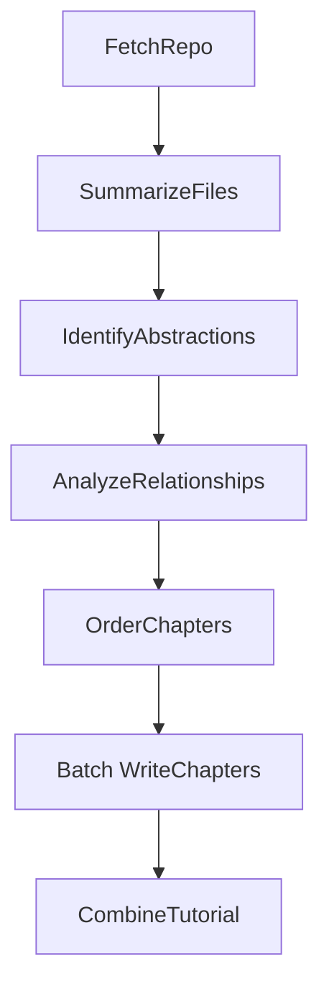

# System Design: Code-IQ

## Requirements

**User Story:** As a developer onboarding to a new codebase, I want a tutorial automatically generated from its GitHub repository or local directory, optionally in a specific language. This tutorial should explain the core abstractions, their relationships (visualized), and how they work together, using beginner-friendly language, analogies, and multi-line descriptions where needed, so I can understand the project structure and key concepts quickly without manually digging through all the code.

**Input:**
- A publicly accessible GitHub repository URL or a local directory path.
- A project name (optional, will be derived from the URL/directory if not provided).
- Desired language for the tutorial (optional, defaults to English).

**Output:**
- A directory named after the project containing:
    - An `index.md` file with:
        - A high-level project summary (potentially translated).
        - A Mermaid flowchart diagram visualizing relationships between abstractions (using potentially translated names/labels).
        - An ordered list of links to chapter files (using potentially translated names).
    - Individual Markdown files for each chapter (`01_chapter_one.md`, `02_chapter_two.md`, etc.) detailing core abstractions in a logical order (potentially translated content).

## Flow Design

### Applicable Design Pattern

This project primarily uses a **Workflow** pattern to decompose the tutorial generation process into sequential steps. The chapter writing step utilizes a **BatchNode** (a form of MapReduce) to process each abstraction individually.

1.  **Workflow:** Sequence: fetch code → summarize/select files → identify abstractions → analyze relationships → order chapters → write chapters → combine into files.
2.  **Batch:** `WriteChapters` processes each abstraction independently (map); `CombineTutorial` structures the final output (reduce).

### Flow high-level Design:

1.  **`FetchRepo`**: Crawls the GitHub repository URL or local directory via `crawl_github_files` or `crawl_local_files`, loading source file contents into the shared store.
2.  **`SummarizeFiles`**: For large codebases, summarizes the file set in chunks and selects a representative subset (up to `LLM_FILE_SUMMARY_MAX_FILES`); always keeps README.md when present. Writes filtered `files` and `file_summary` to the shared store.
3.  **`IdentifyAbstractions`**: LLM identifies ~5–10 core abstractions with descriptions and related file indices (potentially translated if language != English).
4.  **`AnalyzeRelationships`**: LLM produces project summary and relationship list (from/to/label between abstraction indices; summary and labels potentially translated).
5.  **`OrderChapters`**: LLM determines tutorial order (indices) from importance and dependencies; output is language-independent.
6.  **`WriteChapters` (BatchNode)**: For each abstraction in order, LLM writes one chapter using relevant files and prior chapter summaries (content potentially translated).
7.  **`CombineTutorial`**: Writes output directory: `index.md` (summary, Mermaid diagram, chapter links) and `01_*.md` … chapter files. Fixed text (e.g. "Chapters", attribution) stays in English.



## Utility Functions

1.  **`crawl_github_files`** (`utils/crawl_github_files.py`) - *External Dependency: requests, gitpython (optional for SSH)*
    *   *Input*: `repo_url` (str), `token` (str, optional), `max_file_size` (int, optional), `use_relative_paths` (bool, optional), `include_patterns` (set, optional), `exclude_patterns` (set, optional)
    *   *Output*: `dict` containing `files` (dict[str, str]) and `stats`.
    *   *Necessity*: Required by `FetchRepo` to download and read source code from GitHub if a `repo_url` is provided. Handles API calls or SSH cloning, filtering, and file reading.
2.  **`crawl_local_files`** (`utils/crawl_local_files.py`) - *External Dependency: None*
    *   *Input*: `directory` (str), `max_file_size` (int, optional), `use_relative_paths` (bool, optional), `include_patterns` (set, optional), `exclude_patterns` (set, optional)
    *   *Output*: `dict` containing `files` (dict[str, str]).
    *   *Necessity*: Required by `FetchRepo` to read source code from a local directory if a `local_dir` path is provided. Handles directory walking, filtering, and file reading.
3.  **`call_llm`** (`utils/call_llm.py`) - *External Dependency: LLM Provider API (e.g., Google GenAI)*
    *   *Input*: `prompt` (str), `use_cache` (bool, optional)
    *   *Output*: `response` (str)
    *   *Necessity*: Used by `SummarizeFiles`, `IdentifyAbstractions`, `AnalyzeRelationships`, `OrderChapters`, and `WriteChapters`. YAML parsing via `yaml.safe_load` (errors on invalid output).

## Node Design

### Shared Store

The shared store structure:

```python
shared = {
    # --- Inputs ---
    "repo_url": None, # Provided by the user/main script if using GitHub
    "local_dir": None, # Provided by the user/main script if using local directory
    "project_name": None, # Optional, derived from repo_url/local_dir if not provided
    "github_token": None, # Optional, from argument or environment variable
    "output_dir": "output", # Default or user-specified base directory for output
    "include_patterns": set(), # File patterns to include
    "exclude_patterns": set(), # File patterns to exclude
    "max_file_size": 100000, # Default or user-specified max file size
    "language": "english", # Default or user-specified language for the tutorial

    # --- Intermediate/Output Data ---
    "files": [], # After FetchRepo: full list of (path, content); after SummarizeFiles: filtered subset
    "all_files": [], # Output of FetchRepo: full list of (path, content) before summarization
    "file_summary": "", # Output of SummarizeFiles: brief summary of file set
    "abstractions": [], # Output of IdentifyAbstractions: [{"name", "description", "files": [int]}]; indices into shared["files"]
    "relationships": { # Output of AnalyzeRelationships
         "summary": None, # Overall project summary (potentially translated)
         "details": [] # List of {"from": int, "to": int, "label": str (potentially translated)} describing relationships between abstraction indices.
     },
    "chapter_order": [], # Output of OrderChapters: List of indices into shared["abstractions"], determining tutorial order
    "chapters": [], # Output of WriteChapters: List of chapter content strings (Markdown, potentially translated), ordered according to chapter_order
    "final_output_dir": None # Output of CombineTutorial: Path to the final generated tutorial directory (e.g., "output/my_project")
}
```

### Node Steps

1.  **`FetchRepo`**
    *   *Purpose*: Download repo (GitHub) or read local directory; load source files into shared store.
    *   *Type*: Regular
    *   *Steps*:
        *   `prep`: Read `repo_url`, `local_dir`, `project_name`, `github_token`, `output_dir`, `include_patterns`, `exclude_patterns`, `max_file_size` from shared. Derive `project_name` from repo/dir if missing.
        *   `exec`: Call `crawl_github_files(...)` or `crawl_local_files(...)`; convert result to list of `(path, content)` tuples.
        *   `post`: Write `files` and `all_files` (same list) and `project_name` to shared store.

2.  **`SummarizeFiles`**
    *   *Purpose*: For large codebases, summarize file list in chunks and select representative files; always keep README.md. Reduces `files` and sets `file_summary`.
    *   *Type*: Regular
    *   *Steps*:
        *   `prep`: Read `files`, `project_name` from shared.
        *   `exec`: Chunk paths, call LLM per chunk for summary + selected paths; merge and cap to `LLM_FILE_SUMMARY_MAX_FILES`; ensure README.md included if present.
        *   `post`: Replace `shared["files"]` with filtered list (path in selected set); write `shared["file_summary"]`.

3.  **`IdentifyAbstractions`**
    *   *Purpose*: Identify key abstractions (names, descriptions, file indices). Names/descriptions may be translated.
    *   *Type*: Regular
    *   *Steps*:
        *   `prep`: Read `files`, `project_name`, `language` from shared. Build context with `create_llm_context` (index # path).
        *   `exec`: Prompt `call_llm` for ~5–10 abstractions and file indices; output YAML list. Parse and validate indices.
        *   `post`: Write validated `abstractions` (name, description, files: [int]) to shared.

4.  **`AnalyzeRelationships`**
    *   *Purpose*: Produce project summary and relationship list (from/to/label by index). Summary and labels may be translated.
    *   *Type*: Regular
    *   *Steps*:
        *   `prep`: Read `abstractions`, `files`, `project_name`, `language`. Build context with abstraction names/indices and file content via `get_content_for_indices`.
        *   `exec`: Prompt `call_llm` for summary and list of relationships (from_abstraction, to_abstraction, label). Parse YAML and convert to indices.
        *   `post`: Write `relationships` (summary, details: [{from, to, label}]) to shared.

5.  **`OrderChapters`**
    *   *Purpose*: Decide tutorial order (indices) by importance/dependencies.
    *   *Type*: Regular
    *   *Steps*:
        *   `prep`: Read `abstractions`, `relationships`, `project_name`, `language`. Build context with index # name and relationship labels.
        *   `exec`: Prompt `call_llm` for ordered YAML list of index # name; parse and validate (all indices, exactly once).
        *   `post`: Write `chapter_order` (list of indices) to shared.

6.  **`WriteChapters`**
    *   *Purpose*: Generate one Markdown chapter per abstraction; content may be translated.
    *   *Type*: **BatchNode**
    *   *Steps*:
        *   `prep`: Read `chapter_order`, `abstractions`, `files`, `project_name`, `language`. Return iterable of items (one per abstraction index), each with chapter number, abstraction details, file content map, chapter list, prev/next info.
        *   `exec(item)`: Prompt `call_llm` for beginner-friendly Markdown chapter; use prior chapters in context; append to `chapters_written_so_far`. Return chapter content.
        *   `post(shared, prep_res, exec_res_list)`: Set `shared["chapters"]` to exec_res_list; clear `chapters_written_so_far`.

7.  **`CombineTutorial`**
    *   *Purpose*: Write output directory: index.md (summary, Mermaid diagram, chapter links) and chapter .md files. Fixed text (e.g. attribution) in English.
    *   *Type*: Regular
    *   *Steps*:
        *   `prep`: Read `project_name`, `relationships`, `chapter_order`, `abstractions`, `chapters`, `repo_url`, `output_dir`. Build Mermaid flowchart from `relationships["details"]`; build index.md body and list of {filename, content} for chapters (with attribution footer).
        *   `exec`: Create output dir; write index.md; write each chapter file.
        *   `post`: Set `shared["final_output_dir"]`; log completion.