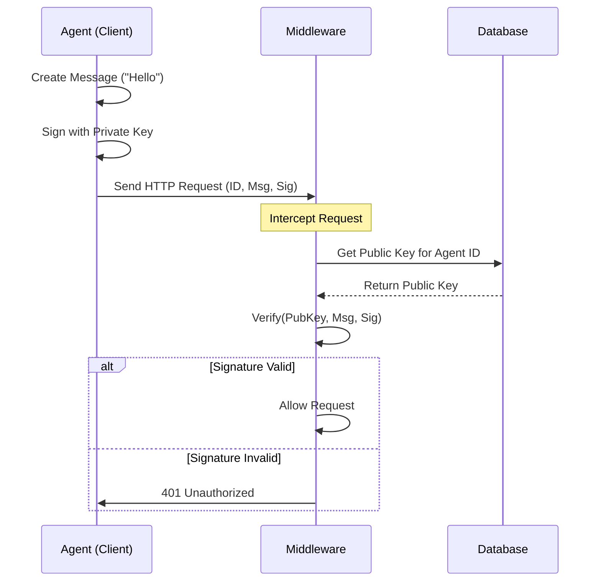

# Chapter 1: Ed25519 Identity & Verification

Welcome to the first chapter of the **AgentLock** tutorial! 

In this series, we will build a secure system for AI Agents. Before we write any complex logic, we must solve a fundamental problem: **Trust**.

## The Problem: Stolen Keys
Imagine you have a financial AI agent. To let it trade stocks, you give it an API Key (a long password). If a hacker intercepts that API Key, they can pretend to be your agent and drain your account. 

Passwords and API keys are "bearer tokens"—whoever holds them holds the power. We need something better.

## The Solution: The Digital Wax Seal
AgentLock uses **Ed25519 Cryptography**. Don't let the math scare you. Think of it exactly like a **King's Wax Seal** on a letter.

1.  **The Private Key ( The Signet Ring ):** Only the Agent has this. It is never shared. The Agent uses it to press a "seal" onto a request.
2.  **The Public Key ( The Image on the Wall ):** The Server keeps this in a database. It's a picture of what the Agent's seal *should* look like.
3.  **The Signature ( The Wax Seal ):** A unique code generated for *specific* request data.

If a hacker steals the request (the letter), they can't change the content, because the wax seal would break. They also can't make a *new* request, because they don't have the signet ring (Private Key) to make a new seal.

---

## Part 1: Generating the Keys

First, an Agent needs to be born. When an Agent is created, it generates a pair of keys. 

We use the `agentlock_sdk` to do this.

```python
from agentlock_sdk.crypto import generate_keypair

# Create a new identity (returns base64 strings)
private_key, public_key = generate_keypair()

print(f"Secret Ring (Private): {private_key[:10]}...")
print(f"Verification ID (Public): {public_key[:10]}...")
```

**What happened?**
*   **Input:** Nothing.
*   **Output:** Two strings.
    *   `private_key`: Saved securely by the Agent.
    *   `public_key`: Sent to the AgentLock database.

---

## Part 2: Signing a Request

Now the Agent wants to do something, like "buy AAPL". It must sign this intention.

```python
from agentlock_sdk.crypto import sign_message

# The instruction the agent wants to send
message = b"action:buy_stock,symbol:AAPL"

# Stamp the wax seal using the private key
signature = sign_message(private_key, message)

print(f"Digital Seal: {signature[:15]}...")
```

**What happened?**
*   **Input:** The secret `private_key` and the `message` bytes.
*   **Output:** A `signature` string.
*   **Security:** This signature is mathematically linked to *this specific message*. If you change "AAPL" to "GOOG", this signature becomes invalid.

---

## Part 3: Verifying the Request

When the server receives the message, it looks at the `public_key` it has on file and checks the seal.

```python
from agentlock_sdk.crypto import verify_signature

# The server receives the message and signature
is_valid = verify_signature(public_key, message, signature)

if is_valid:
    print("This request is authentic!")
else:
    print("ALERT: Someone tampered with the letter.")
```

**What happened?**
*   **Input:** The known `public_key`, the received `message`, and the received `signature`.
*   **Output:** `True` (valid) or `False` (invalid). The server doesn't need the private key to prove the signature is real!

---

## Under the Hood: The Verification Flow

How does AgentLock handle this in the real backend? Here is the lifecycle of a request.



### 1. Storing the Identity
In the backend database, we store the **Public Key**. We never store the Private Key.

*File: `migrations/001_initial_schema.sql`*
```sql
CREATE TABLE IF NOT EXISTS agents (
    id UUID PRIMARY KEY DEFAULT gen_random_uuid(),
    name VARCHAR(255) NOT NULL,
    -- We only store the public verification key here
    public_key TEXT NOT NULL UNIQUE, 
    status VARCHAR(50) NOT NULL DEFAULT 'active'
);
```

### 2. The Gatekeeper (Middleware)
In our Go backend, we use "Middleware". This is code that runs *before* the main application logic. It acts as a security guard.

*File: `internal/interfaces/http/middleware/ed25519_agent_auth.go`*

First, the guard extracts the ID and Signature from the HTTP headers:

```go
// Inside the middleware handler...
agentID := r.Header.Get("X-Agent-ID")
signature := r.Header.Get("X-Agent-Signature")

// The message is the path (e.g., "/api/v1/actions")
message := r.URL.Path + r.URL.RawQuery

// 1. Fetch the agent from the DB
agent, _ := agentRepo.FindByID(agentID)
```

Then, the guard performs the mathematical check:

```go
// 2. Parse the stored public key
publicKey, _ := crypto.ParsePublicKey(agent.PublicKey)
sigBytes, _ := base64.StdEncoding.DecodeString(signature)

// 3. Verify!
if !crypto.VerifySignature(publicKey, []byte(message), sigBytes) {
    http.Error(w, "Signature verification failed", http.StatusUnauthorized)
    return
}
// If we get here, the request is valid. Proceed!
```

## Conclusion

You have just learned the bedrock of AgentLock's security. By using Ed25519 key pairs:
1.  We stopped relying on stealable API keys.
2.  We ensured that requests cannot be tampered with during transit.
3.  We proved mathematically that the Agent—and only the Agent—sent the command.

Now that we have a secure way to sign messages, we need a way to make using this easy for developers. Manually signing every request is tedious!

In the next chapter, we will build a helper tool to automate this.

👉 **Next:** [SDK Client Wrapper](02_sdk_client_wrapper.md)

---

Generated by [Code IQ](https://github.com/adityasoni99/Code-IQ)