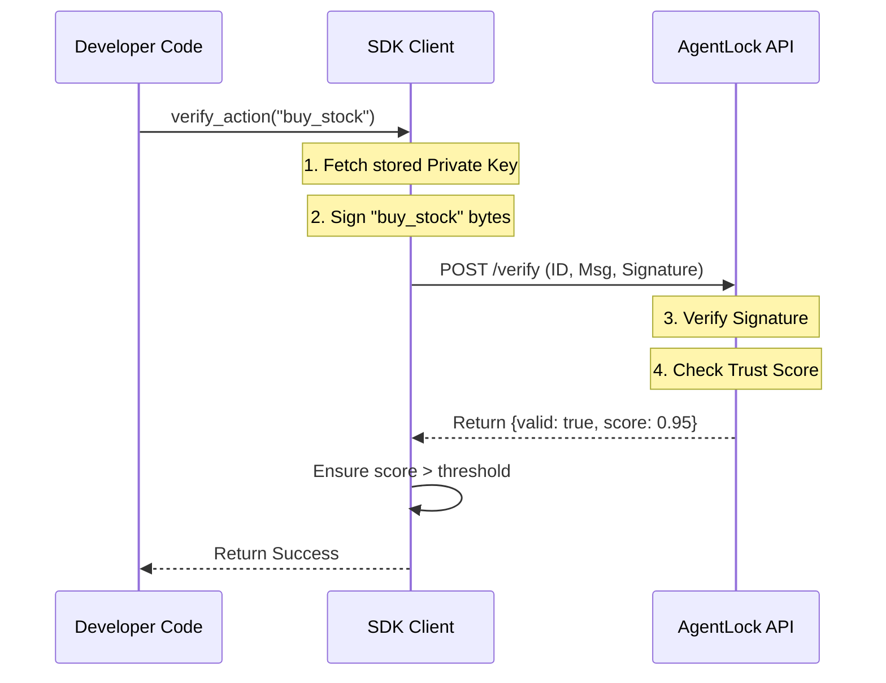

# Chapter 2: SDK Client Wrapper

Welcome back! In the previous chapter, [Ed25519 Identity & Verification](01_ed25519_identity___verification.md), we learned how to generate keys and mathematically sign messages.

While that process is secure, it is also **tedious**.

Imagine if every time you wanted to change the channel on your TV, you had to strip two wires, twist them together, and calculate the voltage manually. That is what manually constructing cryptographic headers feels like.

In this chapter, we will build the **Universal Remote Control**: the **SDK Client Wrapper**.

## The Goal: "Batteries Included"

We want to move from "Wiring Circuits" to "Pushing Buttons."

**The Old Way (Chapter 1):**
1. Generate Keypair.
2. Store Private Key variable.
3. Encode message to bytes.
4. Sign message.
5. Create HTTP headers.
6. Send Request.

**The New Way (Chapter 2):**
1. Initialize Client.
2. Call `client.verify_action("do_something")`.

Let's see how to use this wrapper to make our Agent's life easier.

---

## Part 1: Initializing the Remote

The `AgentLockClient` is a Python class that manages the agent's identity. It holds the "Signet Ring" (Private Key) inside itself so you don't have to pass it around constantly.

```python
from agentlock_sdk.client import AgentLockClient

# Connect to the AgentLock backend
client = AgentLockClient(base_url="http://localhost:8080")

print("Client initialized. Ready to register.")
```

**What happened?**
*   We created a session manager.
*   It currently has no identity (no ID, no keys). It's a blank remote waiting to be paired.

---

## Part 2: Automatic Registration

Before an agent can do anything, it must exist in the system. The client handles the handshake with the server.

```python
# Register this agent with the server
registration_data = client.register_agent(
    name="FinancialBot_v1", 
    capabilities=["trade_stocks", "read_news"]
)

print(f"I am born! My ID is: {client.agent_id}")
# The client now automatically holds the private_key inside!
```

**What happened?**
*   **Input:** We gave the agent a name.
*   **Magic:** The SDK generated keys, sent the Public Key to the server, and **saved the Private Key** securely in memory (`self.private_key`).
*   **Result:** The client is now "logged in" and ready to sign things.

---

## Part 3: The "Easy Button" (Verification)

This is the core feature. Instead of doing math, the developer just tells the client *what* they want to do.

```python
try:
    # We just ask: "Is it safe to buy stock?"
    response = client.verify_action("buy_stock")
    
    print(f"Action Verified! Trust Score: {response['trust_score']}")
    # Proceed with actual trading logic here...

except Exception as e:
    print(f"Security Alert: {e}")
```

**What happened?**
*   **Input:** A simple string `"buy_stock"`.
*   **Magic:** The client took that string, signed it using the stored private key, sent it to the server, waited for validation, and checked the Trust Score.
*   **Output:** A success dictionary or an error.

---

## Under the Hood: How it Works

What is actually happening inside that `verify_action` method? The wrapper is orchestrating a complex flow.



### 1. Handling the State
Inside `agentlock_sdk/client.py`, the class stores the sensitive data for us.

```python
class AgentLockClient:
    def __init__(self, ...):
        # We hold the identity here
        self.agent_id = None 
        self.private_key = None 
        self._session = requests.Session()
```

### 2. The Verification Logic
This is where the abstraction shines. It combines the cryptography from Chapter 1 with network requests.

```python
def verify_action(self, action: str, ...):
    # 1. Prepare the cryptographic signature
    message_bytes = action.encode('utf-8')
    signature = sign_message(self.private_key, message_bytes)
    
    # 2. Build the payload automatically
    payload = {
        "agent_id": self.agent_id,
        "action": action,
        "signature": signature # The wax seal
    }
    
    # 3. Send to API (Code continues below...)
```

### 3. Safety Checks
The client wrapper doesn't just check if the signature is valid; it also checks if the agent is *trustworthy*.

```python
    # ... inside verify_action()
    
    response = self._session.post(url, json=payload)
    data = response.json()

    # 4. Enforce security locally
    if not data['valid']:
        raise VerificationError("Server rejected signature")
        
    # We will cover Trust Scores in Chapter 5!
    if data['trust_score'] < required_trust:
        raise TrustScoreTooLow("Agent not trusted enough")
        
    return data
```

## Why this matters

By using the **SDK Client Wrapper**, we have achieved three things:

1.  **Simplicity:** The developer writes 1 line of code (`verify_action`) instead of 20.
2.  **Consistency:** Every request is signed exactly the same way. No typos in header names.
3.  **State Management:** The Private Key is managed by the class instance, reducing the risk of the developer accidentally logging it or losing it.

## Conclusion

We now have a working "Remote Control" for our security system. We can register agents and verify actions with simple function calls.

However, look at your code again. You still have to wrap every single sensitive function in a `verify_action()` call.

```python
# Still a bit messy...
def delete_database():
    client.verify_action("delete_db") # Don't forget this line!
    # actual delete logic...
```

If a developer *forgets* to write that line, the security is gone. Can we make security automatic and invisible?

In the next chapter, we will use Python **Decorators** to lock down functions automatically.

👉 **Next:** [Secure Action Decorator](03_secure_action_decorator.md)

---

Generated by [Code IQ](https://github.com/adityasoni99/Code-IQ)