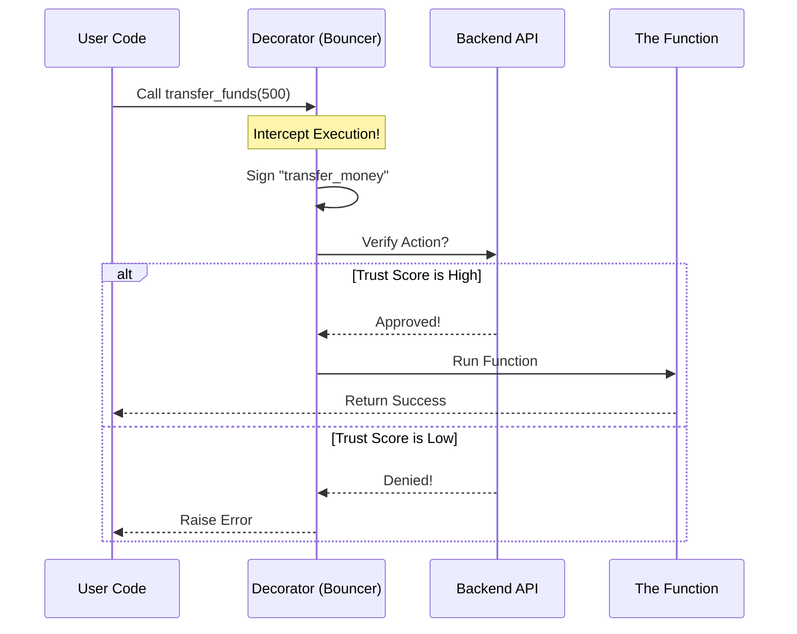

# Chapter 3: Secure Action Decorator

Welcome back! In the previous chapter, [SDK Client Wrapper](02_sdk_client_wrapper.md), we built a "remote control" to make signing requests easier.

However, we still have a human problem. A developer must remember to *press the button*.

Look at this dangerous code:

```python
def delete_database():
    # Oops, I forgot to call client.verify_action() here!
    db.drop_all()
    print("Database deleted.")
```

If a developer forgets the security check, the security doesn't exist. In this chapter, we will build the **Secure Action Decorator** to fix this.

## The Goal: The VIP Rope

We want to move security out of the function's *body* and onto the function's *doorstep*.

Think of your function as a VIP Club.
1.  **The Function:** The party inside (the code executing).
2.  **The Decorator:** The Bouncer at the door.
3.  **The Rope:** The `@` symbol in Python.

Even if a hacker tries to run the function, they cannot get past the Bouncer without a valid ID (Signature) and a good reputation (Trust Score).

---

## Part 1: Using the Decorator

A "Decorator" in Python is just a label you stick on top of a function. It modifies the function's behavior without changing its code.

Let's protect a sensitive action, like transferring money.

```python
from agentlock_sdk.decorators import secure_action

# The Bouncer is set here.
# It requires a trust score of at least 0.9 (very high).
@secure_action(action="transfer_money", required_trust=0.9)
def transfer_funds(amount):
    print(f"$$$ Successfully transferred {amount} $$$")
```

**What happened?**
*   **Input:** We added one line starting with `@`.
*   **Magic:** The `transfer_funds` function effectively disappeared inside a protective shell. You can no longer call it directly; you are actually calling the shell.

---

## Part 2: Triggering the Action

Now, let's try to run this function. We assume our agent is already set up (as we learned in Chapter 2).

```python
try:
    # We call the function normally
    transfer_funds(500)

except Exception as e:
    print(f"Blocked by Bouncer: {e}")
```

**What happens behind the scenes?**
1.  You call `transfer_funds(500)`.
2.  The code **pauses** before executing the print statement.
3.  The decorator grabs the agent's keys and signs a request: "I want to do 'transfer_money'".
4.  It sends this to the AgentLock server.
5.  If the server says "OK", the code **resumes**, and `transfer_funds` runs.
6.  If the server says "Low Trust", the function **never runs**, and an error is raised.

---

## Under the Hood: The Flow

How does the decorator actually intercept the call? Here is the sequence of events.



---

## Part 3: Implementation Details

Let's look at how we built this tool in `agentlock_sdk/decorators.py`. It uses a concept called a "wrapper."

### 1. The Setup
The decorator accepts configuration arguments, like the name of the action and the required trust level.

```python
def secure_action(action: str, required_trust: float = 0.8, client=None):
    """
    Outer layer: Accepts configuration.
    """
    def decorator(func):
        # We return the actual logic in the next step
        return wrapper
    return decorator
```

### 2. The Interception (The Wrapper)
This is the code that replaces your original function. It runs *every time* you call the decorated function.

```python
# Inside the decorator...
def wrapper(*args, **kwargs):
    # 1. Find the AgentLock Client (to get keys)
    # usually found in 'self.client' if inside a class
    client = get_client_from_args(args)

    # 2. Perform the verification (The Bouncer Check)
    client.verify_action(
        action=action, 
        required_trust=required_trust
    )

    # 3. Only if that succeeded, run the original function
    return func(*args, **kwargs)
```

### 3. Automatic Client Detection
One tricky part is: where does the decorator find the Private Key?

Usually, we use this inside a Class (like a Robot definition). The decorator is smart enough to look into `self` to find the client we built in [Chapter 2](02_sdk_client_wrapper.md).

```python
class TradingBot:
    def __init__(self):
        # The decorator will find this automatically!
        self.client = AgentLockClient(...) 

    @secure_action(action="sell_stock", required_trust=0.5)
    def sell(self, symbol):
        print(f"Selling {symbol}")
```

## Why this is better

Compare the two approaches we have learned so far.

**The Manual Way (Chapter 2):**
```python
def nuke_system():
    # If I delete this line, we are doomed
    client.verify_action("nuke") 
    destroy_everything()
```

**The Decorator Way (Chapter 3):**
```python
@secure_action(action="nuke", required_trust=0.99)
def nuke_system():
    destroy_everything()
```

By using the decorator:
1.  **Readability:** You can see the security requirements right at the top.
2.  **Safety:** You cannot accidentally bypass the check by editing the function body.
3.  **Separation:** Business logic (`destroy_everything`) is separate from Security logic.

## Conclusion

We have now successfully automated our security checks! 

1.  We have keys (Chapter 1).
2.  We have a client to manage them (Chapter 2).
3.  We have a Bouncer to guard our functions (Chapter 3).

However, you might be wondering: **"What is this Trust Score?"**

So far, we have just assumed the server returns a number like `0.9` or `0.2`. But how does the server decide if an agent is trustworthy or if it has gone rogue?

In the next chapter, we will look at the server-side logic that calculates these scores.

👉 **Next:** [Enhanced Trust Engine](04_enhanced_trust_engine.md)

---

Generated by [Code IQ](https://github.com/adityasoni99/Code-IQ)