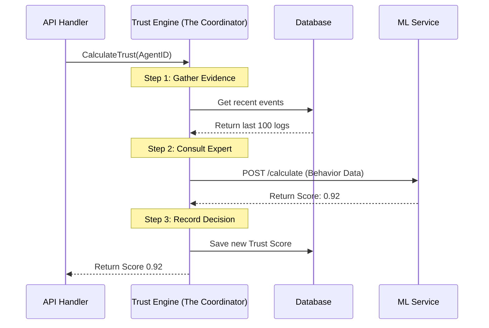

# Chapter 4: Enhanced Trust Engine

Welcome back! In the previous chapter, [Secure Action Decorator](03_secure_action_decorator.md), we built a "Bouncer" for your code. That Bouncer checks if someone has a valid ID (the cryptographic signature) before letting them in.

But here is the scary part: **What if a hacker stole the ID card?**

If a hacker steals an Agent's private key, they can sign valid requests. The math will check out. The Bouncer will let them in. We need something smarter than a Bouncer. We need a **Detective**.

In this chapter, we explore the **Enhanced Trust Engine**.

## The Problem: The "Rogue Agent"

Imagine you have a shopping bot.
*   **Normal Behavior:** buys 1 item every hour.
*   **Suspicious Behavior:** buys 5,000 items in 1 second.

To a simple cryptographic check, both requests look valid. They are both signed correctly. However, the second one is obviously an attack.

We need a system that looks at **context**, not just keys.

## The Solution: The Loan Officer Analogy

The **Enhanced Trust Engine** lives in our Go backend. It does not perform complex AI math itself. Instead, acts like a **Loan Officer**.

1.  **Gathers Documents:** It pulls the agent's recent history from the database.
2.  **Consults the Bureau:** It sends that history to a specialized Machine Learning (ML) Service (the "Credit Bureau").
3.  **Stamps the Decision:** It receives a score, saves it, and decides if the request is approved or denied.

---

## Step 1: Gathering the Evidence

When a request comes in, the Trust Engine first needs to know: "Who are you, and what have you been doing lately?"

It looks into the database to find the Agent's recent **Verification Events**.

*From: `agentlock/apps/backend/internal/application/enhanced_trust_engine.go`*

```go
// Inside CalculateTrust function...

// 1. Get the last 100 things this agent did
events, err := e.verificationEventRepo.FindByAgentID(agentID, 100)

if err != nil {
    return nil, fmt.Errorf("failed to get history: %w", err)
}

// 2. Extract useful stats (like time since last login)
behaviorData := e.extractBehaviorData(events)
```

**What is happening here?**
*   **Input:** The `agentID`.
*   **Action:** The engine queries the database (SQL) for the last 100 actions.
*   **Output:** A list of events and a summary map called `behaviorData`.

---

## Step 2: Consulting the Expert (ML Service)

The Loan Officer (Trust Engine) isn't a mathematician. It takes that `behaviorData` and sends it to the **ML Service**.

Think of this as making a phone call to the Credit Bureau.

```go
// Prepare the package for the ML Service
mlReq := MLServiceRequest{
    AgentID:      agentID,
    BehaviorData: behaviorData,
}

// Make the HTTP call
mlResp, err := e.callMLService(&mlReq)

// If the phone line is dead, use a backup plan!
if err != nil {
    return e.calculateRuleBasedTrust(agentID, events)
}
```

**What is happening here?**
*   **Resilience:** Notice the error check? If the fancy AI service is offline, the Trust Engine falls back to simple rules (`calculateRuleBasedTrust`). Security never sleeps, even if the AI does.

---

## Step 3: The Verdict

The ML Service replies with a number between **0.0** (Malicious) and **1.0** (Trusted). The Trust Engine takes this score and creates an official record.

```go
// Create the official Trust Score record
trustScore := &domain.TrustScore{
    ID:         uuid.New().String(),
    AgentID:    agentID,
    // The number returned by the AI (e.g., 0.95)
    TrustScore: mlResp.TrustScore, 
    CalculatedAt: time.Now(),
}
```

Finally, this score is saved to the database so we have a permanent record of *why* we trusted this agent at this specific moment.

```go
// Save it to the permanent ledger
if err := e.trustScoreRepo.Create(trustScore); err != nil {
    return nil, fmt.Errorf("failed to store score: %w", err)
}

return trustScore, nil
```

---

## Under the Hood: The Coordinator Flow

The Enhanced Trust Engine is the "glue" that connects your raw data to the AI brains. Here is how the data flows when your Agent tries to verify an action.



### Why separate the Engine from the ML?

You might wonder: *Why not put the AI logic directly inside the Go code?*

1.  **Speed:** Go is great for moving data (The Engine). Python is great for AI math (The ML Service). We let each language do what it does best.
2.  **Safety:** If the AI service crashes or takes too long, the Go engine can initiate a "Rule-Based Fallback" so your system doesn't freeze.
3.  **Updates:** You can update the AI model without restarting the main web server.

## Putting it together

In [Chapter 2](02_sdk_client_wrapper.md), your client asked: *"Is it safe to buy stock?"*

Now you know what happened on the server side:
1.  The **API Handler** received your request.
2.  It verified your **Signature** (Chapter 1).
3.  It asked the **Trust Engine** (this chapter) for a score.
4.  The Trust Engine gathered your history, asked the AI, and returned a score (e.g., `0.20`).
5.  Since `0.20` is low, the API rejected your request.

## Conclusion

The **Enhanced Trust Engine** is the central nervous system of AgentLock. It turns raw logs into actionable security decisions by coordinating between the database and the AI.

But we have treated the "ML Service" as a magical black box so far. How does it actually know that "10,000 trades in one second" is bad? How does it calculate that `0.92` score?

In the next chapter, we will open up that black box and look at the math inside the Brain.

👉 **Next:** [ML Trust Scorer](05_ml_trust_scorer.md)

---

Generated by [Code IQ](https://github.com/adityasoni99/Code-IQ)