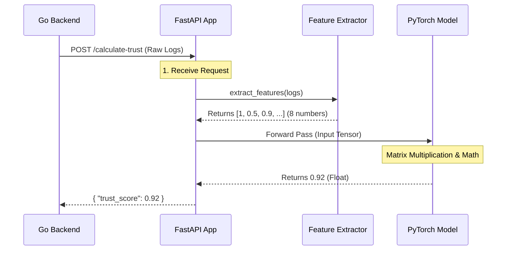

# Chapter 5: ML Trust Scorer

Welcome back! In the previous chapter, [Enhanced Trust Engine](04_enhanced_trust_engine.md), we built the "Coordinator" of our system. It gathers history from the database and asks for a Trust Score.

But we treated the calculation of that score as a "Black Box." We just sent data in and got a number back.

In this chapter, we are opening the box. We will build the **ML Trust Scorer**.

## The Concept: The Detective

Imagine a detective watching a suspect. The detective doesn't just look at one thing. They synthesize many small clues:
*   *Is the suspect sweating?* (Maybe just hot?)
*   *Are they looking over their shoulder?* (Maybe just nervous?)
*   *Are they entering a bank at 3 AM?* (Okay, that's bad.)

Separately, these clues might be innocent. **Together**, they paint a picture of "Suspicion."

Our **ML Trust Scorer** is a Python application that uses a **Neural Network** (a computer brain) to act as that detective. It takes 8 different clues about an Agent's behavior and squishes them into a single number between **0.0** (Malicious) and **1.0** (Trusted).

---

## Part 1: The Brain Structure (The Model)

We use a library called **PyTorch** to build our brain. 

We don't need a massive supercomputer like ChatGPT here. We need a small, fast brain that makes decisions in milliseconds. We use a simple "2-Layer Neural Network."

Think of it as a funnel.
1.  **Input Layer:** 8 numbers enter (the clues).
2.  **Hidden Layer:** 16 neurons mix these clues together to find patterns.
3.  **Output Layer:** 1 final number exits (the Trust Score).

*File: `agentlock/apps/ml-service/models/trust_model.py`*

```python
import torch.nn as nn

class TrustModel(nn.Module):
    def __init__(self):
        super().__init__()
        # Layer 1: Takes 8 clues, mixes them into 16 features
        self.fc1 = nn.Linear(8, 16)
        # Layer 2: Takes 16 features, decides 1 score
        self.fc2 = nn.Linear(16, 1)
        # The Squisher: Forces result to be between 0.0 and 1.0
        self.sigmoid = nn.Sigmoid() 
```

**What is happening?**
*   **Input:** The `8` represents our 8 behavioral factors.
*   **The Magic:** The `Sigmoid` function is crucial. No matter what math happens inside, it forces the final result to be a percentage (0% to 100%).

---

## Part 2: The 8 Factors (The Inputs)

Before we can use the brain, we need to translate raw database logs into numbers the brain understands. This is called **Feature Extraction**.

The system looks at the raw data and calculates these 8 distinct factors:

1.  **Signature Verification:** Did the crypto math pass? (0 or 1)
2.  **Action Frequency:** How fast are requests coming?
3.  **Sequence Pattern:** Is the order of actions logical? (e.g., Login -> Buy is logical. Buy -> Login is weird.)
4.  **Time of Day:** Is this agent working during its normal hours?
5.  **Action Volume:** Is the agent moving an unusual amount of money/data?
6.  **Capability Match:** Is the agent allowed to do this task?
7.  **Historical Consistency:** Does this match the agent's past month of behavior?
8.  **Network Source:** Is the IP address familiar?

---

## Part 3: Calculating the Score

Now, let's write the code that connects the inputs to the brain. This logic lives in the `TrustCalculator`.

It performs three steps:
1.  **Extract:** Turn raw JSON into a list of 8 numbers.
2.  **Predict:** Feed the numbers into the model.
3.  **Return:** Give the score back to the Go backend.

*File: `agentlock/apps/ml-service/services/trust_calculator.py`*

```python
def calculate_trust(self, agent_id, behavior_data):
    # 1. Turn raw history into 8 numbers
    factors = self.feature_extractor.extract_features(behavior_data)
    
    # Create a vector: [1.0, 0.5, 0.2, ...]
    feature_vector = np.array([
        factors["signature_verification"], 
        factors["action_frequency"], 
        # ... (other 6 factors) ...
    ], dtype=np.float32)

    # ... (continued below)
```

Once we have the vector, we ask PyTorch for the answer.

```python
    # 2. Feed into the Brain
    with torch.no_grad():
        # Convert numpy array to PyTorch Tensor
        input_tensor = torch.FloatTensor(feature_vector).unsqueeze(0)
        
        # The model thinks... and outputs a number
        output = self.model(input_tensor)
        trust_score = output.item() # e.g., 0.85
    
    return {"trust_score": trust_score, "factors": factors}
```

**What happened?**
*   **Input:** `behavior_data` (A messy dictionary of logs).
*   **Process:** The model weighed the factors. Maybe the "Time of Day" was weird, but "Historical Consistency" was high, so it balanced out.
*   **Output:** `0.85`. This agent is 85% trustworthy.

---

## Part 4: The Service Interface (FastAPI)

Finally, we need to make this Python code accessible to our Go backend (from Chapter 4). We wrap it in a lightweight web server using **FastAPI**.

*File: `agentlock/apps/ml-service/main.py`*

```python
from fastapi import FastAPI
from services.trust_calculator import TrustCalculator

app = FastAPI()
calculator = TrustCalculator(model_path="model.pth")

@app.post("/calculate-trust")
async def calculate_trust_endpoint(request: CalculateTrustRequest):
    # Call our logic from Part 3
    result = calculator.calculate_trust(
        request.agent_id, 
        request.behavior_data
    )
    return result
```

**What happened?**
*   This code opens port `8001`.
*   When the Go backend (Chapter 4) sends a `POST` request here, this function runs.
*   It returns the JSON response that the Trust Engine is waiting for.

---

## Under the Hood: The Full Pipeline

Let's visualize exactly what happens when that request comes in.



### Why use ML instead of If/Else statements?

You might ask: *Why not just write code like this?*
```python
if time > midnight and volume > 100:
    return 0.0
```

The problem with `if/else` is that it is rigid. Hackers can figure out the rules ("Okay, I will send 99 items at 11:59 PM").

A **Neural Network** is fluid. It learns non-linear relationships.
*   Maybe high volume is okay *if* the sequence pattern is perfect.
*   Maybe a weird time of day is okay *if* the volume is very low.

The ML model captures the "vibe" of the behavior rather than checking rigid boxes.

## Conclusion

We have successfully built the brain of AgentLock.

1.  We defined **8 Factors** that represent behavior.
2.  We built a **PyTorch Model** to process those factors.
3.  We wrapped it in an **API** so our main system can use it.

Now our system is smart. It grants access based on trust, not just keys.

But there is one problem left. As developers, we are currently flying blind. The system is making decisions—blocking agents, trusting others—but we can't see *why*.

How do we monitor this? How do we see a graph of trust scores over time?

In the final chapter, we will visualize everything.

👉 **Next:** [Observability Dashboard](06_observability_dashboard.md)

---

Generated by [Code IQ](https://github.com/adityasoni99/Code-IQ)