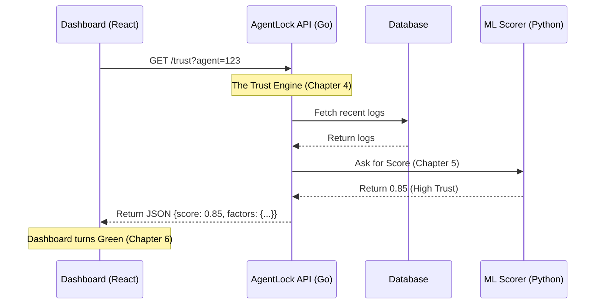

# Chapter 6: Observability Dashboard

Welcome to the final chapter of the AgentLock tutorial!

In the previous chapter, [ML Trust Scorer](05_ml_trust_scorer.md), we built a "Digital Brain" that calculates trust based on 8 different behavioral factors.

However, right now, that brain is invisible. It lives inside a server, silently crunching numbers. If an agent gets blocked, you (the human developer) have no idea why. Did the signature fail? Is the AI hallucinating? Is it just a weird time of day?

In this chapter, we will build the **Observability Dashboard**.

## The Problem: Flying Blind
Imagine driving a car that has no dashboard. No speedometer, no fuel gauge, no "Check Engine" light. You press the gas, and the car moves... until it stops. You don't know if you ran out of gas or if the engine exploded.

Currently, our security system is like that car.

## The Solution: The Heads-Up Display (HUD)
We will build a web interface using **React** and **Next.js**. This dashboard acts as a window into the mind of the Trust Engine.

It answers two questions:
1.  **"How safe is this agent right now?"** (The Trust Score)
2.  **"Why?"** (The Factor Breakdown)

---

## Part 1: Fetching the Data

The dashboard needs to talk to the Backend we built in [Enhanced Trust Engine](04_enhanced_trust_engine.md). We use a simple API client to fetch the data.

We need a function that asks: "Hey Server, what is the score for Agent X?"

*File: `agentlock/apps/web/lib/api.ts`*

```typescript
export const api = {
  // ... other methods ...

  /**
   * Ask the backend for the latest report card
   */
  async getTrustScore(agentId: string): Promise<TrustScore> {
    // We call the Go Backend endpoint we created in Chapter 4
    return fetchAPI<TrustScore>(`/api/v1/agents/${agentId}/trust`);
  },
};
```

**What happened?**
*   **Input:** The `agentId` (e.g., a UUID string).
*   **Action:** It sends a standard HTTP GET request to our backend.
*   **Output:** It returns a `TrustScore` object containing the final score and the breakdown of the 8 factors.

---

## Part 2: Real-Time Monitoring

Security happens in real-time. If a hacker attacks, the trust score will drop rapidly. We can't just load the page once; we need to keep watching.

In React, we use a "Hook" to poll the server every few seconds.

*File: `agentlock/apps/web/app/page.tsx`*

```typescript
// Inside our Dashboard component...
useEffect(() => {
  if (!agentId) return;

  // 1. Define the fetch function
  const fetchTrustScore = async () => {
    const data = await api.getTrustScore(agentId);
    setTrustScore(data); // Save the data to screen
  };

  // 2. Set up a timer to run this every 5 seconds
  const interval = setInterval(fetchTrustScore, 5000);

  // 3. Cleanup when we leave the page
  return () => clearInterval(interval);
}, [agentId]);
```

**What is happening?**
*   **The Trigger:** As soon as you type an Agent ID, this code starts running.
*   **The Loop:** Every 5,000 milliseconds (5 seconds), it asks the server for the latest score.
*   **The Result:** Your screen updates automatically without you refreshing the page.

---

## Part 3: Visualizing the Score (The Speedometer)

A raw number like `0.921` is hard to read quickly. We want a visual indicator—like a health bar in a video game.

We create a component that changes color based on safety.

*File: `agentlock/apps/web/components/trust-score.tsx`*

```typescript
// Determine color based on trust score
const getColor = () => {
  // High Trust = Green
  if (score >= 0.8) return 'text-green-600 bg-green-100';
  
  // Medium Trust = Yellow (Warning)
  if (score >= 0.5) return 'text-yellow-600 bg-yellow-100';
  
  // Low Trust = Red (Danger!)
  return 'text-red-600 bg-red-100';
};
```

We then render this as a bar on the screen:

```typescript
return (
  <div className="flex flex-col items-center">
    <div className={`${getColor()} px-6 py-4 rounded-full`}>
      {/* Show percentage, e.g., 92% */}
      {Math.round(score * 100)}%
    </div>
    
    {/* The Health Bar graphic */}
    <div className="h-2 bg-gray-200 rounded-full w-full mt-4">
      <div 
        className={`h-full ${score >= 0.8 ? 'bg-green-500' : 'bg-red-500'}`} 
        style={{ width: `${score * 100}%` }} 
      />
    </div>
  </div>
);
```

**Why do this?**
*   If an operator sees **Green**, they can relax.
*   If they see **Red**, they know immediately that the [Secure Action Decorator](03_secure_action_decorator.md) is blocking actions.

---

## Under the Hood: The Full Picture

Now that we have the dashboard, let's trace the data through the **entire** AgentLock system we have built over the last 6 chapters.

When you look at the dashboard, here is the journey that data took:



1.  **The Agent** acts (using keys from **Chapter 1** and the client from **Chapter 2**).
2.  **The Decorator** (**Chapter 3**) blocks or allows the action.
3.  **The Trust Engine** (**Chapter 4**) records the event.
4.  **The ML Model** (**Chapter 5**) analyzes the pattern.
5.  **The Dashboard** (**Chapter 6**) displays the result to you.

## Part 4: Diagnosing Issues

The most powerful part of the dashboard isn't the score; it's the **Breakdown**.

If an agent has a score of `0.2` (Blocked), you need to know why. The dashboard receives a list of the 8 factors we defined in the previous chapter.

*Example Data received by Dashboard:*
```json
{
  "trust_score": 0.2,
  "factor_signature_verification": 1.0,  // Keys are valid (Good)
  "factor_network_source": 1.0,          // IP is known (Good)
  "factor_action_volume": 0.0            // VOLUME IS TOO HIGH (Bad!)
}
```

By rendering these numbers, the Dashboard tells the developer: *"Your cryptography is fine, but your agent is spamming the server with too much data. That is why it is blocked."*

## Conclusion: You Are Secure

Congratulations! You have reached the end of the AgentLock tutorial series.

You have built a complete, end-to-end security platform for AI Agents:

1.  **Identity:** You replaced passwords with mathematical seals ([Chapter 1](01_ed25519_identity___verification.md)).
2.  **Usability:** You created an easy SDK for developers ([Chapter 2](02_sdk_client_wrapper.md)).
3.  **Automation:** You built decorators to auto-guard functions ([Chapter 3](03_secure_action_decorator.md)).
4.  **Intelligence:** You built a backend engine to track history ([Chapter 4](04_enhanced_trust_engine.md)).
5.  **Analysis:** You implemented Machine Learning to detect threats ([Chapter 5](05_ml_trust_scorer.md)).
6.  **Visibility:** You visualized it all in real-time (This Chapter).

Your AI agents can now operate autonomously, and you can sleep soundly knowing that if they get hacked or go rogue, **AgentLock** will catch them.

**End of Tutorial.**

---

Generated by [Code IQ](https://github.com/adityasoni99/Code-IQ)