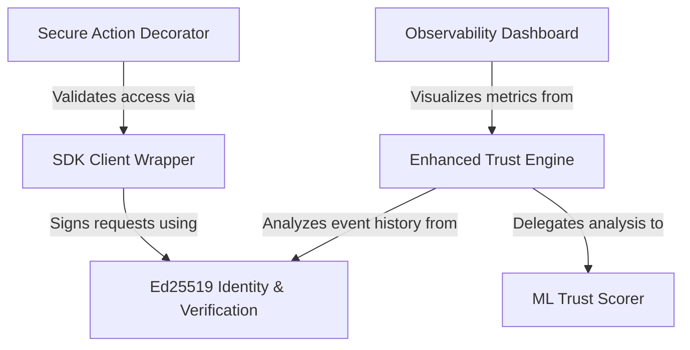

# Tutorial: AgentLock

AgentLock is a security platform that protects **AI Agents** by replacing traditional passwords with strict **cryptographic identities** (Ed25519). Instead of blindly trusting an agent, the system uses a **Machine Learning** brain to continuously analyze behavior—such as the time of day or action frequency—to calculate a dynamic *Trust Score*. If an agent acts suspiciously, their score drops, and the system automatically blocks them from performing sensitive tasks.

## Chapters

1. [Ed25519 Identity & Verification](01_ed25519_identity___verification.md)
2. [SDK Client Wrapper](02_sdk_client_wrapper.md)
3. [Secure Action Decorator](03_secure_action_decorator.md)
4. [Enhanced Trust Engine](04_enhanced_trust_engine.md)
5. [ML Trust Scorer](05_ml_trust_scorer.md)
6. [Observability Dashboard](06_observability_dashboard.md)

---

Generated by [Code IQ](https://github.com/adityasoni99/Code-IQ)