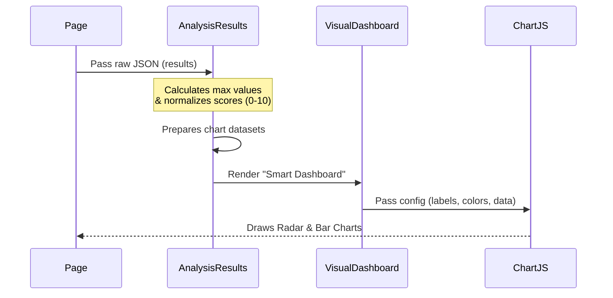

# Chapter 1: Interactive Visualization Layer

Welcome to **Chapter 1** of the OfferComparison tutorial!

We are starting our journey at the very front: **The User Interface**. Before we dive into the complex backend logic, LLMs, or financial math, we need to understand how the user actually sees and interacts with the data.

## 1. The Concept: The Application Cockpit

Imagine you are flying a plane. The engine generates thousands of data points: fuel pressure, wind speed, altitude, and engine temperature. If the plane just printed these numbers on a piece of paper every second, you would crash. You need a **Cockpit**—gauges, dials, and alerts that make the data instantly understandable.

The **Interactive Visualization Layer** is the cockpit for your job offers.

### The Problem
The backend of our application produces massive, complex JSON files containing tax calculations, culture scores, and percentile benchmarks. It looks like this:

```json
{
  "offer_id": "123",
  "base_salary": 150000,
  "wlb_score": 8.5,
  "market_percentile": 72,
  "growth_grade": "A"
}
```
This is hard for a human to compare mentally against two other offers.

### The Solution
This layer takes that raw JSON and converts it into:
1.  **Radar Charts:** To visualize the "shape" of an offer (e.g., high salary but low work-life balance).
2.  **Stacked Bar Charts:** To break down compensation (Base vs. Equity vs. Bonus).
3.  **Badges:** Visual indicators like "Top Earner" or "Best for Growth."

---

## 2. Use Case: Comparing "Culture Fit"

Let's look at a specific scenario. You have two offers:
*   **Startup X:** High equity, high stress.
*   **Corp Y:** Good salary, great work-life balance (WLB).

We want to visualize this so the user can see the trade-off instantly using a **Radar Chart**.

### How It Works High-Level
1.  The **Page** receives data.
2.  The **AnalysisResults** component parses the data.
3.  It passes specific slices of data to **VisualDashboard**.
4.  **Chart.js** draws the graphics.

---

## 3. Usage: Displaying the Results

In our main page (`page.tsx`), we have a state variable called `analysisResults`. When the backend finishes its work, it populates this variable.

Here is how we summon the Visualization Layer. We simply check if we have results, and if so, we pass them to the `AnalysisResults` component.

```tsx
// frontend/app/page.tsx

<AnimatePresence>
  {analysisResults && (
    <motion.div
      initial={{ opacity: 0, y: 40 }}
      animate={{ opacity: 1, y: 0 }}
    >
      {/* We pass the complex JSON object as a simple prop */}
      <AnalysisResults results={analysisResults} />
    </motion.div>
  )}
</AnimatePresence>
```

**Explanation:**
*   `analysisResults`: This holds all the raw data calculated by the backend.
*   `<AnalysisResults />`: This is the main container of our Visualization Layer. It decides *how* to show that data.

---

## 4. Internal Implementation

What happens inside that component? Let's visualize the flow of data from the raw JSON to the pixels on your screen.



### Key Concept: Normalization
To draw a chart, we need comparable numbers. We can't chart "Salary: $150,000" on the same axis as "Culture Score: 8/10".

The **Interactive Visualization Layer** normalizes these. It might treat $150k as a "7/10" on a salary scale so it can be compared visually with the Culture Score.

### Code Deep Dive: Preparing the Radar Data

Inside `AnalysisResults.tsx`, we transform the raw offer data into a format `react-chartjs-2` understands.

```tsx
// frontend/components/AnalysisResults.tsx

// We map over every ranked offer to create a dataset
const radarData = {
  labels: ['Salary', 'Equity', 'Bonus', 'Benefits', 'WLB', 'Growth'],
  datasets: rankedOffers.map((offer, index) => ({
    label: offer.company,
    // We normalize salary to a 0-10 scale for the chart
    data: [
      Math.min(10, (offer.offer_data?.base_salary || 0) / 25000),
      offer.offer_data?.wlb_score || 0, // Already 0-10
      offer.offer_data?.growth_score || 0 // Already 0-10
    ],
    borderColor: index === 0 ? '#06b6d4' : '#fb923c', // Blue vs Orange
  }))
}
```

**Explanation:**
1.  `labels`: The corners of the radar chart.
2.  `datasets`: The actual shapes drawn on the chart.
3.  `Normalization`: Notice `base_salary / 25000`. This is a simple trick to make salary fit on a 1-10 scale (e.g., 250k becomes 10).

### Code Deep Dive: The Visual Dashboard

For individual offer analysis, we use a component called `VisualDashboard`. It uses AI-generated insights to pick an icon badge (like "Top Earner").

```tsx
// frontend/components/VisualDashboard.tsx

const getBadgeIcon = (badge: string) => {
    // Dynamically choose an icon based on the text
    if (badge.includes('Top')) return TrophyIcon
    if (badge.includes('Safe')) return ShieldCheckIcon
    if (badge.includes('Growth')) return RocketLaunchIcon
    return TrophyIcon
}

// ... inside the render ...
<span className="text-cyan-300">
    <BadgeIcon className="h-3 w-3" />
    <span>{verdict.badge}</span>
</span>
```

**Explanation:**
*   This makes the UI feel "intelligent." It reads the text generated by the backend and assigns a visual symbol (Trophy, Shield, Rocket) so the user understands the vibe of the offer instantly.

---

## 5. Connecting the Dots

You might be wondering: *Where does `analysisResults` come from?*

This layer is purely for **display**. It relies on data provided by the backend workflow.
1.  The user clicks "Run Comparison".
2.  The application triggers [Workflow Orchestration (PocketFlow)](02_workflow_orchestration__pocketflow_.md) to gather data.
3.  The data is leveled by [Universal Leveling & Benchmarking](03_universal_leveling___benchmarking.md).
4.  Finally, this Visualization Layer receives the package and paints the picture.

## Summary

In this chapter, we learned:
*   The **Interactive Visualization Layer** acts as the cockpit, turning raw data into human insights.
*   We use **Chart.js** via `react-chartjs-2` to render Radar and Bar charts.
*   We must **normalize** data (like salary vs. scores) so they fit on the same chart.
*   We use components like `VisualDashboard` to dynamically render badges based on text content.

Now that we have a beautiful dashboard, we need to understand the engine that powers it. How do we coordinate the AI, the database, and the math engines to generate this result?

[Next Chapter: Workflow Orchestration (PocketFlow)](02_workflow_orchestration__pocketflow_.md)

---

Generated by [Code IQ](https://github.com/adityasoni99/Code-IQ)