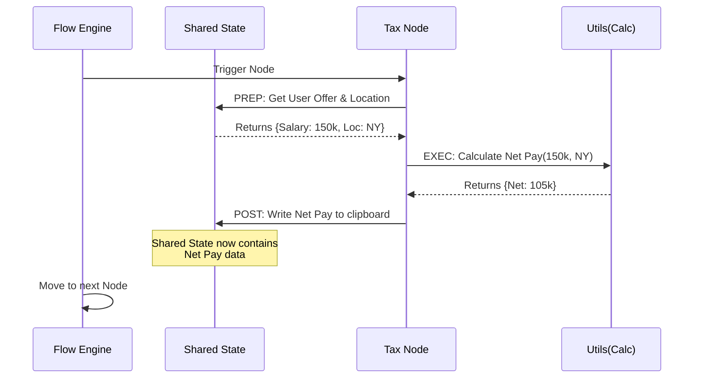

# Chapter 2: Workflow Orchestration (PocketFlow)

Welcome to **Chapter 2** of the OfferComparison tutorial!

In the previous [Interactive Visualization Layer](01_interactive_visualization_layer.md) chapter, we looked at the beautiful dashboard that the user sees. Now, we are going to open the hood and look at the engine.

## 1. The Concept: The Industrial Assembly Line

Comparing job offers involves many complex steps: scraping company data, calculating taxes for different states, estimating cost of living, and asking an AI for advice.

If we wrote all this in one giant file, it would be a messy "spaghetti code" nightmare. Instead, we use **Workflow Orchestration** (specifically a library called **PocketFlow**).

### The Use Case
Imagine an industrial assembly line.
1.  **Raw Material:** The user inputs their job offer details.
2.  **Station 1:** A worker collects the data.
3.  **Station 2:** A researcher looks up the company online.
4.  **Station 3:** An accountant calculates the taxes.
5.  **Station 4:** A robotic arm (AI) writes a summary.

In our code, we call these stations **Nodes**, and the conveyor belt that moves the data between them is the **Flow**.

---

## 2. Key Concepts

Before looking at the code, let's understand the three main pieces of PocketFlow.

### The Node (The Worker)
A **Node** is a small, self-contained block of code that does *one specific task*. It doesn't know about the whole app; it just knows how to do its job (e.g., "Calculate Tax").

### The Shared State (The Clipboard)
As the job offer moves down the assembly line, we need a place to store the results. Imagine a physical clipboard attached to the product.
*   Station 1 writes the Salary on the clipboard.
*   Station 2 reads the Salary, calculates Tax, and writes the Tax on the clipboard.
*   Station 3 reads the Tax and calculates Savings.

In code, this is a simple Python dictionary called `shared`.

### The Flow (The Manager)
The **Flow** defines the sequence. It tells the application: "First go to Station 1, then Station 2, then Station 3."

---

## 3. Usage: Building the Flow

Let's look at `flow.py`. This is where we define our assembly line. We don't write the complex logic here; we just organize the workers.

### Step 1: Instantiate the Nodes
First, we hire our workers (create instances of the Node classes).

```python
# flow.py

def create_offer_comparison_flow():
    # Create all our "workers"
    offer_collection = OfferCollectionNode()
    market_research = MarketResearchNode()
    tax_calculation = TaxCalculationNode()
    # ... more nodes ...
```
*Explanation: We are preparing our stations. `OfferCollectionNode` handles user input, and `MarketResearchNode` handles web searching.*

### Step 2: Connect the Dots
This is the magic of PocketFlow. We use the `>>` operator to define the direction of the conveyor belt.

```python
    # Connect nodes in sequence
    offer_collection >> market_research
    market_research >> tax_calculation
    tax_calculation >> col_analysis
    # ... and so on
```
*Explanation: This line reads like English: "Offer Collection goes to Market Research, which goes to Tax Calculation." If we ever want to change the order, we just change these lines.*

### Step 3: Start the Engine
Finally, we create the Flow object, telling it where to start.

```python
    # Create the Flow starting at the first node
    flow = AsyncFlow(start=offer_collection)
    
    return flow
```
*Explanation: We use `AsyncFlow` because some steps (like calling an LLM or scraping the web) take time. `AsyncFlow` allows the application to handle these waiting periods efficiently.*

---

## 4. Internal Implementation

How does a Node actually work inside? Let's look at `nodes.py`.

Every Node in PocketFlow has a standard structure. It divides work into three phases:
1.  **Prep:** Get data from the clipboard (`shared`).
2.  **Exec:** Do the hard work (calculation, API call).
3.  **Post:** Write results back to the clipboard.

### The Sequence Diagram
Here is the lifecycle of a single step in our flow, specifically the **TaxCalculationNode**.



### Code Deep Dive: Inside a Node
Let's look at a simplified version of `OfferCollectionNode` in `nodes.py`. This is the first station on the line.

```python
# nodes.py

class OfferCollectionNode(Node):
    
    def prep(self, shared):
        # Initialize the storage if it doesn't exist
        if "offers" not in shared:
            shared["offers"] = []
        return shared
```
*Explanation: `prep` runs before the main logic. Here, it ensures our "clipboard" has a blank page ready to write offers onto.*

### Code Deep Dive: The Execution
Next is the `exec` method. This is where the work happens.

```python
    def exec(self, prep_data):
        offers = []
        
        # In the real app, this asks the user for input
        print("Collecting details for Offer...")
        # ... logic to collect inputs ...
        
        return { "offers": offers }
```
*Explanation: `exec` does the heavy lifting. In this specific node, it pauses the program to ask the user to type in their salary and company name.*

### Code Deep Dive: Saving Results
Finally, `post` saves the work.

```python
    def post(self, shared, prep_data, exec_result):
        # Update the shared state with the new data
        shared["offers"] = exec_result["offers"]
        
        return "default"
```
*Explanation: We take the data calculated in `exec` and save it to `shared["offers"]`. The next node in the line (Market Research) will look exactly here to find the company name.*

### Advanced Concept: Batch Processing
You might notice some nodes inherit from `BatchNode` or `AsyncParallelBatchNode`.

```python
class MarketBenchmarkingNode(AsyncParallelBatchNode):
    # ...
```

If the user inputs **3 Job Offers**, we don't want to process them one by one linearly. `AsyncParallelBatchNode` splits the conveyor belt into 3 parallel lanes. It researches Google, Microsoft, and Amazon *at the same time*, effectively tripling the speed of our assembly line.

## 5. Summary

In this chapter, we learned:
*   **PocketFlow** organizes our backend into an "Assembly Line."
*   **Nodes** are the workers; **Flow** is the manager.
*   **Shared State** is the clipboard passed between nodes.
*   We use `>>` in `flow.py` to connect nodes easily.

Now that we have our assembly line running, the next step is to ensure we are comparing apples to apples. How do we know if a "Senior Engineer" at a Startup is the same as a "Level 4" at a Big Tech company?

[Next Chapter: Universal Leveling & Benchmarking](03_universal_leveling___benchmarking.md)

---

Generated by [Code IQ](https://github.com/adityasoni99/Code-IQ)