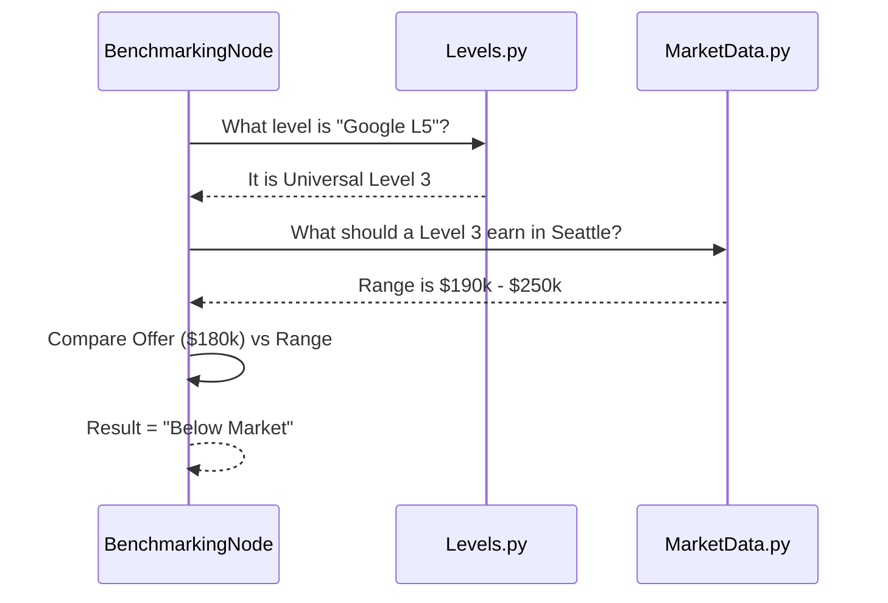

# Chapter 3: Universal Leveling & Benchmarking

Welcome to **Chapter 3** of the OfferComparison tutorial!

In the previous chapter, [Workflow Orchestration (PocketFlow)](02_workflow_orchestration__pocketflow_.md), we built the assembly line that moves data through our application. Now, we need to make sure the data we are processing makes sense.

## 1. The Concept: The "Currency Converter" for Job Titles

Comparing job titles across different companies is messy.
*   **Company A** might call you a "Principal Engineer."
*   **Company B** might call you a "Level 64."
*   **Company C** might call you a "Member of Technical Staff."

If you just compare the titles, you might think the "Principal" role is higher, but Company B's "Level 64" might actually pay double.

**Universal Leveling** is like a currency converter. We convert all these confusing titles into a standard currency: **The Universal Level (L1 - L9)**.

### The Use Case
Imagine a user inputs two offers:
1.  **Google:** "L4 Software Engineer" in New York.
2.  **Startup Inc:** "Senior Engineer" in Austin.

Our system needs to determine:
*   Is Google L4 equivalent to a Senior role? (Answer: usually no, it's often considered mid-level).
*   Is the salary offered fair for *that specific level* in *that specific city*?

---

## 2. Key Concepts

### The Universal Scale
We map every job to a standard ruler from 1 to 9.

| Level | Description | Typical Big Tech Title |
| :--- | :--- | :--- |
| **L1** | Junior / Entry | Google L3, Amazon L4 |
| **L2** | Mid-Level | Meta E4, Microsoft 61/62 |
| **L3** | Senior | Google L5, Netflix Senior |
| **L4** | Staff / Lead | Google L6, Amazon L7 |
| ... | ... | ... |

### Benchmarking (The Market Check)
Once we know the **Level** (e.g., L3) and the **Location** (e.g., Seattle), we look up the "Market Rate."

If an L3 in Seattle usually makes \$200k, and you are offered \$180k, our system flags this as **"Below Market" (40th Percentile)**.

---

## 3. Usage: How to Convert and Compare

We use two main utility files: `levels.py` (to find the level) and `market_data.py` (to find the money).

### Step 1: Find the Universal Level
We use `get_universal_level`. It looks at a predefined map of companies.

```python
# utils/levels.py usage

from utils.levels import get_universal_level

# Scenario: User inputs "L5" at "Google"
level = get_universal_level("Google", "L5")

print(f"Universal Level: {level}") 
# Output: Universal Level: 3 (which maps to Senior)
```

### Step 2: Calculate Market Percentile
Now that we know it is **Level 3**, we check if the salary is good using `calculate_market_percentile`.

```python
# utils/market_data.py usage

from utils.market_data import calculate_market_percentile

# Check if $180k is good for a Level 3 in Seattle
stats = calculate_market_percentile(
    salary=180000, 
    position="Software Engineer", 
    location="Seattle, WA",
    universal_level=3  # We pass the level we found earlier
)

print(f"You are at the {stats['market_percentile']}th percentile.")
```

---

## 4. Internal Implementation

How does the system actually know that "Google L5" equals "Universal Level 3"? Let's look under the hood.

### The Logic Flow
The **MarketBenchmarkingNode** is the worker responsible for this.



### Code Deep Dive: The Static Map (`levels.py`)
At the heart of the system is a giant dictionary mapping companies to levels.

```python
# utils/levels.py

COMPANY_LEVEL_MAP = {
    "Google": {
        "Engineering": {
            "L3 (SWE II)": 1, 
            "L4 (SWE III)": 2, 
            "L5 (Senior)": 3, # <--- The mapping happens here
            "L6 (Staff)": 4
        }
    },
    "Microsoft": {
        "Engineering": {
            "59": 1, "60": 1, "61": 2, "62": 2, "63": 3
        }
    }
}
```
*Explanation: We manually define that Google L5 maps to our Universal Level 3. If a company isn't in this list, we use an AI fallback (explained in Chapter 6).*

### Code Deep Dive: The Salary Database (`market_data.py`)
We store salary ranges for standard positions. We also use **Location Multipliers** to adjust for cost of labor (e.g., Seattle pays less than San Francisco).

```python
# utils/market_data.py

LOCATION_SALARY_MULTIPLIERS = {
    "San Francisco, CA": 1.0,
    "New York, NY": 0.95,
    "Seattle, WA": 0.90,  # Salaries here are 90% of SF
    "Austin, TX": 0.80,
    "Remote": 0.85
}
```
*Explanation: Instead of storing salary data for every single city, we store a baseline (SF) and multiply it. If SF pays \$100k, Seattle pays \$90k.*

### Code Deep Dive: The Orchestrator (`nodes.py`)
This pulls it all together inside the PocketFlow node.

```python
# nodes.py (Inside MarketBenchmarkingNode)

async def exec_async(self, item):
    # 1. Get the level
    uni_level = await get_universal_level_async(
        item["company"], 
        item["level"], 
        item["position"]
    )

    # 2. Get the stats using that level
    stats = await calculate_market_percentile_async(
        item["base_salary"],
        item["position"],
        item["location"],
        universal_level=uni_level
    )
    
    return { "universal_level": uni_level, "stats": stats }
```
*Explanation: This code runs inside the "Assembly Line" we built in Chapter 2. It normalizes the title, then uses that normalized title to judge the salary.*

---

## 5. Summary

In this chapter, we learned:
*   **Universal Leveling** acts as a "currency converter" for confusing job titles.
*   We map specific company titles (e.g., "Google L5") to a **Universal Scale (L1-L9)**.
*   We use **Location Multipliers** to adjust market expectations based on where the user lives.
*   We calculate a **Market Percentile** to tell the user if they are being lowballed.

Now that we know if the salary is *fair* relative to the market, we need to find out what that money is actually *worth* in the user's pocket.

[Next Chapter: Financial Reality Engine](04_financial_reality_engine.md)

---

Generated by [Code IQ](https://github.com/adityasoni99/Code-IQ)