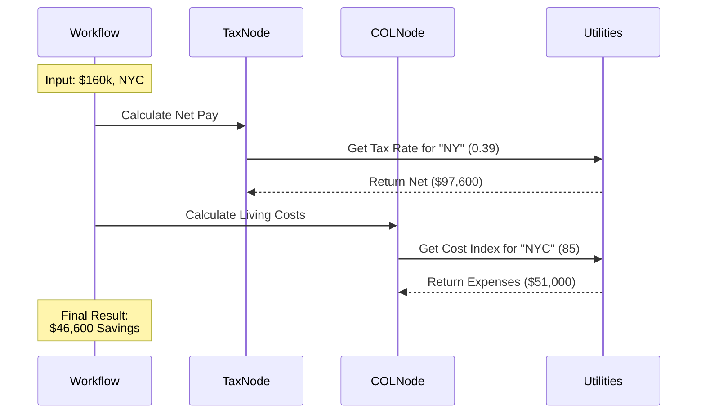

# Chapter 4: Financial Reality Engine

Welcome to **Chapter 4** of the OfferComparison tutorial!

In the previous [Universal Leveling & Benchmarking](03_universal_leveling___benchmarking.md) chapter, we determined if a job offer was fair relative to the market. But "fair" doesn't always mean "wealthy."

## 1. The Concept: The "Real Feel" Calculator

A high salary in an expensive city often feels like a low salary in a cheap city. The **Financial Reality Engine** strips away the illusion of the gross salary number to reveal what actually lands in your pocket.

Think of this engine as a **Personal Accountant** and a **Travel Agent** working together.
*   **The Accountant** knows the tax laws (State, Federal, FICA) for every location.
*   **The Travel Agent** knows the price of rent, groceries, and gas in every city.

### The Use Case: The NYC vs. Austin Dilemma
Imagine you have two offers:
1.  **$160,000** in New York City (High Tax, High Rent).
2.  **$135,000** in Austin, Texas (No State Tax, Lower Rent).

Most people see $160k and think it's the winner. This engine does the math to prove which one actually builds your wealth faster.

---

## 2. Key Concepts

We break the "Reality Check" down into three mathematical steps:

### 1. Gross to Net (The Accountant)
We take the **Gross Salary** (the number on the offer letter) and subtract taxes.
*   *Formula:* `Gross Pay - (Federal + State + Local Taxes) = Net Pay`

### 2. Cost of Living Adjustment (The Travel Agent)
We calculate **Annual Expenses**. We use San Francisco as a "Baseline" (100 points).
*   If SF costs \$60k/year to live, and Austin is 52% of SF's cost, Austin costs \$31.2k/year.

### 3. The "Discretionary Income" (The Bottom Line)
This is the most important number. It represents your **Savings Potential**.
*   *Formula:* `Net Pay - Annual Expenses = Discretionary Income`

---

## 3. Usage: Running the Numbers

Let's look at how we use our utility files (`utils/tax_calculator.py` and `utils/col_calculator.py`) to solve the Austin vs. NYC dilemma.

### Step 1: Calculate Net Pay
First, we ask the tax calculator how much we keep.

```python
from utils.tax_calculator import calculate_net_pay

# Scenario: $160k in NYC
nyc_pay = calculate_net_pay(160000, "New York, NY")

print(f"Tax Rate: {nyc_pay['estimated_tax_rate'] * 100}%")
print(f"Take Home: ${nyc_pay['estimated_net_pay']}")
# Output: Tax Rate: 39%, Take Home: $97,600
```

### Step 2: Calculate Expenses
Next, we ask the COL calculator how much it costs to survive there.

```python
from utils.col_calculator import estimate_annual_expenses

# Scenario: Living in NYC
nyc_costs = estimate_annual_expenses("New York, NY")

print(f"Cost Index: {nyc_costs['cost_index']}") 
print(f"Annual Burn: ${nyc_costs['estimated_annual_expenses']}")
# Output: Cost Index: 85, Annual Burn: $51,000
```
*Note: In our data, NYC is slightly cheaper than SF (100), but still expensive.*

### Step 3: Find the "Real Feel"
Finally, we calculate the discretionary income.

```python
discretionary = nyc_pay['estimated_net_pay'] - nyc_costs['estimated_annual_expenses']
print(f"Savings Potential: ${discretionary}")
```

---

## 4. Internal Implementation

How does this fit into our "Assembly Line" (PocketFlow)?

The **Financial Reality Engine** doesn't usually run as one giant block. It is split into two specific workers (Nodes): `TaxCalculationNode` and `COLAnalysisNode`.

### The Logic Flow



### Code Deep Dive: The Tax Database
Inside `utils/tax_calculator.py`, we keep a simplified map of "Effective Tax Rates." This combines Federal, State, and FICA into one estimated percentage to keep things fast.

```python
# utils/tax_calculator.py

TAX_RATES = {
    "San Francisco, CA": 0.38, # High tax state
    "New York, NY": 0.39,      # State + City tax
    "Seattle, WA": 0.26,       # No state income tax
    "Austin, TX": 0.26,        # No state income tax
    # ...
}

DEFAULT_TAX_RATE = 0.30
```
*Explanation: We map specific cities to their estimated tax burden. If you earn $100k in Austin, you keep $74k. In NYC, you keep $61k.*

### Code Deep Dive: The Cost of Living Index
Inside `utils/col_calculator.py`, we use a baseline system. San Francisco is the anchor (100.0).

```python
# utils/col_calculator.py

COST_OF_LIVING_DATA = {
    "San Francisco, CA": 100.0, # The Baseline
    "New York, NY": 85.0,
    "Austin, TX": 52.0,         # ~Half the cost of SF
    "Remote": 50.0              # Assumed average for digital nomads
}

BASELINE_ANNUAL_EXPENSES = 60000.0 # Cost to live in SF
```
*Explanation: If you live in Austin (Index 52.0), your estimated expenses are 52% of the SF baseline ($60k), which is roughly $31,200.*

### Code Deep Dive: The Node Integration
In `nodes.py`, the `QuickFinancialAnalysisNode` combines these two steps into one swift action for efficiency.

```python
# nodes.py

def exec(self, item):
    offer = item["offer"]
    
    # 1. The Accountant
    net_pay_data = calculate_net_pay(offer["total_compensation"], offer["location"])
    
    # 2. The Travel Agent
    expense_data = estimate_annual_expenses(offer["location"])
    
    # 3. The Reality Check
    net_savings = net_pay_data["estimated_net_pay"] - expense_data["estimated_annual_expenses"]
    
    return { "net_savings": net_savings, ... } # Returns the truth
```
*Explanation: This node acts as the bridge. It calls the Accountant, calls the Travel Agent, performs the subtraction, and saves the `net_savings` to the offer object.*

## 5. Summary

In this chapter, we learned:
*   **Gross Salary is a lie:** Taxes and Rent change the value of money significantly.
*   **The Accountant (Tax Calc):** Estimates how much money actually hits your bank account based on location.
*   **The Travel Agent (COL Calc):** Estimates how much it costs to survive in that city using an Index system.
*   **Discretionary Income:** The final metric we use to compare offers "Apples-to-Apples."

Now we know the **Market Value** (Chapter 3) and the **Real Financial Value** (Chapter 4). But what about your *personal* values? What if you care more about Work-Life Balance than money?

[Next Chapter: Preference Scoring Matrix](05_preference_scoring_matrix.md)

---

Generated by [Code IQ](https://github.com/adityasoni99/Code-IQ)