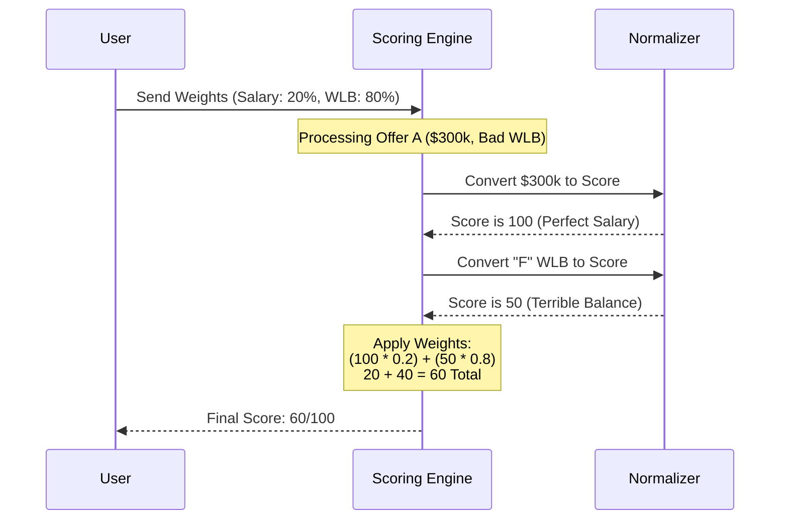

# Chapter 5: Preference Scoring Matrix

Welcome to **Chapter 5** of the OfferComparison tutorial!

In the previous [Financial Reality Engine](04_financial_reality_engine.md) chapter, we calculated the cold, hard financial truth of an offer. We know exactly how much money lands in your bank account.

But here is the problem: **Money isn't everything.**

## 1. The Concept: Teaching "Values" to a Computer

A computer naturally thinks that `$200,000` is better than `$150,000`. But what if the $200k job requires working 80 hours a week, and you have a new baby at home? Suddenly, the $150k job with great work-life balance is the "better" offer *for you*.

The **Preference Scoring Matrix** is the logic that translates **Objective Data** (Dollars, Hours) into a **Subjective Score** (How happy this makes you).

### The Use Case: The "Burnout" Prevention
Imagine two offers:
1.  **Hedge Fund:** $300k Salary, but "F" grade for Work-Life Balance.
2.  **Non-Profit:** $120k Salary, but "A+" grade for Work-Life Balance.

If you tell the system "I value my free time more than money," this engine will calculate a score where the Non-Profit actually wins (e.g., scoring 92/100) while the Hedge Fund loses (scoring 60/100).

---

## 2. Key Concepts

To make this work, we use a concept similar to a **Weighted Grade Book** in school.

### 1. The Factors (The Subjects)
These are the individual categories we grade an offer on:
*   Base Salary
*   Equity Upside
*   Work-Life Balance (WLB)
*   Company Culture
*   Career Growth

### 2. Normalization (The 0-100 Scale)
We can't mathematically multiply "$150,000" by "Work-Life Balance." We need to turn everything into the same unit. We convert everything to a **0-100 Score**.
*   **Salary:** Top 1% earner = 100 points. Average earner = 50 points.
*   **Grades:** "A" Grade = 96 points. "C" Grade = 74 points.

### 3. The Weights (The Importance)
This is where the user comes in. You assign a percentage importance to each factor. The total must equal 100% (or 1.0).

---

## 3. Usage: Setting Preferences

In our frontend, the user interacts with the `PreferencesPanel`. This allows them to drag sliders to tell the system what they care about.

### Step 1: Defining the Profile
We have presets for common user types. Here is how we define a "Life Balance" focused user in the code.

```typescript
// frontend/components/PreferencesPanel.tsx

{
  name: 'Life Balance',
  description: 'Prioritizes wellness over max salary',
  weights: {
    salary_weight: 0.20, // Money is only 20% of the decision
    wlb_weight: 0.40,    // Balance is 40% of the decision
    culture_weight: 0.10,
    // ... other weights ...
  }
}
```

### Step 2: Running the Calculation
On the backend, we use `utils/scoring.py` to process the offer against these weights.

```python
from utils.scoring import calculate_offer_score

# User cares deeply about WLB (80%), little about money (20%)
user_weights = {"base_salary": 0.2, "work_life_balance": 0.8}

# The Engine calculates the personalized score
result = calculate_offer_score(offer_data, weights=user_weights)

print(f"Personal Suitability: {result['total_score']}/100")
```

---

## 4. Internal Implementation

How does the math actually work? Let's walk through the "Scoring Engine."

### The Logic Flow
When the frontend asks for a score, the backend performs a weighted average calculation.



### Code Deep Dive: Normalization
First, inside `utils/scoring.py`, we need to handle letter grades (like "A" or "B") and turn them into math.

```python
# utils/scoring.py

GRADE_TO_SCORE = {
    "A+": 100, "A": 96, 
    "B": 84,   "C": 74, 
    "F": 50
}

def _convert_grade_to_score(grade):
    # If the AI gave us an "A", return 96.0
    if isinstance(grade, str):
        return GRADE_TO_SCORE.get(grade.upper(), 75.0)
    
    return float(grade)
```
*Explanation: This utility function ensures that subjective grades (from the AI) become objective numbers we can do math with.*

### Code Deep Dive: The Weighted Sum
This is the heart of the matrix. We loop through every factor, look up its score, multiply by the user's weight, and add it to the total.

```python
# utils/scoring.py - calculate_offer_score function

    total_score = 0
    
    for factor, score in factor_scores.items():
        # 1. Get how much the user cares (e.g., 0.80)
        weight = weights.get(factor, 0)
        
        # 2. Math: Score (50) * Weight (0.80) = 40 points
        weighted_score = score * weight
        
        # 3. Add to the pile
        total_score += weighted_score
```
*Explanation: `total_score` accumulates points. If a factor has a weight of `0` (zero importance), it contributes nothing to the final score, no matter how good the offer is in that area.*

### Code Deep Dive: Generating a Verdict
Once we have the final 0-100 number, we translate it back into English for the user.

```python
    if total_score >= 80:
        rating = "Excellent"
    elif total_score >= 70:
        rating = "Very Good"
    elif total_score >= 50:
        rating = "Fair"
    else:
        rating = "Below Average"
```
*Explanation: A score of 65 might be "Good" for a specific user because it meets their specific needs, even if the salary is lower than market rate.*

---

## 5. Connecting the Dots

This logic is what powers the dashboard we built in the [Interactive Visualization Layer](01_interactive_visualization_layer.md).

1.  **PocketFlow** (Chapter 2) gathers the data.
2.  **Benchmarking** (Chapter 3) gives us the percentiles (0-100).
3.  **Financial Engine** (Chapter 4) gives us the Net Savings score.
4.  **This Chapter** combines them all using User Preferences to output the final "Suitability Score."

## Summary

In this chapter, we learned:
*   **Objective data is not enough:** We need to account for user values.
*   **Normalization:** We convert dollars, grades, and percentages into a universal 0-100 scale.
*   **Weighted Scoring:** We multiply scores by user-defined weights to find the "Personal Best" offer.
*   **Profiles:** We can use presets (like "Money Focused" or "Life Balance") to quickly set these weights.

We have calculated the money, the market value, and the personal score. But wait—where did those "Grades" (like "A" for Growth or "B" for WLB) come from? We didn't calculate those with math. We asked an AI.

How do we talk to different AI models (like GPT-4 or Claude) to get these qualitative opinions?

[Next Chapter: Multi-Provider LLM Gateway](06_multi_provider_llm_gateway.md)

---

Generated by [Code IQ](https://github.com/adityasoni99/Code-IQ)