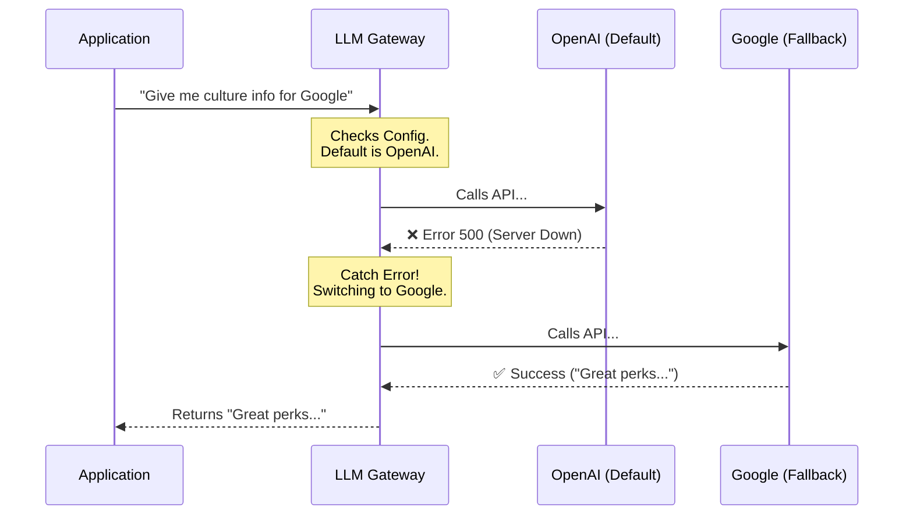

# Chapter 6: Multi-Provider LLM Gateway

Welcome to **Chapter 6**, the final chapter of the OfferComparison tutorial!

In the previous [Preference Scoring Matrix](05_preference_scoring_matrix.md) chapter, we calculated a precise mathematical score for every job offer. But numbers can't tell the whole story. A salary might be "98/100," but if the company culture is toxic, you need to know.

To get those qualitative insights (like "Good Work-Life Balance" or "High Stress"), we need to talk to an Artificial Intelligence (LLM).

## 1. The Concept: The Universal Translator

Here is the problem: There are many AI models (OpenAI's GPT-4, Google's Gemini, Anthropic's Claude).
*   They all speak different "languages" (different code/API formats).
*   They limit how many questions you can ask per minute.
*   Sometimes, they just crash.

If we hardcoded our app to only speak to OpenAI, and OpenAI goes down, our entire application breaks.

The **Multi-Provider LLM Gateway** is a **Universal Translator**. Our application speaks *one* simple language to the Gateway, and the Gateway handles the messy details of talking to the different AI giants.

### The Use Case: The "Culture Check"
Imagine our application needs to answer: *"What is the work-life balance like at Amazon?"*

1.  **The App** hands a note to the Gateway: "Ask someone about Amazon."
2.  **The Gateway** tries calling **OpenAI**.
3.  *Scenario:* OpenAI is busy (Rate Limit Error).
4.  **The Gateway** automatically hangs up and calls **Google Gemini**.
5.  **Google Gemini** answers.
6.  **The Gateway** hands the answer back to the App.

The App never knew there was a problem. It just got the answer.

---

## 2. Key Concepts

### The Provider (The Company)
This is the organization hosting the AI. We support three major ones:
*   **OpenAI** (Creators of ChatGPT)
*   **Google** (Creators of Gemini)
*   **Anthropic** (Creators of Claude)

### The Fallback Strategy (The Plan B)
This is our safety net. If our "Default Provider" fails, the system immediately tries the next one on the list. This ensures high reliability.

### Structured Output (The Translator)
LLMs love to chat. But our code needs strictly formatted **JSON**. The Gateway forces the AI to stop chatting and output raw data (like `{ "grade": "A", "score": 95 }`) so our backend can process it.

---

## 3. Usage: Talking to the AI

We use the utility function `call_llm` from `utils/call_llm.py`.

### Basic Usage
Here is how we ask a simple question. We don't need to specify *which* AI to use; the system picks the default.

```python
from utils.call_llm import call_llm

# Ask a simple question
prompt = "What are the pros and cons of working at a startup?"

# The function handles all the API keys and connections
answer = call_llm(prompt)

print(answer)
# Output: "Working at a startup offers high growth but..."
```

### Advanced Usage: Getting JSON Data
In [Universal Leveling & Benchmarking](03_universal_leveling___benchmarking.md), we needed "Levels" and "Grades." We use `call_llm_structured` to force the AI to give us computer-readable data.

```python
from utils.call_llm import call_llm_structured

prompt = "Analyze the culture of Netflix based on public knowledge."

# We tell the AI exactly what format we need
response = call_llm_structured(
    prompt,
    response_format={"type": "json_object"} # Force JSON mode
)

# The result is ready to be used by our code
print(response) 
# Output: { "culture_grade": "A", "stress_level": "High" }
```

---

## 4. Internal Implementation

How does the Gateway decide who to call? Let's visualize the "Traffic Controller" logic.

### The Logic Flow



### Code Deep Dive: The Dispatcher
Inside `utils/call_llm.py`, the `call_llm` function acts as the switchboard. It looks at the provider name and routes the call.

```python
# utils/call_llm.py

def call_llm(prompt, provider=None, ...):
    # 1. Pick a provider (Default or specified)
    if not provider:
        provider = get_default_provider()

    try:
        # 2. Route the call based on the name
        if provider == "openai":
            return call_llm_openai(prompt, ...)
        elif provider == "gemini":
            return call_llm_gemini(prompt, ...)
            
    except Exception as e:
        # 3. If it crashes, try the Fallback!
        return try_fallback_provider(prompt, failed_provider=provider)
```
*Explanation: This code isolates the complexity. The rest of the app doesn't care if we add a new AI provider later; we just update this one function.*

### Code Deep Dive: Smart Retry (Gemini)
Some providers, like Google Gemini, have specific rules about how fast you can talk to them. We implemented "Smart Retry" logic to handle this.

```python
# utils/call_llm.py (Inside call_llm_gemini)

    try:
        response = client.models.generate_content(...)
        return response.text

    except Exception as e:
        # If Google says "Stop! You're too fast!" (RPM Limit)
        if "RESOURCE_EXHAUSTED" in str(e):
            print("Hit rate limit. Waiting 2 seconds...")
            time.sleep(2)
            # Try again automatically
            return retry_call(...)
```
*Explanation: Instead of crashing when the API is busy, the code patiently waits and tries again. This makes the application feel much more stable to the user.*

### Code Deep Dive: The Research Agent
We use this gateway in `utils/web_research.py` to act as an intelligent researcher. It combines a **System Prompt** (instructions on how to behave) with a **User Prompt** (the question).

```python
# utils/web_research.py

def research_company(company_name):
    # Instructions for the AI persona
    system_prompt = "You are an expert, objective research analyst."
    
    # The actual question
    prompt = f"Analyze {company_name} for culture and stability."
    
    # Use the gateway to get the answer
    return call_llm(prompt, system_prompt=system_prompt)
```

---

## 5. Summary and Series Conclusion

In this chapter, we learned:
*   **The LLM Gateway** abstracts away the complexity of different AI providers.
*   **Fallback Logic** ensures that if OpenAI goes down, our app keeps working using Google or Anthropic.
*   **Structured Output** forces the AI to return JSON data that we can use in our charts and graphs.

### The Complete Picture
Congratulations! You have navigated the entire architecture of the **OfferComparison** project. Let's look back at how data flows through the system we built:

1.  **User Input:** The user enters job offers.
2.  **Orchestration:** [PocketFlow](02_workflow_orchestration__pocketflow_.md) starts the assembly line.
3.  **Research:** The **LLM Gateway** (this chapter) researches the company culture.
4.  **Leveling:** [Universal Leveling](03_universal_leveling___benchmarking.md) normalizes the job titles using Market Data.
5.  **Finance:** The [Financial Engine](04_financial_reality_engine.md) calculates taxes and cost of living.
6.  **Scoring:** The [Scoring Matrix](05_preference_scoring_matrix.md) applies your personal values.
7.  **Visualization:** The [Visualization Layer](01_interactive_visualization_layer.md) renders the final dashboard.

You now have a fully modular, AI-powered system capable of making complex life decisions easier. Happy coding!

---

Generated by [Code IQ](https://github.com/adityasoni99/Code-IQ)