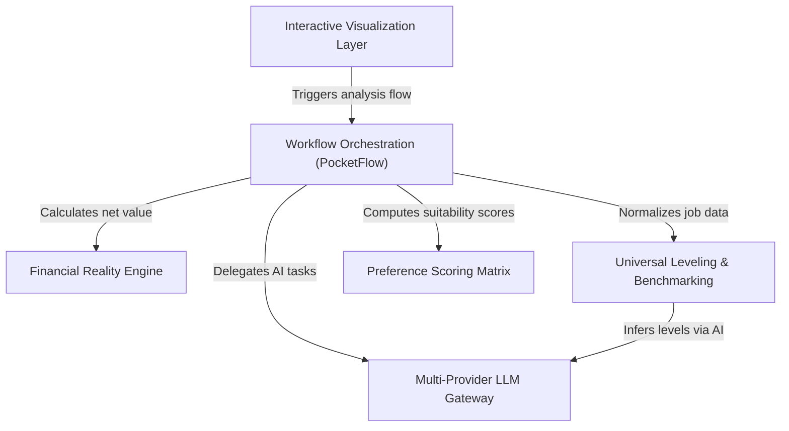

# Tutorial: OfferComparision

**OfferComparison** is an intelligent engine that helps job seekers evaluate offers beyond just the gross salary. It functions as a **workflow pipeline** that standardizes job titles, calculates *real-world purchasing power* (after taxes and cost of living), and scores offers based on personal preferences. Finally, it uses **Artificial Intelligence** to generate negotiation advice and presents everything in an *interactive visual dashboard*.

## Chapters

1. [Interactive Visualization Layer](01_interactive_visualization_layer.md)
2. [Workflow Orchestration (PocketFlow)](02_workflow_orchestration__pocketflow_.md)
3. [Universal Leveling & Benchmarking](03_universal_leveling___benchmarking.md)
4. [Financial Reality Engine](04_financial_reality_engine.md)
5. [Preference Scoring Matrix](05_preference_scoring_matrix.md)
6. [Multi-Provider LLM Gateway](06_multi_provider_llm_gateway.md)

---

Generated by [Code IQ](https://github.com/adityasoni99/Code-IQ)