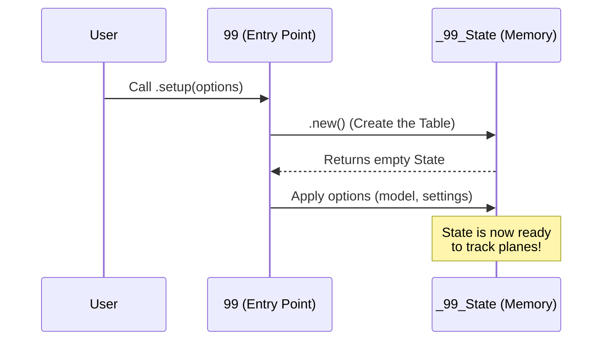

# Chapter 1: Global State & Entry Point

Welcome to the **99** project! If you are new to plugin development, thinking about how an entire application manages its data can be overwhelming. Don't worry—we are going to start with the foundation.

In this chapter, we will build the "Brain" of our plugin.

## The Motivation: The Airport Control Tower

Imagine a busy airport. Planes are taking off, landing, and circling in the air.
*   **Without a Control Tower:** Pilots wouldn't know if the runway is clear. No one would know which planes are currently flying. Chaos ensues.
*   **With a Control Tower:** There is a central authority that knows exactly:
    1.  **Configuration:** What is the weather? (Settings like which AI model to use).
    2.  **Status:** Who is currently in the air? (Active AI requests).
    3.  **History:** Who landed recently? (Past logs).

In **99**, the **Global State** is that Control Tower. It is a central place to store everything the plugin needs to remember while Neovim is running.

## Key Concepts

### 1. The Entry Point (`setup`)
Every Neovim plugin needs a front door. This is usually a function called `setup`. When a user installs `99`, they put this in their config:

```lua
require("99").setup({
  model = "claude-3-5-sonnet",
  display_errors = true
})
```

This function "turns on the lights" in the Control Tower and prepares the state.

### 2. The Singleton State
"Singleton" is a fancy programming word that means "there can be only one." We don't want five different Control Towers giving conflicting orders. We want exactly one `_99_state` object that holds all our data.

### 3. Tracking Requests
When you ask the AI to write code, that is a **Request**. The State needs to track this request so it doesn't get lost. It moves requests from "In Flight" (processing) to "Landed" (finished).

## Usage: Configuring the Tower

Let's look at how a user interacts with the entry point to configure the state.

**Input (User Config):**
```lua
-- User's init.lua
require("99").setup({
  -- We tell the state which AI model to use
  model = "opencode/claude-sonnet-4-5",
  -- We tell the state to show a loading spinner
  show_in_flight_requests = true,
})
```

**What happens:**
1.  The `setup` function is called.
2.  It creates the internal Global State.
3.  It saves "opencode/claude-sonnet-4-5" into the state's memory.
4.  It initializes the UI components (covered in [UI & Window Management](02_ui___window_management.md)).

## Implementation: Under the Hood

How does this work inside the code? Let's trace the lifecycle of the State.

### The Flow



### 1. Creating the State Table
Deep inside `lua/99/init.lua`, we define what the state looks like. It's just a Lua table with properties.

```lua
--- lua/99/init.lua

local function create_99_state()
  return {
    model = "opencode/claude-sonnet-4-5", -- Default model
    languages = { "lua", "go", "java" },  -- Supported languages
    __request_history = {},               -- The log of all flights
    __request_by_id = {},                 -- Fast lookup for active flights
    -- ... other properties
  }
end
```

### 2. The State Class
We wrap that table in a class so we can attach methods (actions) to it. This ensures that only the State object can modify its own data.

```lua
local _99_State = {}
_99_State.__index = _99_State

function _99_State.new()
  local props = create_99_state()
  -- This makes 'props' behave like an instance of _99_State
  return setmetatable(props, _99_State)
end

-- We create the ONE instance immediately
local _99_state = _99_State.new()
```

### 3. Tracking a Flight (Request)
This is the most important job of the Control Tower. When an AI request starts, we add it to the history and mark it as "requesting".

```lua
function _99_State:track_request(context)
  local entry = {
    context = context,      -- Details about the request
    status = "requesting",  -- It is currently in the air
    started_at = time.now(),
  }
  
  -- Add to the big list of history
  table.insert(self.__request_history, entry)
  
  -- Add to the lookup table for easy access
  self.__request_by_id[context.xid] = entry
  
  return entry
end
```
*Explanation:* `context` contains the details of what the user asked. We stamp it with a `status` and `started_at` time, then file it away in our lists.

### 4. The Setup Function
Finally, we expose the `setup` function to the user. This is the bridge between the outside world and our internal state.

```lua
function _99.setup(opts)
  opts = opts or {}

  -- 1. Create a fresh state
  _99_state = _99_State.new()

  -- 2. Apply user configurations
  _99_state.model = opts.model or _99_state.model
  _99_state.show_in_flight_requests = opts.show_in_flight_requests or false

  -- 3. Initialize other systems (Context Intelligence)
  Languages.initialize(_99_state)
end
```

## Summary

We have successfully built the nervous system of **99**.
1.  We created a **Global State** to hold our configuration and history.
2.  We built an **Entry Point** (`setup`) to initialize that state.
3.  We added logic to **track requests**, ensuring we never lose track of what the AI is doing.

Now that our Control Tower knows *what* is happening, we need a way to show that information to the user (the pilot).

[Next Chapter: UI & Window Management](02_ui___window_management.md)

---

Generated by [Code IQ](https://github.com/adityasoni99/Code-IQ)