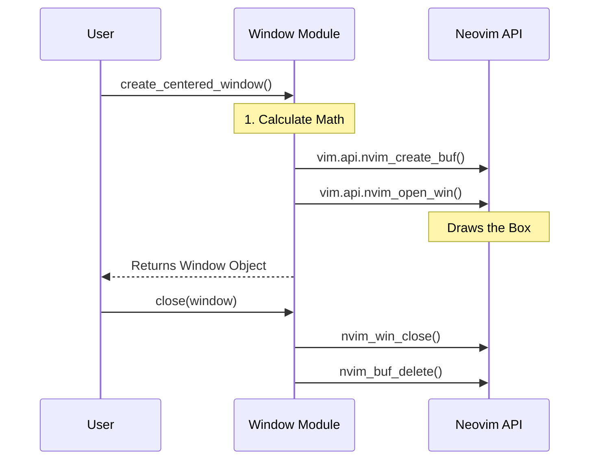

# Chapter 2: UI & Window Management

In the previous chapter, [Global State & Entry Point](01_global_state___entry_point.md), we built the "Control Tower" (the State) to remember what our plugin is doing.

But right now, our plugin is invisible. A Control Tower isn't useful if the pilot (you) can't see the instruments or talk to the tower.

In this chapter, we will build the **Windshield and Dashboard**. This includes:
1.  **Input Windows:** Popups that ask you "What code should I write?"
2.  **Status Indicators:** A "Throbber" (spinner) that tells you the AI is thinking.
3.  **Output Windows:** Floating panels to show results or errors.

## The Motivation

Neovim is a text editor. Usually, text lives in a grid. But modern plugins need to show information *floating* above that grid—like a dialog box in a standard GUI application.

Doing this manually in Neovim is hard. You have to calculate rows and columns, draw borders, and manage cleanup. If you don't clean up, you end up with "ghost windows" stuck on your screen.

The **UI & Window Management** abstraction (`lua/99/window/init.lua`) handles this "boring math" so the rest of the plugin can just say: *"Show a box here."*

## Key Concepts

To understand UI in Neovim, you need to know two words:

### 1. The Buffer vs. The Window
*   **Buffer:** The *content* (the text, the file). Think of this as a sheet of paper.
*   **Window:** The *viewport* (the frame). Think of this as a picture frame placed over the paper.

In **99**, we create "Scratch Buffers" (temporary sheets of paper) and display them in "Floating Windows" (frames that hover above your code).

### 2. The Throbber
This is a visual heartbeat. When the AI is processing a complex request, we need a way to say "I haven't crashed, I'm just thinking." We use a simple text animation called a throbber.

## Usage: Creating a Prompt

The most common UI task in **99** is asking the user for instructions. Let's look at the `capture_input` function.

**The Goal:** Open a floating box in the center of the screen, let the user type a request, and get that text when they press Enter.

**How we call it:**
```lua
local Window = require("99.window")

Window.capture_input("Input", {
  -- 'cb' stands for Callback. It runs when the user is done.
  cb = function(success, text)
    if success then
      print("User wants to: " .. text)
    else
      print("User cancelled.")
    end
  end,
  rules = {} -- (Covered in Chapter 3)
})
```

**What happens:**
1.  A box with a rounded border appears in the center.
2.  The title says `99 Input`.
3.  You type "Refactor this function."
4.  You save/close the buffer (`:w` or specific keybinds).
5.  The callback function runs with your text.

## Implementation: Under the Hood

How does `window/init.lua` actually float a window? Let's trace the creation of a window.

### The Lifecycle



### 1. The Math (Config)
First, we need to know *where* to put the window. Neovim coordinates start at (0,0) in the top-left. To center a window, we need the screen size.

```lua
-- lua/99/window/init.lua (Simplified)

local function create_centered_window()
  -- Get total screen size
  local ui = vim.api.nvim_list_uis()[1]
  local width = ui.width
  local height = ui.height

  -- Calculate box size (2/3rds width, 1/3rd height)
  local win_width = math.floor(width * 2 / 3)
  local win_height = math.floor(height / 3)

  -- Return the configuration table
  return {
    width = win_width,
    height = win_height,
    -- Math to find the center starting point
    row = math.floor((height - win_height) / 2),
    col = math.floor((width - win_width) / 2),
    border = "rounded",
  }
end
```
*Explanation:* We take the screen width, chop off some space, and calculate the `row` and `col` coordinates so the box sits perfectly in the middle.

### 2. Opening the Window
Now we use the Neovim API to actually draw it.

```lua
-- lua/99/window/init.lua (Simplified)

local function create_floating_window(config, title)
  -- 1. Create a blank sheet of paper (buffer)
  -- false = not listed in file list, true = scratch buffer
  local buf_id = vim.api.nvim_create_buf(false, true)

  -- 2. Open the frame (window) using our math config
  local win_id = vim.api.nvim_open_win(buf_id, true, {
    relative = "editor", -- Position relative to entire screen
    width = config.width,
    height = config.height,
    row = config.row,
    col = config.col,
    style = "minimal",   -- No line numbers, etc.
    border = "rounded",
    title = title
  })

  return { win_id = win_id, buf_id = buf_id }
end
```

### 3. Cleanup (The Garbage Collector)
We track every window we open in a list called `active_windows`. This is crucial. If the plugin crashes or resets, we want to close all existing popups so the user isn't stuck with them.

```lua
function M.clear_active_popups()
  for _, window in ipairs(M.active_windows) do
    -- Force close the window
    if vim.api.nvim_win_is_valid(window.win_id) then
      vim.api.nvim_win_close(window.win_id, true)
    end
    -- Delete the buffer memory
    if vim.api.nvim_buf_is_valid(window.buf_id) then
      vim.api.nvim_buf_delete(window.buf_id, { force = true })
    end
  end
  M.active_windows = {}
end
```

### 4. The Throbber (Animation)
The Throbber (`lua/99/ops/throbber.lua`) is a fun little piece of engineering. It doesn't block Neovim. It uses a **Timer**.

It cycles through a list of icons: `⠋`, `⠙`, `⠹`, `⠸`...

```lua
-- lua/99/ops/throbber.lua (Simplified)

function Throbber:_run()
  -- If we stopped, don't run again
  if self.state ~= "throbbing" then return end

  -- Calculate which icon to show based on time
  local icon = self.get_next_icon()
  
  -- Run the callback (update the UI)
  self.cb(icon)

  -- Schedule this function to run again in 100ms
  vim.defer_fn(function()
    self:_run()
  end, 100)
end
```
*Explanation:* This creates a loop that updates the UI every 100 milliseconds, creating the illusion of smooth animation without freezing the editor.

## Syntax Highlighting

You might notice `syntax/99prompt.vim` in the file list. When a user types into our input window, we want to highlight specific things, like referencing a file (`@main.lua`) or a rule (`#no-comments`).

We apply a specific filetype to our window:

```lua
-- Inside window creation logic
vim.bo[win.buf_id].filetype = "99"
```

Neovim then automatically loads `syntax/99prompt.vim`, which contains rules like:
```vim
syntax match 99RuleRef /#\S\+/
highlight default 99RuleRef guifg=#00FFFF
```
This turns any text starting with `#` into a Cyan color. This is a great UX touch that helps users see what the AI will recognize.

## Summary

We have built the **Dashboard** for our car.
1.  We can calculate screen geometry to center windows.
2.  We can create Floating Windows to prompt the user for input.
3.  We can animate a "Throbber" to show status.
4.  We can clean up after ourselves so we don't leave mess on the screen.

Now that we have a **Brain** (State) and a **Dashboard** (UI), we need to give the AI some actual skills. We need to teach it how to behave.

[Next Chapter: Agents & Rules (Skills)](03_agents___rules__skills_.md)

---

Generated by [Code IQ](https://github.com/adityasoni99/Code-IQ)