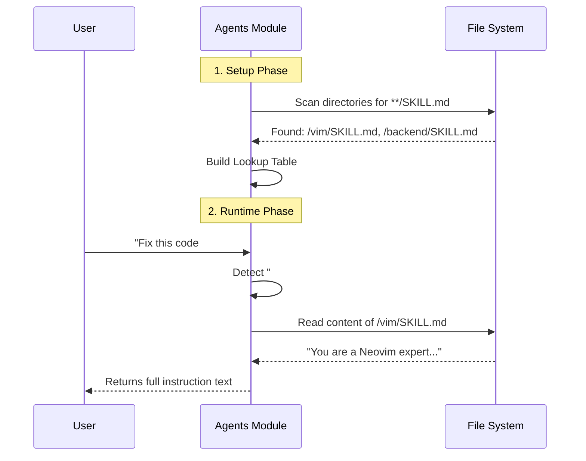

# Chapter 3: Agents & Rules (Skills)

In the previous chapter, [UI & Window Management](02_ui___window_management.md), we built the dashboard that lets us talk to the plugin. Before that, in [Global State & Entry Point](01_global_state___entry_point.md), we built the brain to remember our settings.

Now, we need to give our AI a **Personality**.

## The Motivation: The "Job Card"

By default, Large Language Models (LLMs) are generalists. They know a little bit about everything. But when you are coding, you don't want a generalist; you want a specialist.

*   If you are writing SQL, you want a Database Architect.
*   If you are writing CSS, you want a UI Designer.

In **99**, we don't hard-code these personalities. Instead, we use **Skills** (also called Agents or Rules).

Think of the AI as a talented actor. A **Skill** is a "Job Card" or a "Script" you hand to the actor.
*   Hand them the `#backend` card $\rightarrow$ They act like a Go/Java expert.
*   Hand them the `#vim` card $\rightarrow$ They act like a Neovim plugin developer.

This chapter explains how **99** reads these cards from your hard drive and injects them into your conversation.

## Key Concepts

### 1. The Skill File (`SKILL.md`)
A skill is just a Markdown file. It lives in a specific folder structure. The text inside contains instructions (System Prompts) that tell the AI how to behave.

### 2. The Trigger (`#`)
We use the hash symbol (`#`) to reference these skills. If you have a skill named "test", typing `#test` in the input window tells the plugin: *"Go find the instructions for 'test' and include them in this request."*

### 3. The Agent System
This is the code that scans your folders, creates a list of available skills, and swaps `#tags` for actual text content.

## Usage: Creating and Using a Skill

Let's say we want to create a personality that is really good at writing Lua code for Neovim.

**1. Create the File**
You create a file at `custom_rules/vim/SKILL.md`.

```markdown
<!-- custom_rules/vim/SKILL.md -->
You are a Neovim Lua expert.
1. Always use `vim.api` functions, not standard Lua functions.
2. Be concise.
3. Do not explain standard library code.
```

**2. Configure the Plugin**
We tell **99** where to look for these rules in our setup function.

```lua
require("99").setup({
  completion = {
    -- Look in this folder for skills
    custom_rules = { "/home/user/.config/nvim/custom_rules" }
  }
})
```

**3. Use it in the UI**
When you open the input window (from Chapter 2), you simply type:

> "Refactor this function #vim"

**What happens:**
The system sees `#vim`, reads `custom_rules/vim/SKILL.md`, and sends those instructions secretly to the AI. The AI now acts like the expert we defined.

## Implementation: Under the Hood

How does the plugin turn `#vim` into text? Let's look at the lifecycle.

### The Flow



### 1. Scanning for Skills
First, we need to find all the `SKILL.md` files. We use a helper to list files in the directories provided by the user.

```lua
-- lua/99/extensions/agents/init.lua

function M.rules(_99)
  local custom = {}
  -- Loop through user-defined paths
  for _, path in ipairs(_99.completion.custom_rules or {}) do
    -- 'ls' is a helper that finds SKILL.md files in subfolders
    local custom_rules = helpers.ls(path) 
    
    -- Add them to our list
    for _, r in ipairs(custom_rules) do
      table.insert(custom, r)
    end
  end
  -- ... code to index by name ...
end
```
*Explanation:* We iterate through the folders configured in the global state. We find every valid skill file and store it in a list called `custom`.

### 2. Detecting the Trigger
When the user types a prompt, we need to scan their text for words starting with `#`.

```lua
-- lua/99/extensions/agents/init.lua

function M.by_name(rules, prompt)
  local names = {}    -- List of skill names found
  local out_rules = {} -- List of rule objects found

  -- Split prompt by spaces and check every word
  for word in prompt:gmatch("%S+") do
    if word:sub(1, 1) == "#" then
      local w = word:sub(2) -- Remove the '#'
      
      -- Check if we have a rule with this name
      if rules.by_name[w] then 
        table.insert(names, w)
        -- Add the actual rule object to our list
        -- (Logic simplified for readability)
      end
    end
  end
  return { names = names, rules = out_rules }
end
```
*Explanation:* If the user types `#vim`, we strip the `#`, getting `vim`. We look inside `rules.by_name["vim"]`. If it exists, we know the user wants to activate that agent.

### 3. Reading the Content
Once we know the user wants `#vim`, we need to read the file content to send to the AI. We wrap the content in XML-style tags so the AI understands where the rules start and end.

```lua
-- lua/99/extensions/agents/init.lua

function M.get_rule_content(rule)
  -- Open the file in read mode
  local file = io.open(rule.path, "r")
  if not file then return nil end

  -- Read the whole file (*a = all)
  local content = file:read("*a")
  file:close()

  -- Wrap in tags: <vim> ... instructions ... </vim>
  return string.format(
    "<%s>\n%s\n</%s>", 
    rule.name, content, rule.name
  )
end
```
*Explanation:* This function physically opens the file on your hard drive, reads the text, and wraps it. If `SKILL.md` contained "Be cool", this returns `<vim>Be cool</vim>`.

### 4. Autocomplete (The Hint)
To make this user-friendly, we want a popup menu to appear when the user types `#`. This is handled by the `completion_provider`.

```lua
-- lua/99/extensions/agents/init.lua

function M.completion_provider(_99)
  return {
    trigger = "#", -- Activate when user types this
    
    get_items = function()
      local items = {}
      -- Convert our loaded rules into menu items
      for _, rule in ipairs(_99.rules.custom) do
        table.insert(items, {
          label = rule.name,       -- Show "vim"
          insertText = "#" .. rule.name, -- Type "#vim"
          detail = "Rule: " .. rule.path,
        })
      end
      return items
    end
  }
end
```
*Explanation:* This allows the UI (which we will connect in Chapter 8) to show a dropdown list of all available skills immediately after the user types `#`.

## Summary

We have built the **Personality System** for **99**.

1.  We defined **Skills** as simple `SKILL.md` files in folders.
2.  We built a scanner to find these files and organize them.
3.  We built a parser to detect when a user types `#skillname`.
4.  We built a reader to pull the text from the file and prepare it for the AI.

Now our AI has a Brain (State), a Body (UI), and a Personality (Agents). But it doesn't actually *do* anything yet. It needs to perform tasks.

[Next Chapter: Operations (Ops)](04_operations__ops_.md)

---

Generated by [Code IQ](https://github.com/adityasoni99/Code-IQ)