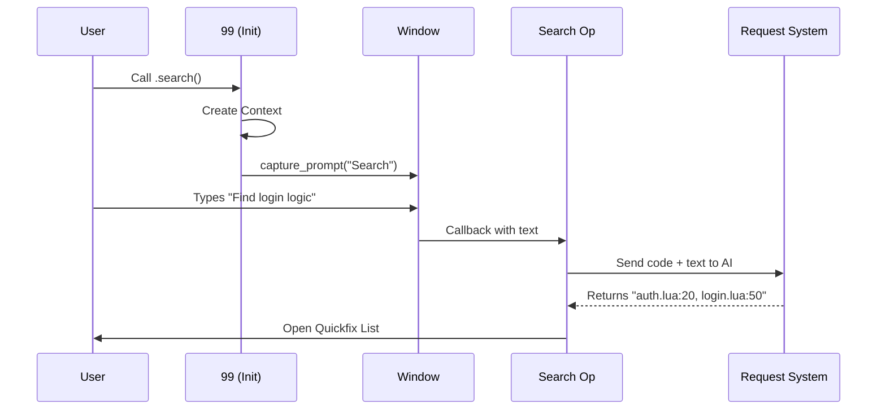

# Chapter 4: Operations (Ops)

In the previous chapter, [Agents & Rules (Skills)](03_agents___rules__skills_.md), we gave our AI a personality. Before that, in [UI & Window Management](02_ui___window_management.md), we gave it a face.

Now, we need to give it **Action Buttons**.

## The Motivation: The Remote Control

Imagine you have a high-tech television (the AI). You have electricity (Global State) and a screen (UI). But how do you actually tell the TV to *do* something specific?

You need a remote control with specific buttons:
*   **"Search"**: Finds a movie.
*   **"Volume"**: Changes sound levels.
*   **"Input"**: Switches devices.

In **99**, **Operations (Ops)** are these buttons.
*   **Search Op**: Asks the AI to find code files.
*   **Visual Op**: Asks the AI to rewrite selected code.
*   **Tutorial Op**: Asks the AI to write a lesson in a new window.

While the "brain" (AI) is the same for all of them, the **workflow** is different. "Search" creates a list of files, while "Visual" edits text. The **Op** defines this workflow.

## Key Concepts

### 1. The Orchestrator
An Op is a manager. It doesn't do the heavy lifting itself. Instead, it coordinates the other departments:
1.  **Context:** "Where am I?" (File paths, current line).
2.  **UI:** "Ask the user what they want."
3.  **Request:** "Send this to the AI."
4.  **Handler:** "Do something with the answer."

### 2. The Handler (The Result)
This is the main difference between Ops.
*   If I run `search`, the **Handler** parses the answer and puts it in a Quickfix list (a clickable list of files).
*   If I run `visual` refactor, the **Handler** takes the answer and overwrites the text in my buffer.

## Use Case: The "Search" Operation

Let's build the workflow for the `search` command.

**The Goal:**
1.  User types: "Find where I defined the user login logic."
2.  AI reads the codebase.
3.  AI responds with a list of files and line numbers.
4.  Plugin displays this list so the user can jump to them.

## Implementation: Under the Hood

How does the code wire all these systems together? Let's trace the lifecycle of a Search Operation.

### The Workflow



### 1. The Entry Point
In `lua/99/init.lua`, we expose the button to the user. This function prepares the **Context** (environment data) and opens the input window.

```lua
-- lua/99/init.lua

function _99.search(opts)
  -- 1. Create context (Who acts? The 'search' op)
  local context = get_context("search")
  
  -- 2. Open the UI asking for input
  -- When the user presses Enter, run 'ops.search'
  capture_prompt(ops.search, "Search", context, opts)
end
```
*Explanation:* We aren't searching yet. We are just setting up the stage and opening the microphone (UI).

### 2. The Orchestrator (The Op)
Once the user types their query, `ops.search` is called. This lives in `lua/99/ops/search.lua`. This is where the magic happens.

```lua
-- lua/99/ops/search.lua

local function search(context, opts)
  -- 1. Prepare the Request object
  local request = Request.new(context)

  -- 2. Create the Prompt (Combine user text + code context)
  local prompt, refs = make_prompt(context, opts)
  request:add_prompt_content(prompt)

  -- 3. Define what happens when we finish (The Clean Up)
  local clean_up = make_clean_up(function() request:cancel() end)
  
  -- 4. Launch the request!
  request:start(make_observer(clean_up, function(status, response)
    if status == "success" then
      -- HANDLER: Do something with the result
      create_search_locations(context._99, response)
    end
  end))
end
```
*Explanation:* 
1.  We create a `Request` (like an empty envelope).
2.  We fill it with the `Prompt` (the letter).
3.  We define a `clean_up` routine (to turn off the loading spinner).
4.  We `start` the request and attach an **Observer**. The Observer waits for the AI to finish.

### 3. The Handler (Parsing Results)
The AI returns a big string of text. For a search, we expect the AI to return lines looking like: `filename:line:description`.

We need to parse this string and feed it into Neovim's "Quickfix List" (a built-in feature for listing errors or search results).

```lua
-- lua/99/ops/search.lua

local function create_search_locations(_99, response)
  local qf_list = {}
  
  -- Split the AI's answer line by line
  for _, line in ipairs(vim.split(response, "\n")) do
    -- Helper to parse "file.lua:10:found it"
    local res = parse_line(line) 
    if res then
      table.insert(qf_list, res)
    end
  end

  -- Tell Neovim to show this list
  vim.fn.setqflist(qf_list, "r")
  vim.cmd("copen") -- Open the bottom window
end
```
*Explanation:* This function converts the "smart" AI response into a "dumb" list that Neovim understands. `copen` is the Vim command to open that list window at the bottom of the screen.

### 4. Comparison: The Visual Op
To understand how Ops differ, let's look briefly at how `visual` would look different (conceptually).

Ideally, `visual` looks almost the same, except for the **Handler**:

```lua
-- Conceptual Visual Handler
if status == "success" then
    -- Instead of a list, we replace text in the buffer
    local range = context.range
    vim.api.nvim_buf_set_text(
        range.buffer, 
        range.start_row, 
        range.end_row, 
        response_text
    )
end
```

The **Op** abstraction allows us to reuse the Prompting, UI, and Networking logic, changing only the final action.

## Summary

We have built the **Buttons** for our remote control.
1.  **Operations** orchestrate the flow of data.
2.  They connect the **UI** (User Input) to the **Request** (AI).
3.  They define a specific **Handler** to decide if the output should be a list of files (`search`) or a code edit (`visual`).

However, we have glossed over a massive part of the system: **The Request**. How does the plugin actually talk to the AI? How does it handle streaming? How does it handle errors?

[Next Chapter: The Request Lifecycle](05_the_request_lifecycle.md)

---

Generated by [Code IQ](https://github.com/adityasoni99/Code-IQ)