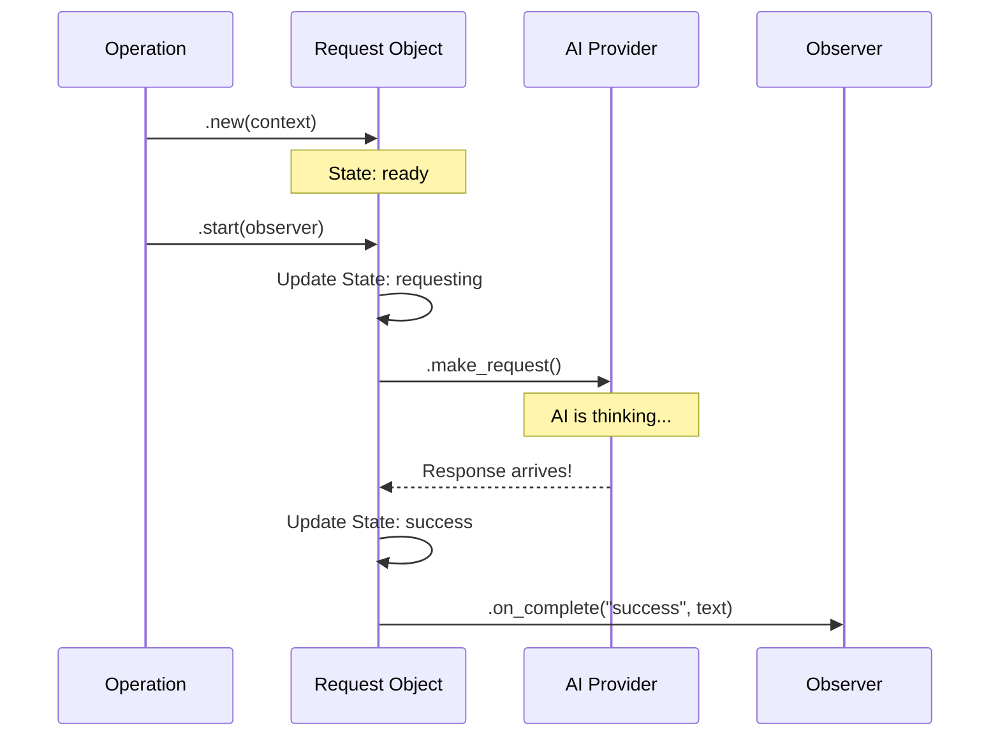

# Chapter 5: The Request Lifecycle

In the previous chapter, [Operations (Ops)](04_operations__ops_.md), we built the "Remote Control" buttons (`search`, `visual`, etc.) that orchestrate workflows.

But what happens after you press the button?

Sending code to an AI, processing the logic, and waiting for a response takes time—sometimes 5 to 10 seconds. If Neovim simply stopped and waited, your editor would freeze. You wouldn't be able to type or scroll.

In this chapter, we will build the **Request Lifecycle**. This is the system that manages the "waiting game" without freezing your editor.

## The Motivation: The Waiter at a Restaurant

Imagine you are at a busy restaurant.
1.  **You (The User)** give your order to the **Waiter (The Request Object)**.
2.  The Waiter takes the ticket to the **Kitchen (The AI Provider)**.
3.  You continue chatting with your friends (editing code) while the food cooks.
4.  When the food is ready, the Waiter brings it back to your table.

If the Waiter just stood at the kitchen door staring at the chef for 20 minutes, they couldn't help anyone else.

In **99**, the **Request Object** is that Waiter. It wraps the entire interaction in a neat package that manages timing, errors, and delivery.

## Key Concepts

### 1. The Request Object
This is a Lua table that represents *one specific conversation* with the AI. It holds:
*   **The Context:** What file are we in? (From [Global State & Entry Point](01_global_state___entry_point.md)).
*   **The Prompt:** What are we asking?
*   **The State:** Is it cooking? Is it done? Did it burn?

### 2. State Transitions
A request moves through a specific lifecycle:
*   `ready`: Created, but not sent yet.
*   `requesting`: Sent to the AI, currently waiting.
*   `success`: AI replied successfully.
*   `failed`: Something went wrong (e.g., no internet).
*   `cancelled`: User changed their mind.

### 3. The Observer
The Observer is a set of instructions we give the waiter: *"When the food is ready, put it on table 4."* In code, these are "callback functions" that run when the request finishes.

## Usage: Creating and Sending a Request

Let's look at how an Operation (from Chapter 4) creates and uses a Request.

**The Goal:** create a request, add text to it, and send it.

```lua
local Request = require("99.request")

-- 1. Create the waiter (The Request)
local req = Request.new(context)

-- 2. Add the order (The Prompt)
req:add_prompt_content("Explain this code.")

-- 3. Send it to the kitchen!
req:start({
  -- The Observer (What to do when finished)
  on_complete = function(status, result)
    if status == "success" then
      print("AI says: " .. result)
    else
      print("Something went wrong.")
    end
  end
})
```

**What happens:**
1.  `Request.new` creates a generic request object.
2.  `add_prompt_content` builds up the text we want to send.
3.  `start` triggers the background process. Neovim remains responsive!

## Implementation: Under the Hood

How does `lua/99/request/init.lua` manage this state? Let's trace the lifecycle.

### The Lifecycle Flow



### 1. Creating the Request
The constructor initializes the state to `ready` and attaches the logger.

```lua
-- lua/99/request/init.lua

function Request.new(context)
  -- Create the object with default values
  return setmetatable({
    context = context,      -- Access to Global State
    state = "ready",        -- Initial state
    _content = {},          -- Empty prompt list
    _proc = nil,            -- No background process yet
  }, Request)
end
```
*Explanation:* We prepare a table. `_proc` is important—it will eventually hold the ID of the background system process (like `curl`) so we can kill it if needed.

### 2. Building the Prompt
We don't send the request immediately. We might want to add multiple pieces of information (like file content, then user instructions).

```lua
-- lua/99/request/init.lua

function Request:add_prompt_content(content)
  -- Add a string to our list
  table.insert(self._content, content)
  return self
end
```
*Explanation:* We store the strings in a list (`_content`). We will glue them together later.

### 3. Starting the Request
This is where the action happens. We glue the prompt together and hand it off to the **Provider** (which we will build in [Chapter 7](07_ai_providers__backends_.md)).

```lua
-- lua/99/request/init.lua

function Request:start(observer)
  -- Safety check
  if self.state ~= "ready" then return end

  -- Combine all prompt parts into one string
  local prompt = table.concat(self._content, "\n")
  
  -- Hand off to the Provider (The Kitchen)
  -- We wrap 'observer' to handle state updates automatically
  self.provider:make_request(
    prompt,
    self, -- Pass 'self' so the provider can update us
    self:_create_internal_observer(observer)
  )
end
```
*Explanation:* The Request object doesn't actually know *how* to talk to OpenAI or Claude. It just asks the `provider` to do it.

### 4. The Internal Observer
We need to make sure the Request's `state` property (`requesting`, `success`) is always updated, regardless of what the Operation wants to do. We wrap the user's observer with our own logic.

```lua
-- Internal helper (simplified)
function observer_from_request(req, user_obs)
  return {
    on_complete = function(status, result)
      -- 1. Update our internal state
      req.state = status
      
      -- 2. Update Global State (Chapter 1)
      req.context._99:finish_request(req.context, status)

      -- 3. Call the user's callback
      if user_obs then user_obs.on_complete(status, result) end
    end
  }
end
```
*Explanation:* This ensures that even if the developer forgets to update the status, the Request object handles it automatically. It also tells the Global State to stop the "throbber" animation.

### 5. Cancellation (Walking Out)
Sometimes a request takes too long, or you realize you made a typo. You want to cancel.

```lua
-- lua/99/request/init.lua

function Request:cancel()
  -- If already finished, do nothing
  if self.state == "success" or self.state == "failed" then return end

  self.state = "cancelled"
  
  -- Kill the background process (SIGTERM)
  if self._proc then
    self._proc:kill(15) 
    self._proc = nil
  end
end
```
*Explanation:* Because we stored `_proc` earlier, we can send a `kill` signal to the operating system to stop the `curl` command immediately.

## Summary

We have built the **Waiter** for our restaurant.
1.  The **Request Object** wraps the complexity of an asynchronous job.
2.  It manages **State** (`ready` $\rightarrow$ `success`).
3.  It handles **Cancellation** to clean up stuck processes.
4.  It coordinates between the **Operation** (User) and the **Provider** (Backend).

But wait—what exactly *is* the data we are sending? Just the text the user typed? To be smart, the AI needs to know about your code, your file structure, and your definitions.

[Next Chapter: Context Intelligence (LSP & Tree-sitter)](06_context_intelligence__lsp___tree_sitter_.md)

---

Generated by [Code IQ](https://github.com/adityasoni99/Code-IQ)