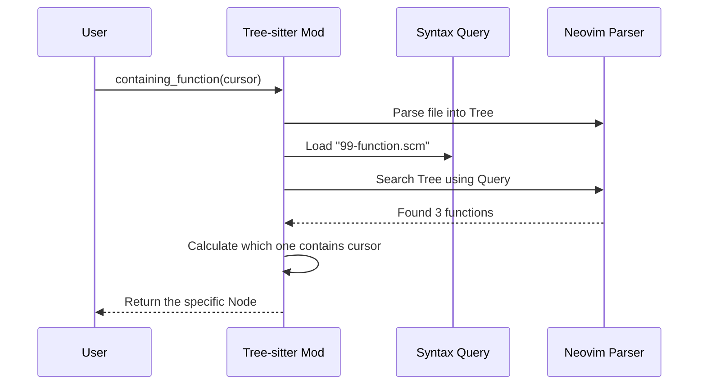
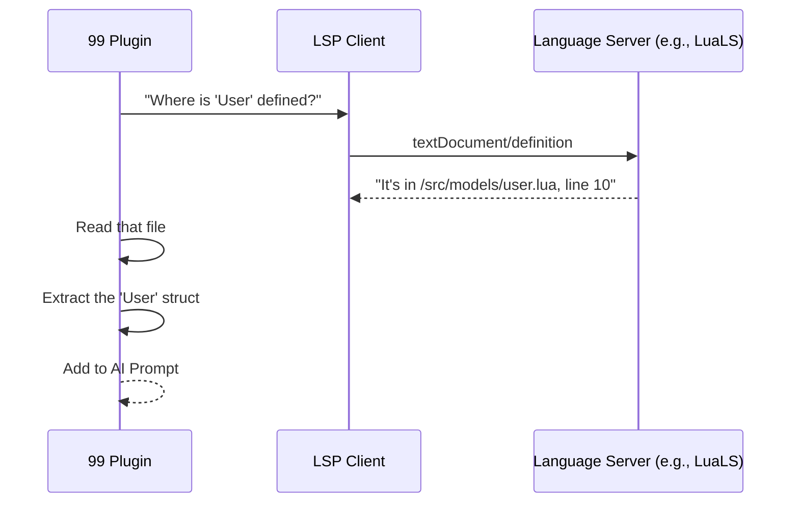

# Chapter 6: Context Intelligence (LSP & Tree-sitter)

In the previous chapter, [The Request Lifecycle](05_the_request_lifecycle.md), we built the system to send messages to the AI and wait for a response.

But sending a message is only half the battle. If you just send the code `x = y + 2` to an AI and ask "Is this correct?", the AI will say: *"I don't know what x or y are."*

To write good code, the AI needs **Context**. It needs to see the surrounding functions, the variable definitions, and the imported modules.

In this chapter, we will give our plugin "X-Ray Vision" using **Tree-sitter** and **LSP**.

## The Motivation: The Research Assistant

Imagine you are writing a research paper. You ask your assistant: *"Summarize the conclusion of this book."*

*   **Bad Assistant:** Rips out the last page and hands it to you. (Context missing).
*   **Good Assistant (Context Intelligence):** Reads the Table of Contents (Structure), finds the Glossary (Definitions), and highlights the specific paragraphs you need.

Neovim has two powerful built-in tools that act as this "Good Assistant":

1.  **Tree-sitter:** Understanding the **Structure** (Syntax).
    *   *Questions it answers:* "Where does this function start and end?" "Is this an import statement?"
2.  **LSP (Language Server Protocol):** Understanding the **Meaning** (Semantics).
    *   *Questions it answers:* "Where is `User` defined?" "What arguments does `login()` take?"

## Key Concepts

### 1. The Tree (Tree-sitter)
Code isn't just a string of text; it's a tree. A file contains a class, which contains functions, which contain blocks, which contain lines.

**99** uses Tree-sitter to "select" logical blocks of code. Instead of sending line 10 to 20, we send "Function `my_logic`".

### 2. The Query (`.scm` files)
How do we tell Neovim what a "function" looks like in Lua vs. Go? We use **Query Files**. These are map legends that tell Tree-sitter what patterns to look for.

### 3. The Definition (LSP)
When the AI sees `User.new()`, it needs to know what the `User` struct looks like. We use LSP's "Go to Definition" feature programmatically to fetch that code and send it to the AI.

## Usage: Finding the Current Function

Let's look at the most common task: The user is typing inside a function, and we want to send *just* that function to the AI.

We use the abstraction in `lua/99/editor/treesitter.lua`.

**The Goal:** Find the function surrounding the user's cursor.

```lua
local TS = require("99.editor.treesitter")

-- 'context' holds the current buffer and filetype
-- 'cursor' is the row/col of the user
local func = TS.containing_function(context, cursor)

if func then
  print("Found function!")
  -- We can now extract just this text
  print(func.function_range:get_text())
end
```

**What happens:**
1.  The plugin looks at the file structure.
2.  It ignores the class wrapping the function.
3.  It ignores the `if` statement inside the function.
4.  It identifies the exact start and end of the function definition.

## Implementation: Tree-sitter (The Structure)

How does the plugin know what a function looks like? It uses `scm` (Scheme) query files.

### 1. The Map Legend (`queries/lua/99-function.scm`)
This file tells Tree-sitter: *"If you see a `function_declaration`, label it as `@context.function`"*.

```scheme
; queries/lua/99-function.scm

(function_declaration) @context.function
(function_definition) @context.function
```

### 2. The Locator
Now, let's look at how the code uses that map.



### 3. The Code (`lua/99/editor/treesitter.lua`)
Here is a simplified view of how we find the function.

```lua
function M.containing_function(context, cursor)
  -- 1. Get the parsed tree for this file
  local root = tree_root(context.buffer, context.file_type)
  
  -- 2. Load our custom query (the map legend)
  local query = vim.treesitter.query.get(context.file_type, "99-function")

  -- 3. Loop through every match in the file
  for id, node in query:iter_captures(root, context.buffer) do
    local range = Range:from_ts_node(node)
    
    -- 4. Check if the cursor is inside this node
    if query.captures[id] == "context.function" and range:contains(cursor) then
      return Function.from_ts_node(node)
    end
  end
end
```
*Explanation:* We iterate over every function in the file. If the cursor is geographically "inside" one of them, that's our match.

## Implementation: LSP (The Meaning)

Tree-sitter is great for "Here is the code." LSP is great for "Here is what the code *means*."

If your code imports a module, **99** tries to read that module's exports so the AI knows how to use it.

### 1. The Flow



### 2. Requesting Definitions (`lua/99/editor/lsp.lua`)
We use Neovim's built-in LSP client to ask the server questions.

```lua
local function get_lsp_definitions(buffer, position, cb)
  -- Prepare the parameters (Line and Column)
  local params = {
    textDocument = vim.lsp.util.make_text_document_params(buffer),
    position = { line = position.row, character = position.col }
  }

  -- Send the request asynchronously
  vim.lsp.buf_request(buffer, "textDocument/definition", params, 
    function(err, result)
      -- 'result' contains the file path and line number of the definition
      cb(result)
    end
  )
end
```

### 3. Extracting Exports
Once we know *where* the file is, we need to read it and find what it exports. This is handled by `Lsp.get_exports`.

This function is complex, but the logic is:
1.  Open the target file.
2.  Ask LSP for `documentSymbols` (a list of all classes/functions in that file).
3.  Filter for items that are "Exported" or "Public".
4.  Format them into a string to send to the AI.

```lua
-- Simplified logic from lua/99/editor/lsp.lua

function Lsp.get_exports(uri, cb)
  -- 1. Ask LSP for symbols in that file
  get_lsp_document_symbols(uri, function(symbols)
    
    -- 2. Convert symbols (JSON) into a readable list
    local definitions = build_export_definitions(symbols)
    
    -- 3. Turn it into a string for the AI
    local text = stringify_export_definitions(definitions)
    
    cb(text)
  end)
end
```

## Putting it Together

When you run a request in **99**, the system combines these two technologies:

1.  **Operation:** "Refactor this function."
2.  **Tree-sitter:** Finds the start/end lines of the function.
3.  **LSP:** Scans the function for unknown types (like `Config` or `User`) and fetches their definitions.
4.  **Prompt:** The AI receives:
    *   The Function Code (from Tree-sitter).
    *   The Type Definitions (from LSP).
    *   The User's Instructions.

This gives the AI enough context to write code that actually compiles, without needing to see your entire project.

## Summary

We have given the AI **Context Intelligence**.
1.  We used **Tree-sitter** to understand the hierarchy of the file and select code blocks accurately.
2.  We used **LSP** to look up definitions across files, acting like a "Go to Definition" crawler.
3.  We learned how to query these systems using `scm` files and asynchronous callbacks.

Now we have the **Data** (Context) and the **Mechanism** (Request Lifecycle). The final missing piece is the **Engine**. Who are we actually sending this data to? OpenAI? Claude? Ollama?

[Next Chapter: AI Providers (Backends)](07_ai_providers__backends_.md)

---

Generated by [Code IQ](https://github.com/adityasoni99/Code-IQ)