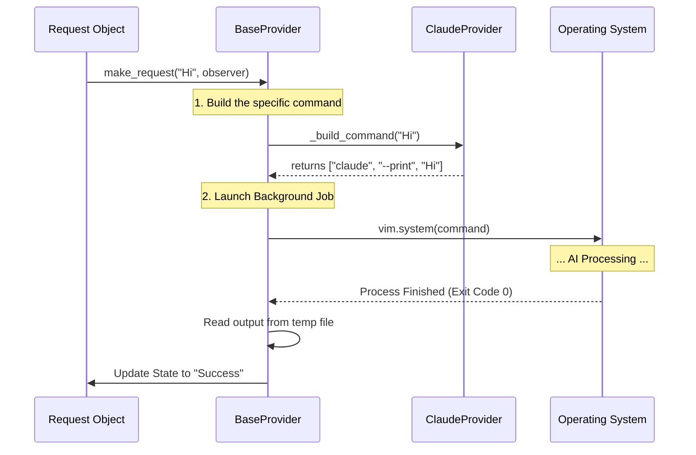

# Chapter 7: AI Providers (Backends)

In the previous chapter, [Context Intelligence (LSP & Tree-sitter)](06_context_intelligence__lsp___tree_sitter_.md), we learned how to gather intelligent context (like function definitions) to make our prompt smarter. Before that, in [The Request Lifecycle](05_the_request_lifecycle.md), we built the object that manages the waiting time.

Now, we have a fully prepared "Package" (the Prompt) containing your code and instructions. But who actually delivers it to the AI model?

In this chapter, we will build the **Couriers** (AI Providers).

## The Motivation: Courier Services

Imagine you have a package to send. You don't fly the plane yourself. You hire a courier.
*   **FedEx** requires you to fill out Form A.
*   **UPS** requires you to fill out Form B.
*   **DHL** requires a specific box size.

In the world of AI, there are many tools that run models on your command line: `opencode`, `claude`, `cursor-agent`, `kiro-cli`.

Each tool expects different arguments:
*   `opencode run -m model "prompt"`
*   `claude --print "prompt"`

If we hard-coded one tool into **99**, users with different tools couldn't use our plugin.

The **Provider Abstraction** acts as a universal adapter. It lets the plugin say *"Send this package"* without worrying about which truck carries it.

## Key Concepts

### 1. The Interface (`BaseProvider`)
This is the "Parent Class". It defines the standard behavior that *every* provider must follow. It handles the boring stuff: logging, starting the background process, and reading the output file.

### 2. The Implementation (The Children)
These are specific files for specific tools (e.g., `ClaudeCodeProvider`). Their only job is to translate the generic request into the specific command-line flags that `claude` or `opencode` expects.

### 3. The `vim.system`
Neovim is single-threaded. If we ran a command like `os.execute("claude ...")`, your editor would freeze until the AI finished generating text.
We use `vim.system` to run these commands in the background (asynchronously), keeping your editor buttery smooth.

## Usage: Switching Couriers

The user selects which "Courier" they want to use in the global configuration (covered in [Global State & Entry Point](01_global_state___entry_point.md)).

**Example Config:**

```lua
require("99").setup({
  -- We specify the provider class here
  provider = "claude", 
  model = "claude-3-5-sonnet"
})
```

Internal logic (Conceptual):
```lua
local Providers = require("99.providers")

-- The plugin picks the right tool based on config
local current_provider = Providers.ClaudeCodeProvider

-- We call the standard method
current_provider:make_request("Write code", request_obj, observer)
```

## Implementation: Under the Hood

How does the plugin actually talk to the command line? Let's trace the flow.

### The Delivery Process



### 1. The Specifics (The Child)
The child classes are incredibly simple. They just return a list of strings that represent the command line arguments.

Here is the `ClaudeCodeProvider`:

```lua
-- lua/99/providers.lua

local ClaudeCodeProvider = setmetatable({}, { __index = BaseProvider })

function ClaudeCodeProvider._build_command(_, query, request)
  return {
    "claude",                         -- The command
    "--dangerously-skip-permissions", -- Auto-approve
    "--model", request.context.model, -- The model from State
    "--print",                        -- Output to stdout
    query,                            -- The actual prompt
  }
end
```
*Explanation:* This function doesn't run anything. It just prepares the "shopping list" of arguments.

Here is `OpenCodeProvider` for comparison:

```lua
-- lua/99/providers.lua

function OpenCodeProvider._build_command(_, query, request)
  return {
    "opencode",
    "run",
    "--agent", "build",
    "-m", request.context.model,
    query,
  }
end
```
*Explanation:* See how the arguments differ? `opencode` needs `run` and `--agent`. The BaseProvider doesn't need to know this; it just asks for the list.

### 2. The Engine (The BaseProvider)
The `BaseProvider` does the heavy lifting. It takes the command list and executes it.

```lua
-- lua/99/providers.lua (Simplified)

function BaseProvider:make_request(query, request, observer)
  -- 1. Ask the child for the command list
  local command = self:_build_command(query, request)

  -- 2. Run it in the background
  local proc = vim.system(
    command,
    { text = true }, -- Handle output as text
    
    -- 3. Callback when finished
    vim.schedule_wrap(function(obj)
      if obj.code == 0 then
         -- Success! Read the result
         local result = self:_retrieve_response(request)
         observer.on_complete("success", result)
      else
         -- Failure
         observer.on_complete("failed", "Error running command")
      end
    end)
  )

  -- Save the process ID so we can cancel it later
  request:_set_process(proc)
end
```
*Explanation:*
1.  `_build_command`: Polymorphism in action. It calls the specific logic of whatever child is currently active.
2.  `vim.system`: This launches the external CLI tool.
3.  `request:_set_process`: We hand the process handle back to the Request object (see [The Request Lifecycle](05_the_request_lifecycle.md)) so the user can cancel it if it takes too long.

### 3. Retrieving the Response
You might notice `_retrieve_response`. Why not just use the standard output (`stdout`) from the command?

Sometimes AI output is huge. To ensure stability, many of these tools write their final answer to a temporary file. The provider reads that file to get the clean answer.

```lua
function BaseProvider:_retrieve_response(request)
  local tmp = request.context.tmp_file
  
  -- Read the file content safely
  local success, result = pcall(function()
    return vim.fn.readfile(tmp)
  end)

  -- Combine lines into one string
  return table.concat(result, "\n")
end
```

## Summary

We have built the **Transport Layer** of our plugin.

1.  We created a **BaseProvider** to handle the complex asynchronous logic of `vim.system`.
2.  We created **Child Providers** (`Claude`, `OpenCode`) to handle the specific command-line arguments of different tools.
3.  We connected this back to the **Request Object** so it can manage cancellation and state updates.

We now have the entire pipeline:
1.  **State** stores settings.
2.  **Context** reads the code.
3.  **UI** gets user input.
4.  **Ops** creates the prompt.
5.  **Providers** send it to the AI.

The final step is to put it all together and actually see the results. How do we take the raw text returned by the provider and make it useful?

[Next Chapter: Prompt Completions](08_prompt_completions.md)

---

Generated by [Code IQ](https://github.com/adityasoni99/Code-IQ)