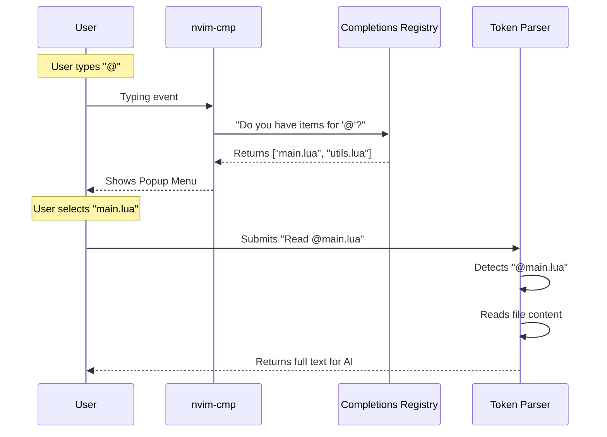

# Chapter 8: Prompt Completions

In the previous chapter, [AI Providers (Backends)](07_ai_providers__backends_.md), we built the delivery trucks that carry our messages to the AI. Before that, in [Context Intelligence (LSP & Tree-sitter)](06_context_intelligence__lsp___tree_sitter_.md), we learned how to gather code context automatically.

Now, we face a user experience problem.

When you open the **99** prompt window, you face a blank box. You might want to reference a specific file (`main.lua`) or a specific persona (`#backend-expert`). Typing these paths out manually is tedious and error-prone.

In this chapter, we will build **Prompt Completions**. This feature connects our plugin to `nvim-cmp` (Neovim's standard autocomplete engine) to give you a "smart typing" experience.

## The Motivation: Predictive Text for Code

Imagine typing a text message on your phone.
*   You type "H", and it suggests "Hello".
*   You type "I'm at the", and it suggests "Airport".

This is **Completion**. It saves time and reduces typos.

In **99**, we want to do the same, but for your project data:
1.  **Skills:** If you type `#`, we show a list of available personas (from [Agents & Rules (Skills)](03_agents___rules__skills_.md)).
2.  **Files:** If you type `@`, we show a list of files in your project.

We also need a **Parser**. When the user presses Enter, the AI doesn't want to see `#backend`. It wants to see the *content* of that rule. The Parser swaps the shortcut for the full text.

## Key Concepts

### 1. The Trigger
A trigger is a special character that tells the system "Wake up! The user wants to select something."
*   **`#`** triggers the **Rules** list.
*   **`@`** triggers the **Files** list.

### 2. The Registry
This is a central list of all available completion sources. It's like a phone book. When `nvim-cmp` asks for suggestions, the Registry checks who is responsible for the current trigger.

### 3. The Resolution (Swapping)
This is the hidden magic.
*   **User sees:** "Please refactor `@main.lua`"
*   **AI receives:** "Please refactor `[Content of main.lua...]`"

We must find these "tokens" in the text and replace them with their actual content before sending the request.

## Usage: The User Experience

This abstraction works automatically in the background, but here is what the user experiences.

1.  User opens the **99** prompt window.
2.  User types: `Fix the bug in @`
3.  A popup menu appears listing files: `main.lua`, `config.lua`, etc.
4.  User selects `main.lua` and presses Enter.
5.  User submits the request.

Behind the scenes, the plugin reads `main.lua` and attaches it to the prompt.

## Implementation: Under the Hood

How do we connect the prompt window to the autocomplete engine?

### The Flow



### 1. The Registry (`extensions/completions.lua`)
We need a place to store our providers. A provider is just an object that knows its trigger character (e.g., `@`) and how to find items.

```lua
-- lua/99/extensions/completions.lua

local providers = {}
local M = {}

-- Add a new provider (like the File provider or Agent provider)
function M.register(provider)
  -- If one exists with this trigger, replace it
  for i, p in ipairs(providers) do
    if p.trigger == provider.trigger then
      providers[i] = provider
      return
    end
  end
  table.insert(providers, provider)
end
```
*Explanation:* This allows different parts of our system (Files, Agents) to plug themselves in. The Registry doesn't know *how* to find files; it just knows *who* to ask.

### 2. Getting Suggestions
When `nvim-cmp` asks "What should I show?", we look at what the user just typed.

```lua
-- lua/99/extensions/completions.lua

function M.get_completions(trigger_char)
  -- Find the provider responsible for this character
  for _, provider in ipairs(providers) do
    if provider.trigger == trigger_char then
      -- Ask that provider for the list
      return provider.get_items()
    end
  end
  return {}
end
```
*Explanation:* If the trigger was `#`, we find the Rules provider and ask for its items. If it was `@`, we ask the Files provider.

### 3. Parsing (The Magic Swap)
This is the most critical logic for the AI. We scan the final string for our triggers and "resolve" them into real content.

```lua
-- lua/99/extensions/completions.lua

function M.parse(prompt_text)
  local refs = {}
  
  -- Loop through all known triggers (e.g., #, @)
  for _, provider in ipairs(providers) do
    -- Build a pattern to find words starting with the trigger
    -- e.g. "@%S+" finds "@filename"
    local pattern = provider.trigger .. "%S+"
    
    for word in prompt_text:gmatch(pattern) do
      -- Strip the trigger to get the ID (e.g., "filename")
      local token = word:sub(#provider.trigger + 1)
      
      -- Ask the provider for the content
      if provider.is_valid(token) then
         local content = provider.resolve(token)
         table.insert(refs, { content = content })
      end
    end
  end
  return refs
end
```
*Explanation:*
1.  We look for words starting with `@` or `#`.
2.  We extract the name (e.g., `main.lua`).
3.  We call `.resolve()` on the provider. For a file provider, this reads the file from disk.
4.  We return a list of contents to be attached to the AI prompt.

### 4. Connecting to Neovim (`extensions/cmp.lua`)
Finally, we need to bridge our Registry to `nvim-cmp`. Neovim's completion system expects a specific format.

```lua
-- lua/99/extensions/cmp.lua

function CmpSource.complete(_, params, callback)
  -- Get the text before the cursor
  local before = params.context.cursor_before_line or ""

  -- Check if the text ends with one of our triggers
  local trigger = nil
  for _, char in ipairs(Completions.get_trigger_characters()) do
    if before:match(char .. "%S*$") then
      trigger = char
      break
    end
  end

  -- If we found a trigger, get suggestions!
  if trigger then
    local items = Completions.get_completions(trigger)
    callback({ items = items, isIncomplete = false })
  else
    callback({ items = {}, isIncomplete = false })
  end
end
```
*Explanation:* This checks the cursor position. If the user just typed `@`, it calls our registry. It then formats the list so Neovim can display the popup menu.

## Putting It All Together

We have now built the complete loop for the **99** plugin project!

1.  **State:** We initialize the plugin.
2.  **UI:** We open a window.
3.  **Completion:** The user types `Fix @main.lua`. We autocomplete the filename.
4.  **Parsing:** We read `main.lua` from disk.
5.  **Context:** We use Tree-sitter/LSP to add extra definition info.
6.  **Ops:** We organize this into a Request.
7.  **Providers:** We send it to the AI (Claude/OpenAI).
8.  **Handler:** The AI responds, and we update the code.

## Series Conclusion

Congratulations! You have navigated the architecture of a complex Neovim AI plugin.

By breaking **99** down into these 8 distinct layers, we've turned a massive, intimidating codebase into a set of manageable, logical components.
*   The **State** is the memory.
*   The **UI** is the face.
*   The **Agents** are the personalities.
*   The **Ops** are the actions.
*   The **Requests** are the couriers.
*   The **Context** is the eyes.
*   The **Providers** are the engines.
*   The **Completions** are the helping hand.

You now have the knowledge to extend **99**, fix bugs, or even write your own plugin from scratch using these patterns. Happy coding!

---

Generated by [Code IQ](https://github.com/adityasoni99/Code-IQ)