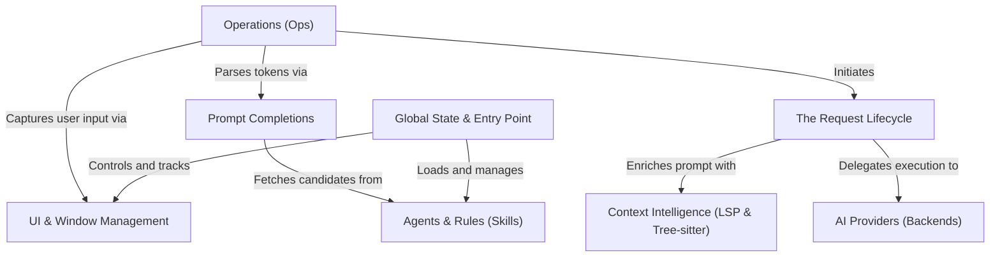

# Tutorial: 99

The **99** project is a sophisticated *AI assistant plugin* for Neovim that bridges your code editor with powerful AI models. It acts as a "Control Tower," managing context-aware **Requests** that leverage *LSP and Tree-sitter* to understand your code's structure. Users can execute operations like searches or refactors through a floating **UI**, using customizable *Skills* (Agents) to steer the AI's personality and expertise.

**Source Repository:** [https://github.com/ThePrimeagen/99](https://github.com/ThePrimeagen/99)

## Chapters

1. [Global State & Entry Point](01_global_state___entry_point.md)
2. [UI & Window Management](02_ui___window_management.md)
3. [Agents & Rules (Skills)](03_agents___rules__skills_.md)
4. [Operations (Ops)](04_operations__ops_.md)
5. [The Request Lifecycle](05_the_request_lifecycle.md)
6. [Context Intelligence (LSP & Tree-sitter)](06_context_intelligence__lsp___tree_sitter_.md)
7. [AI Providers (Backends)](07_ai_providers__backends_.md)
8. [Prompt Completions](08_prompt_completions.md)

---

Generated by [Code IQ](https://github.com/adityasoni99/Code-IQ)