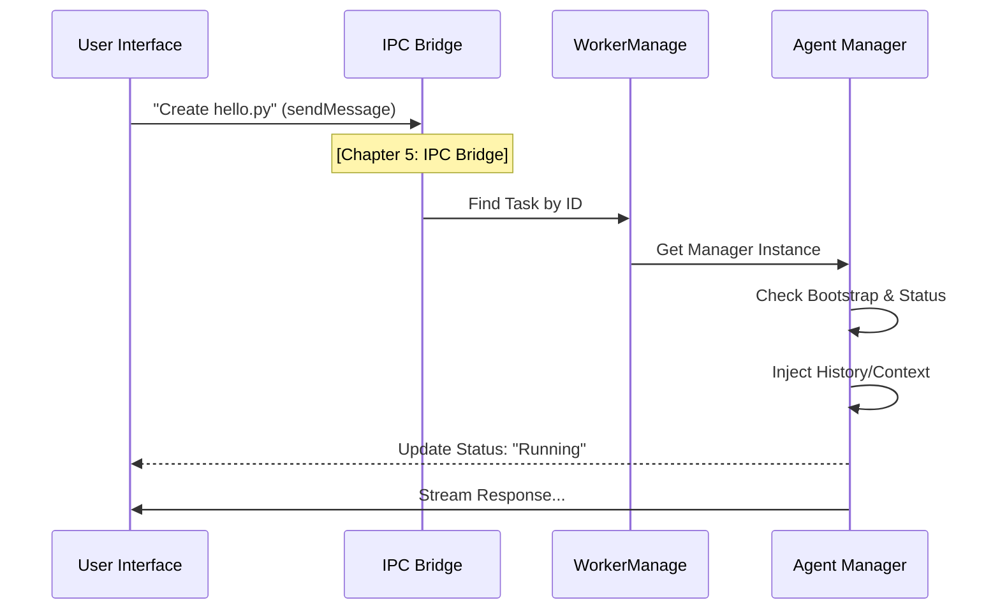

# Chapter 1: Agent Task Orchestration

Welcome to the first chapter of the **AionUi** developer guide! 

In this series, we will explore how AionUi builds powerful AI interfaces. We start with the most critical component: the **Agent Manager**.

### The Motivation: The "Project Manager" Analogy

Imagine you are a Client (the **User Interface**) who wants to build a website. You could try to talk directly to the raw AI models (like Gemini or Codex), acting as the Specialists. However, raw AI models are like brilliant but disorganized geniuses:
*   They don't remember previous conversations unless you remind them every time.
*   They might try to delete files without asking.
*   They stop working if the internet flickers.

You need a middleman. You need a **Project Manager**.

In AionUi, this Project Manager is the **Agent Task Orchestration** layer. It sits between the UI and the raw AI. It hires the right specialist, manages the project files (Context), remembers the history (State), and asks you for permission before doing anything risky (Approvals).

### The Use Case: "Write a File"

Let's look at a simple scenario we want to solve in this chapter:

1.  **User says:** "Create a file named `hello.py`."
2.  **System:** Receives the message, finds the active session, and sends it to the AI.
3.  **AI:** Says "I need to run a command to create this file."
4.  **System:** Catches this request, pauses the AI, and asks the User: "Do you approve?"
5.  **User:** Clicks "Yes."
6.  **System:** Tells the AI to proceed.

The **Agent Manager** handles steps 2, 4, and 6.

---

### Key Concept: The Agent Manager

The Agent Manager is a class (like `GeminiAgentManager` or `CodexAgentManager`) that wraps the raw AI. It ensures the AI behaves like a reliable employee.

#### 1. Sending a Message
When the UI sends a message, it doesn't send it to the cloud immediately. It sends it to the Manager. The Manager ensures the "office is open" (bootstrapped) before passing the note.

```typescript
// Conceptual usage inside the Manager
async sendMessage(data) {
  // 1. Tell the UI we are busy working
  this.status = 'running'; 

  // 2. Ensure the agent is fully loaded (bootstrapped)
  await this.bootstrap;

  // 3. Actually send the data to the AI logic
  await super.sendMessage(data);
}
```
*   **Input:** Text like "Hello" or file attachments.
*   **Output:** The Manager updates its status to `running`, starts a spinner in the UI, and eventually streams the response back.

#### 2. The "YOLO" Mode (Auto-Approval)
Sometimes, you trust the AI completely. We call this **YOLO Mode** (You Only Live Once). The Manager checks this setting before bothering the user.

```typescript
// Inside GeminiAgentManager.ts
private tryAutoApprove(content) {
  // Check if we are in "YOLO" mode
  if (this.currentMode === 'yolo') {
    console.log("Auto-approving operation!");
    
    // Automatically say "Yes" to the tool execution
    this.postMessagePromise(content.callId, 'ProceedOnce');
    return true; 
  }
  return false; // Otherwise, we must ask the User
}
```
*   **Explanation:** If `currentMode` is `'yolo'`, the Manager acts on your behalf and instantly approves the tool. If not, it halts and waits for the UI.

---

### Under the Hood: How It Works

How does a click in the UI travel all the way to the Agent Manager? Let's visualize the flow.



#### The Bridge Layer
The entry point for all orchestration is `conversationBridge.ts`. This acts as the receptionist. It receives requests from the frontend and routes them to the correct Manager.

We use the **IPC Bridge** here, which is covered in detail in [Chapter 5: IPC Bridge (Inter-Process Communication)](05_ipc_bridge__inter_process_communication_.md).

```typescript
// src/process/bridge/conversationBridge.ts

// The bridge listens for the 'sendMessage' event from the UI
ipcBridge.conversation.sendMessage.provider(async ({ conversation_id, input }) => {
  
  // 1. Find the specific Project Manager (Task) for this conversation
  const task = WorkerManage.getTaskById(conversation_id);

  if (!task) return { success: false, msg: 'Manager not found' };

  // 2. Hand over the message to the Manager
  // The bridge doesn't care HOW the task is done, just that it gets assigned.
  await task.sendMessage({ input });

  return { success: true };
});
```

#### The Manager Implementation (`GeminiAgentManager`)
Once the bridge hands off the task, the specific Manager takes over. In `GeminiAgentManager.ts`, we handle the specific quirks of the Gemini AI.

**State & History Injection:**
Before the AI answers, the Manager checks if there is old history (chat logs) that needs to be loaded so the AI remembers context.

```typescript
// src/process/task/GeminiAgentManager.ts

private async injectHistoryFromDatabase(): Promise<void> {
  // 1. Get recent messages from the database
  const messages = await db.getMessages(this.conversation_id);
  
  // 2. Format them for the AI
  const formattedHistory = this.formatForGemini(messages);

  // 3. Load them into the AI's memory
  await this.model.injectHistory(formattedHistory);
}
```

**Tool Confirmation:**
When the AI wants to use a tool (covered in [Chapter 3: Tools & Skills Framework](03_tools___skills_framework.md)), the Manager intercepts the request.

```typescript
// src/process/task/GeminiAgentManager.ts

// Called when the AI initiates a tool call
private handleConformationMessage(message) {
  // 1. Check if we can auto-approve (YOLO mode)
  if (this.tryAutoApprove(message)) return;

  // 2. If not, prepare a confirmation request for the UI
  this.addConfirmation({
    id: message.callId,
    title: "Allow Execution?",
    description: message.command,
    options: ["Yes", "Always Allow", "No"]
  });
}
```
This pauses the AI's execution flow until the user responds via the UI.

### Summary

In this chapter, we learned:
1.  **Agent Managers** act as "Project Managers" between the UI and the raw AI.
2.  They handle **Lifecycle** (starting/stopping), **State** (history injection), and **Approvals** (YOLO mode vs. manual confirm).
3.  The **Bridge** connects the UI to these Managers.

Now that we know *who* manages the agents, we need to understand *how* we talk to different types of agents (like Gemini vs. Codex).

Next, we will look at **Agent Protocol Adapters** to see how AionUi translates a common language into specific AI protocols.

[Next Chapter: Agent Protocol Adapters](02_agent_protocol_adapters.md)

---

Generated by [Code IQ](https://github.com/adityasoni99/Code-IQ)