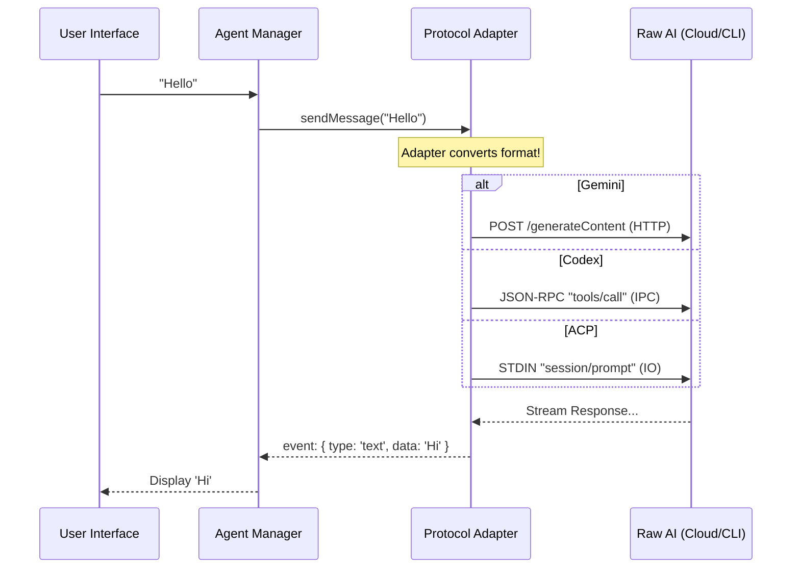

# Chapter 2: Agent Protocol Adapters

Welcome back! In the previous chapter, [Agent Task Orchestration](01_agent_task_orchestration.md), we learned about the **Agent Manager**—the "Project Manager" that assigns tasks and manages permissions.

But there is a problem. The Project Manager speaks one language (AionUi internal commands), but the workers (the AI models) speak many different languages.

### The Motivation: The "Universal Translator"

Imagine you have three workers:
1.  **Gemini** lives in the cloud and only speaks **HTTP API**.
2.  **Codex** is a program on your computer that speaks **MCP (Model Context Protocol)**.
3.  **Claude (via ACP)** is a command-line tool that communicates via **Standard I/O** (typing text into a terminal).

If the User Interface (UI) had to learn all three languages, the code would be a mess.

**Agent Protocol Adapters** are the translators. They take a generic command from the UI ("Send Message") and convert it into the specific dialect required by the AI.

### The Use Case: "Say Hello"

Let's trace a simple command: **"Say Hello"**.

*   **AionUi Internal:** `sendMessage("Hello")`
*   **Gemini Adapter:** Converts to `POST https://... { content: "Hello" }`
*   **Codex Adapter:** Converts to JSON-RPC `{"method": "tools/call", "args": {"prompt": "Hello"}}`
*   **ACP Adapter:** Writes `{"jsonrpc": "2.0", "method": "session/prompt", ...}` to a hidden terminal process.

---

### Concept 1: The Cloud Adapter (Gemini)

The `GeminiAgent` connects to Google's servers. Its main job is handling **Streams**. When an AI replies, it doesn't send the whole text at once; it sends it letter by letter (streaming).

The adapter must catch these droplets of text and assemble them into a meaningful message for the UI.

#### Handling the Stream
Inside `src/agent/gemini/index.ts`, we see how the agent listens to the cloud:

```typescript
// Inside GeminiAgent.ts (Simplified)
private async handleMessage(stream, msg_id) {
  // 1. Loop through every "chunk" of data coming from Google
  for await (const chunk of stream) {
    
    // 2. Convert raw data into an AionUi event
    this.onStreamEvent({
      type: 'text',       // It's a text chunk
      data: chunk.text(), // The actual text (e.g., "Hel")
      msg_id: msg_id
    });
  }
}
```
*   **Input:** A raw network stream.
*   **Action:** The adapter loops through the stream.
*   **Output:** Uniform events (`type: 'text'`) that the UI understands.

#### Resilience (The "Bad Connection" Fixer)
Sometimes streams break. The adapter handles retries so the user doesn't have to.

```typescript
// Inside GeminiAgent.ts (Simplified Logic)
if (data.type === 'invalid_stream' && retryCount < 2) {
  console.log("Stream broke. Retrying automatically...");
  
  // Wait 1 second
  await wait(1000); 
  
  // Try sending the message again
  return this.handleMessage(newStream, ...);
}
```

---

### Concept 2: The Local CLI Adapter (Codex/MCP)

Unlike Gemini, **Codex** runs locally on your machine. We don't use HTTP; we use the **Model Context Protocol (MCP)**. This is like a formalized handshake between two programs.

This logic lives in `src/agent/codex/core/CodexAgent.ts`.

#### Connecting to the Process
Instead of a URL, we look for a program path.

```typescript
// Inside CodexAgent.ts
async start() {
  // 1. Start the CLI tool on your computer
  await this.conn.start('codex', this.workingDir);

  // 2. Perform the MCP Handshake (Say "Hello, I am AionUi")
  await this.conn.request('initialize', {
    clientInfo: { name: 'AionUi', version: '1.0' }
  });
}
```

#### Sending a Request
When we send a prompt, it's wrapped in a JSON-RPC envelope.

```typescript
// Inside CodexAgent.ts
async sendPrompt(prompt: string) {
  // We call the 'tools/call' method on the local process
  await this.conn.request('tools/call', {
    name: 'codex-reply',
    arguments: { 
      prompt: prompt,
      conversationId: this.conversationId 
    }
  });
}
```
*   **What happens?** The adapter sends a JSON object to the running Codex process. Codex thinks about it and sends a JSON object back.

---

### Concept 3: The Standard I/O Adapter (ACP)

**ACP** (Agent Communication Protocol) is used for tools like `Claude Code` or `Goose`. It is similar to Codex but runs over **Standard Input/Output (Stdio)**.

Imagine slipping notes under a door. You slide a note (JSON) under the door (Stdin), and the agent slides a response note back (Stdout).

This is handled in `src/agent/acp/AcpConnection.ts`.

#### Spawning the "Hidden" Terminal
We spawn a child process—a background terminal that the user doesn't see.

```typescript
// Inside AcpConnection.ts
async connect(backend, cliPath) {
  // Spawn the command (e.g., 'claude' or 'goose')
  this.child = spawn(cliPath, [], {
    stdio: ['pipe', 'pipe', 'pipe'] // Create the "pipes" (the door gap)
  });

  // Listen for notes coming OUT from under the door
  this.child.stdout.on('data', (data) => {
    this.handleMessage(JSON.parse(data));
  });
}
```

#### Writing to the Agent
To talk to the agent, we write directly to its input stream.

```typescript
// Inside AcpConnection.ts
private sendMessage(message) {
  // Convert our object to a string
  const jsonString = JSON.stringify(message);
  
  // Write it to the child process's Standard Input
  this.child.stdin.write(jsonString + '\n');
}
```

---

### Under the Hood: The Flow

How does the system ensure the UI treats all these distinct agents exactly the same?



### Summary

In this chapter, we learned:
1.  **Protocol Adapters** act as translators between AionUi and specific AI backends.
2.  **GeminiAgent** handles HTTP requests and stream resilience (retries).
3.  **CodexAgent** manages a local process using the MCP protocol.
4.  **AcpConnection** manages background processes via Standard I/O (piping data in and out).

Now we have a Manager (Chapter 1) and we can Talk to the AI (Chapter 2). But an AI that only talks is just a chatbot. We want an agent that can *do* things—like edit files or run commands.

Next, we will explore how we give these agents actual capabilities.

[Next Chapter: Tools & Skills Framework](03_tools___skills_framework.md)

---

Generated by [Code IQ](https://github.com/adityasoni99/Code-IQ)