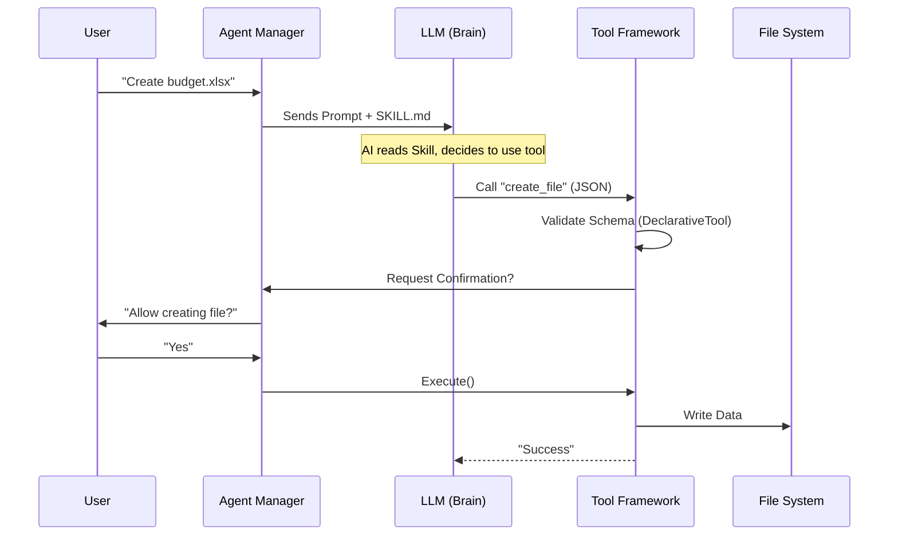

# Chapter 3: Tools & Skills Framework

Welcome back! In the previous chapter, [Agent Protocol Adapters](02_agent_protocol_adapters.md), we learned how AionUi acts as a "Universal Translator" to speak to different AI models.

At this point, we have an AI that can *talk*. But an AI that can only talk is just a fancy chatbot. We want an AI that can **work**. We want it to edit code, create spreadsheets, and read PDFs.

### The Motivation: The "Brain" needs "Hands"

Think of the Large Language Model (LLM) as a brilliant brain in a jar.
*   **The Brain (LLM):** Can think, plan, and write code on an imaginary whiteboard.
*   **The Problem:** It has no hands. It cannot reach out and actually create a file on your hard drive. It might say, "I have created the file," because it *hallucinated* doing the work, but nothing happened.

The **Tools & Skills Framework** gives the AI "hands."
1.  **Tools (The Code):** The actual TypeScript functions that perform actions (e.g., `fs.writeFile`).
2.  **Skills (The Manual):** Detailed documentation that teaches the AI *how* and *when* to use those tools.

### The Use Case: "Create a Spreadsheet"

Let's imagine the user says: **"Make an Excel file with a budget for 2024."**

If we just send this to raw ChatGPT, it will spit out a text table. But with the Tools & Skills Framework:
1.  The AI reads the **Skill** (Manual) on how to handle Excel files.
2.  The AI decides to call the **Tool** named `create_xlsx`.
3.  AionUi intercepts this, validates the data, and runs the code to actually generate the `.xlsx` file.

---

### Key Concept 1: The Skill (The Instruction Manual)

Before the AI tries to do a job, it needs to read the manual. In AionUi, these are Markdown files (like `SKILL.md`).

This isn't code; it's **Prompt Engineering** stored as a file. It tells the AI best practices, common pitfalls, and formatting rules.

#### Example: The Excel Skill
Here is a simplified look at `skills/xlsx/SKILL.md` (from the provided context):

```markdown
# XLSX creation, editing, and analysis

## CRITICAL: Use Formulas, Not Hardcoded Values
Always use Excel formulas instead of calculating values in Python.

### ❌ WRONG
sheet['B10'] = 5000  # Hardcoded

### ✅ CORRECT
sheet['B10'] = '=SUM(B2:B9)' # Dynamic formula
```

*   **Why is this here?** Without this file, the AI might calculate `2 + 2` in its head and write `4` into the cell. If the user later changes the input to `3`, the result stays `4`. This manual forces the AI to write `=2+2` so the spreadsheet actually works!

---

### Key Concept 2: The Tool (The Code Implementation)

Once the AI knows *how* to behave, it needs a way to act. We build tools using the `DeclarativeTool` class found in `src/agent/gemini/cli/tools/tools.ts`.

A tool has two main parts:
1.  **Schema:** Describes the inputs (so the AI knows what parameters to send).
2.  **Execution:** The actual code that runs.

#### 1. Defining the Tool
We extend `BaseDeclarativeTool`. This handles all the messy validation logic for us.

```typescript
// Example: A simplified Create File tool
import { BaseDeclarativeTool } from './tools';

export class CreateFileTool extends BaseDeclarativeTool {
  constructor() {
    super(
      'create_file',             // Tool Name (for AI)
      'Create File',             // Display Name (for UI)
      'Writes text to a file',   // Description
      Kind.Edit,                 // Category
      {                          // JSON Schema for inputs
        type: 'object',
        properties: {
          path: { type: 'string' },
          content: { type: 'string' }
        }
      }
    );
  }
// ... implementation continues below
```

#### 2. The Execution Logic
We implement a `createInvocation` method. This returns the actual "Action" the tool performs.

```typescript
  protected createInvocation(params: any) {
    return {
      // 1. Tell the UI what we are about to do (for confirmation dialogs)
      getDescription: () => `Creating file at ${params.path}`,
      
      // 2. The actual work happens here
      execute: async (signal) => {
        await fs.writeFile(params.path, params.content);
        
        return { 
          returnDisplay: "File created successfully!",
          llmContent: "File created." 
        };
      }
    };
  }
}
```
*   **Input:** The AI sends a JSON object: `{ path: "budget.txt", content: "..." }`.
*   **Action:** The `execute` function runs `fs.writeFile`.
*   **Output:** The tool returns a success message to the AI.

---

### Key Concept 3: Safety & Confirmation

Giving an AI "hands" is dangerous. You don't want it to delete your operating system.

The framework includes a **Confirmation System**. Before `execute()` runs, the framework asks: "Do we need user permission?"

This is defined in the `ToolInvocation` interface:

```typescript
// Inside a ToolInvocation
shouldConfirmExecute(abortSignal): Promise<ToolCallConfirmationDetails | false>;
```

If this returns data, the [Agent Task Orchestration](01_agent_task_orchestration.md) layer (Chapter 1) pauses everything and shows a pop-up to the user: *"The AI wants to edit 'budget.xlsx'. Allow?"*

---

### Under the Hood: The Tool Lifecycle

How does a text request become a file on your disk?



#### Deep Dive: `validateBuildAndExecute`

In `src/agent/gemini/cli/tools/tools.ts`, there is a critical method called `validateBuildAndExecute`. This is the safe-guard wrapper around every tool.

1.  **Validation:** It checks if the AI sent garbage data (e.g., missing filename).
2.  **Building:** It constructs the tool instance.
3.  **Execution:** It runs the tool and catches errors so the whole app doesn't crash.

```typescript
// src/agent/gemini/cli/tools/tools.ts

async validateBuildAndExecute(params, abortSignal) {
  // 1. Try to build the tool (Checks JSON Schema)
  const invocationOrError = this.silentBuild(params);
  
  // 2. If validation fails, tell the AI nicely
  if (invocationOrError instanceof Error) {
    return {
      llmContent: `Error: Invalid parameters. ${invocationOrError.message}`,
      error: { type: ToolErrorType.INVALID_TOOL_PARAMS }
    };
  }

  // 3. If valid, try to Execute
  try {
    return await invocationOrError.execute(abortSignal);
  } catch (error) {
    // Handle crashes gracefully
    return {
       llmContent: `Error: Execution failed. ${error.message}`
    };
  }
}
```

### Summary

In this chapter, we learned:
1.  **Skills** are markdown manuals that teach the AI *how* to do a job (like formatting Excel formulas correctly).
2.  **Tools** are TypeScript classes (extending `DeclarativeTool`) that perform the actual work.
3.  **Validation & Confirmation** ensures the AI doesn't break things or act without permission.

Now the AI can manage tasks, talk to us, and use tools to edit files. But how do we get the AI to write *better* responses? How do we structure the prompts that are sent to the brain?

Next, we will look at **Prompt Engineering Protocols** to see how we construct the perfect query.

[Next Chapter: Prompt Engineering Protocols](04_prompt_engineering_protocols.md)

---

Generated by [Code IQ](https://github.com/adityasoni99/Code-IQ)