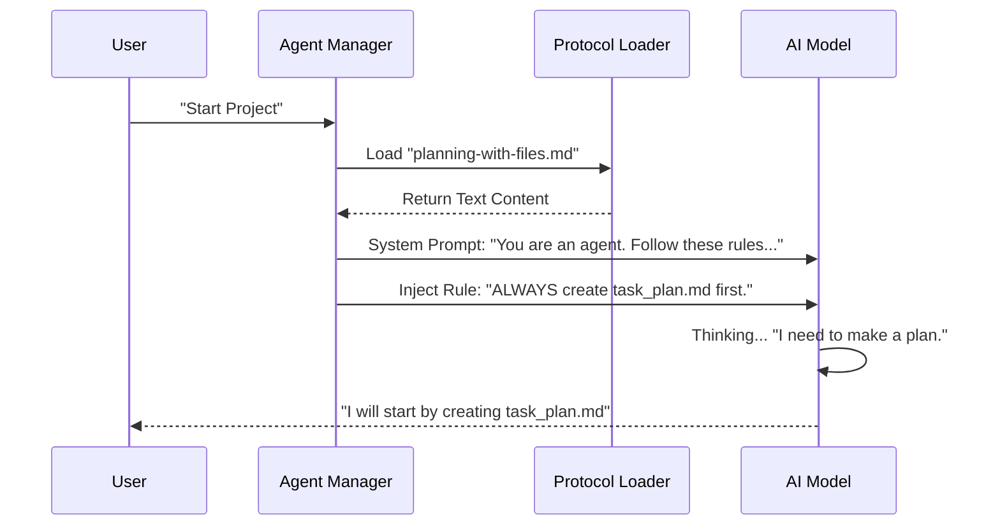

# Chapter 4: Prompt Engineering Protocols

Welcome back! In the previous chapter, [Tools & Skills Framework](03_tools___skills_framework.md), we gave our AI "hands" so it can edit files and run commands.

Now we have a powerful agent, but we face a new problem: **The Goldfish Memory.**

### The Motivation: The "Employee Handbook"

Raw AI models have a limited "Context Window" (short-term memory). If you ask an AI to build a complex website, by step 50, it often forgets what it decided in step 1. It starts hallucinating, repeating mistakes, or losing track of files it created.

**Prompt Engineering Protocols** are the solution.

Think of this not as code, but as an **Employee Handbook** (Standard Operating Procedure). It is a rigorous set of rules we feed the AI that forces it to:
1.  **Write down its plan** before starting.
2.  **Log its findings** to a file (Long-term memory) instead of keeping them in its head (RAM).
3.  **Check off tasks** as it finishes them.

### The Use Case: "Build a Web App"

Imagine a user says: **"Create a full To-Do app with a database."**

Without a protocol, the AI rushes in, writes code, forgets to create the database, and crashes.
With the **Planning Protocol**, the AI pauses and says:
*"I must first create a `task_plan.md` file to map out this project."*

---

### Key Concept 1: RAM vs. Disk

The core philosophy of our protocols is simple:
*   **Context Window = RAM:** It is fast but volatile. If the conversation gets too long, old memories are deleted.
*   **Filesystem = Hard Drive:** It is permanent.

**The Rule:** If it is important, the AI *must* write it to a markdown file on the disk.

### Key Concept 2: The "3-File Pattern" (Manus-Style)

We enforce a specific workflow called the **3-File Pattern**. For any complex task, the AI acts like a project manager and creates three specific files:

#### 1. The Map (`task_plan.md`)
This tracks *what* needs to be done.
```markdown
# Task Plan
## Goal: Build To-Do App
- [x] Phase 1: Setup React project (Status: Complete)
- [ ] Phase 2: Create Database (Status: In Progress)
- [ ] Phase 3: Add Styling (Status: Pending)
```

#### 2. The Notebook (`findings.md`)
This tracks *what was learned*. If the AI reads a PDF or documentation, it summarizes it here so it doesn't have to read it again.
```markdown
# Findings
- The user wants a dark mode interface.
- We are using SQLite for the database.
- Note: The API port is 3000.
```

#### 3. The Logbook (`progress.md`)
This tracks *history*. Every time the AI runs a test or hits an error, it logs it here.
```markdown
# Progress Log
- 10:00 AM: Ran `npm install`. Success.
- 10:05 AM: Error `db not found`. 
- 10:06 AM: Fixed error by creating folder.
```

---

### Key Concept 3: The Hooks (The Rules of Engagement)

Just having files isn't enough. The Protocol defines **Rules** on *when* to use them.

1.  **Session Start:** You *must* create the 3 files immediately.
2.  **Before Acting:** You *must* read `task_plan.md` to remember your goal.
3.  **After Acting:** You *must* update the checkbox in `task_plan.md` to `[x]`.

This prevents the AI from getting lost. It always knows "Where am I?" and "What is next?" by reading the file.

---

### Key Concept 4: Specialist Protocols (UI/UX Pro Max)

Protocols aren't just for planning. They can be for specific skills.

The **UI/UX Pro Max** protocol is a guide that turns a generic coder into a Design Expert. It forces the AI to follow a strict design process:

1.  **Analyze:** Identify the industry (e.g., "Healthcare").
2.  **Search:** Look up color palettes (e.g., "Blue/White for trust").
3.  **Apply:** Only *then* write the CSS code.

Without this protocol, the AI picks random colors. With it, the AI acts like a professional designer.

---

### Under the Hood: How It Works

How do we force the AI to follow these rules? We don't change the Python/TypeScript code of the AI model. Instead, we inject these "Handbooks" into the **System Prompt** at the start of the conversation.

We use the **Agent Task Orchestration** system (from [Chapter 1](01_agent_task_orchestration.md)) to inject these files.



#### Implementation Details

The protocols are stored as Markdown files in the `assistant/` folder. The system reads them and appends them to the context.

```typescript
// src/process/task/ProtocolManager.ts (Conceptual)

export class ProtocolManager {
  
  // Load the handbook from disk
  async loadProtocol(name: string): Promise<string> {
    const path = `./assistant/${name}/${name}.md`;
    return await fs.readFile(path, 'utf-8');
  }

  // Inject it into the AI's "brain"
  async injectIntoAgent(agent: Agent, protocolName: string) {
    const rules = await this.loadProtocol(protocolName);
    
    // Add to the System Instruction (The AI's personality)
    agent.setSystemPrompt(`
      ${agent.defaultPrompt}
      
      IMPORTANT PROTOCOLS:
      ${rules}
    `);
  }
}
```

*   **Input:** The name of a protocol (e.g., "planning-with-files").
*   **Action:** Reads the markdown file and glues it to the AI's initial instructions.
*   **Result:** The AI now "knows" the rules and will voluntarily create the planning files.

#### Simulating the AI's Behavior

Once the protocol is loaded, the AI generates tool calls (from [Chapter 3](03_tools___skills_framework.md)) to fulfill the protocol requirements.

```typescript
// The AI essentially does this logically:

if (isNewProject && protocol === 'planning') {
  // Rule 1: Create Plan
  await tools.call('create_file', { 
    path: 'task_plan.md', 
    content: '# Task Plan...' 
  });
}

if (justFinishedTask) {
  // Rule 3: Update Status
  await tools.call('edit_file', {
    path: 'task_plan.md',
    change: 'Mark Phase 1 as Complete'
  });
}
```

### Summary

In this chapter, we learned:
1.  **Context is volatile (RAM), Files are permanent (Disk).**
2.  **Prompt Engineering Protocols** are text-based "Employee Handbooks" we feed the AI.
3.  The **3-File Pattern** (`task_plan`, `findings`, `progress`) keeps the AI organized during long tasks.
4.  We inject these protocols via the **Agent Manager** at the start of a session.

Now the AI is organized, has tools, and has a manager. But how do the User Interface (Frontend) and the Agent Manager (Backend) actually send messages back and forth?

Next, we will explore the **IPC Bridge**, the communication highway of our application.

[Next Chapter: IPC Bridge (Inter-Process Communication)](05_ipc_bridge__inter_process_communication_.md)

---

Generated by [Code IQ](https://github.com/adityasoni99/Code-IQ)