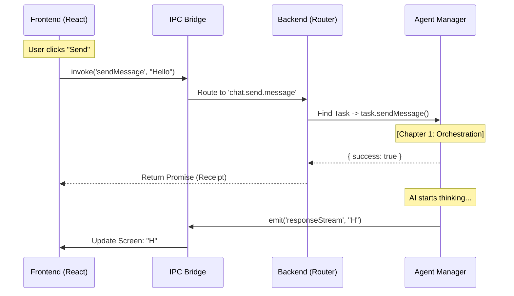

# Chapter 5: IPC Bridge (Inter-Process Communication)

Welcome back! In the previous chapter, [Prompt Engineering Protocols](04_prompt_engineering_protocols.md), we taught our AI how to plan and behave using strict text-based rules.

But we have a structural problem. AionUi is built on **Electron**. This means it is split into two separate worlds:
1.  **The Frontend (Renderer):** The visual interface (React) where the user clicks buttons. It is lightweight and safe.
2.  **The Backend (Main Process):** The "Brain" where Node.js lives. It handles files, databases, and the heavy AI logic.

### The Motivation: The "Restaurant" Analogy

Imagine a busy restaurant:
*   **The Dining Room (Frontend):** This is where the User sits. It looks nice, but customers aren't allowed to cook food or grab knives.
*   **The Kitchen (Backend):** This is where the Chefs (AI Agents) work with fire and knives (System Access).
*   **The Problem:** The Customer (User) cannot walk into the Kitchen to shout an order. It's dangerous and chaotic.

We need a Waiter. We need the **IPC Bridge**.

The **IPC (Inter-Process Communication) Bridge** is the secure telephone line between the Frontend and the Backend. It ensures that when you click "Send," the request travels safely to the Kitchen, gets cooked, and the result is served back to you.

### The Use Case: "Sending a Message"

Let's follow the journey of a single user action: **The User types "Hello" and clicks Send.**

1.  **Frontend:** UI catches the click.
2.  **Bridge:** UI calls `ipcBridge.conversation.sendMessage`.
3.  **Backend:** The Bridge receives the call and wakes up the [Agent Task Orchestration](01_agent_task_orchestration.md) layer.
4.  **Result:** The AI starts thinking.

---

### Key Concept 1: The Contract ( The Menu )

Before the Frontend and Backend can talk, they need to agree on a list of allowed commands. We call this the **Contract**.

This lives in `src/common/ipcBridge.ts`. It acts like a Restaurant Menu—you can only order what is written here.

```typescript
// src/common/ipcBridge.ts
import { bridge } from '@office-ai/platform';

export const conversation = {
  // Define a "Provider" (Request/Response)
  // Input: ISendMessageParams, Output: IBridgeResponse
  sendMessage: bridge.buildProvider<IBridgeResponse, ISendMessageParams>(
    'chat.send.message' // The internal channel ID
  ),
  
  // Define an "Emitter" (One-way stream from Backend -> Frontend)
  responseStream: bridge.buildEmitter<IResponseMessage>(
    'chat.response.stream'
  ),
};
```

*   **`buildProvider`:** Used when the UI asks for something and expects an answer (like "Send Message" -> returns "Success").
*   **`buildEmitter`:** Used when the Backend needs to shout updates (like "Here is the next word of the AI response...").

---

### Key Concept 2: The Caller ( The Customer )

Now, let's see how the **Frontend** uses this bridge. To the React developer, it looks just like calling a normal asynchronous function.

You don't need to know *how* the message gets to the backend. You just `invoke` it.

```typescript
// Inside your React UI Component
async function onSendClick(text) {
  // 1. We "invoke" the bridge function
  const result = await ipcBridge.conversation.sendMessage.invoke({
    conversation_id: 'chat-123',
    input: text,
    msg_id: 'msg-abc'
  });

  // 2. We wait for the "Receipt"
  if (result.success) {
    console.log("Message delivered to the kitchen!");
  }
}
```

*   **Explanation:** The `.invoke()` method packages your data, sends it over the electron wire, and waits for the backend to reply.

---

### Key Concept 3: The Handler ( The Chef )

On the **Backend**, we need to listen for this specific phone line. This happens in `src/process/bridge/conversationBridge.ts`.

When the phone rings, we answer it, find the right Agent Manager (from Chapter 1), and put them to work.

```typescript
// src/process/bridge/conversationBridge.ts

// We define the "provider" logic
ipcBridge.conversation.sendMessage.provider(async (params) => {
  
  // 1. Find the Manager for this conversation
  const task = WorkerManage.getTaskById(params.conversation_id);

  // 2. If valid, tell the Manager to handle the message
  if (task) {
    // This calls the logic we built in Chapter 1 & 2
    await task.sendMessage({ content: params.input });
    return { success: true };
  }

  return { success: false, msg: 'Agent not found' };
});
```

*   **Explanation:** The `.provider()` method defines the actual function that runs in the Node.js process. This is the only place allowed to touch the database or file system.

---

### Under the Hood: The Full Lifecycle

How does the data flow from a click to a response?



#### Routing to Different Agents
One of the most powerful features of the Bridge is that the Frontend doesn't care *which* AI is running. It just sends a message.

Inside the backend handler, we route it to the correct implementation (Gemini, ACP, or Codex) based on the task type.

```typescript
// src/process/bridge/conversationBridge.ts (Simplified)

ipcBridge.conversation.sendMessage.provider(async (params) => {
  const task = await WorkerManage.getTaskById(params.conversation_id);

  // The Bridge handles the routing logic
  if (task.type === 'gemini') {
    await (task as GeminiAgentManager).sendMessage(params);
  } 
  else if (task.type === 'codex') {
    // See Chapter 2: Agent Protocol Adapters
    await (task as CodexAgentManager).sendMessage(params);
  }
  
  return { success: true };
});
```

### Advanced: The "Emitter" (Streaming)

Most HTTP requests are "Ask and Wait." But AI is slow. We want to see the text appear letter-by-letter.

For this, we use an **Emitter**. The Frontend subscribes to listen, and the Backend broadcasts data whenever it wants.

**1. Backend Broadcasts:**
```typescript
// Inside the Agent Manager
ipcBridge.conversation.responseStream.emit({
  msg_id: 'msg-abc',
  data: 'Hello World'
});
```

**2. Frontend Listens:**
```typescript
// Inside React
ipcBridge.conversation.responseStream.on((event, payload) => {
  // Update the chat bubble in real-time
  updateChatUI(payload.data);
});
```

### Summary

In this chapter, we learned:
1.  **The IPC Bridge** is the safe "Waiter" connecting the UI (Dining Room) to the Backend (Kitchen).
2.  **`buildProvider`** creates a two-way Request/Response channel (like "Send Message").
3.  **`buildEmitter`** creates a one-way Broadcast channel (like "Stream AI Response").
4.  The Frontend uses `.invoke()`, and the Backend uses `.provider()` to handle the logic.

At this point, we have a fully functional application!
*   **Chapter 1:** A manager orchestrates tasks.
*   **Chapter 2:** Adapters talk to different AIs.
*   **Chapter 3:** Tools let the AI do work.
*   **Chapter 4:** Protocols keep the AI smart.
*   **Chapter 5:** The Bridge connects it all to the user.

But what if we want to talk to *other* apps? What if we want to connect AionUi to Telegram, Slack, or Lark?

Next, we will explore the **Channel & Plugin System** to extend our agent's reach beyond our own window.

[Next Chapter: Channel & Plugin System](06_channel___plugin_system.md)

---

Generated by [Code IQ](https://github.com/adityasoni99/Code-IQ)