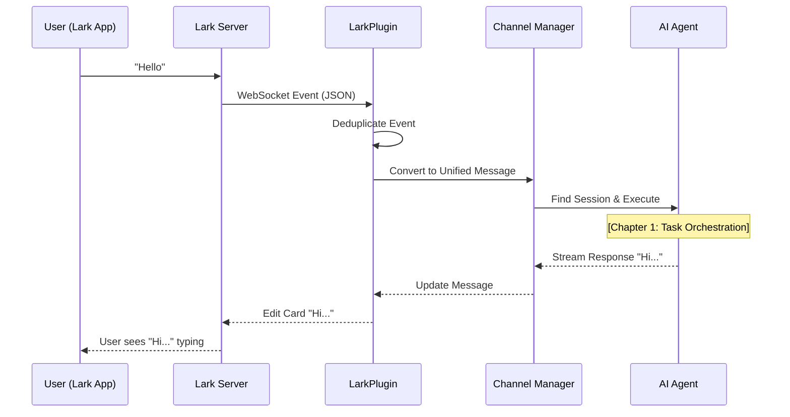

# Chapter 6: Channel & Plugin System

Welcome back! In the previous chapter, [IPC Bridge (Inter-Process Communication)](05_ipc_bridge__inter_process_communication_.md), we learned how to connect our React Frontend to our Node.js Backend using a secure bridge.

But why limit our AI to just the desktop application window?

### The Motivation: The "Call Center" Analogy

Imagine your AI agent is a super-smart employee sitting in an office.
*   **Currently:** You have to walk into the office (open the AionUi Desktop App) to talk to them.
*   **The Goal:** You want to text them from the bus, or have your team talk to them in a group chat.

The **Channel & Plugin System** acts like a **Call Center Switchboard**.
1.  It accepts calls from **Telegram**, **Lark**, **Slack**, or **DingTalk**.
2.  It translates their specific languages (external JSON) into "AionUi Standard English."
3.  It routes the message to the AI.
4.  It translates the AI's answer back to the specific platform.

### The Use Case: "Remote Control via Lark"

Let's imagine you are away from your computer. You open the **Lark** mobile app and message your bot:
**User:** "Check the server status."

Here is how the Channel System handles it:
1.  **Lark Plugin:** Hears the ping from Lark's servers.
2.  **Channel Manager:** Finds your existing session (memory).
3.  **Agent:** Runs the command (using the [Tools & Skills Framework](03_tools___skills_framework.md)).
4.  **Lark Plugin:** Updates the chat message with the result.

---

### Key Concept 1: The Channel Manager (The Boss)

The `ChannelManager` is the central hub. It is a **Singleton** (there is only ever one instance). It manages the lifecycle of all connections—turning them on when the app starts and shutting them down when the app closes.

It lives in `src/channels/core/ChannelManager.ts`.

#### Initialization
When AionUi starts, the manager loads your settings from the database and boots up the enabled plugins.

```typescript
// src/channels/core/ChannelManager.ts

async initialize(): Promise<void> {
  // 1. Initialize helper services (Session, Pairing, Plugins)
  this.pluginManager = new PluginManager(this.sessionManager);
  
  // 2. Load enabled plugins (like Telegram or Lark) from DB
  await this.loadEnabledPlugins();
  
  console.log('[ChannelManager] Listening for external messages...');
}
```
*   **What happens?** The system wakes up and checks: "Do I need to log in to Telegram? Do I need to connect to Lark?"

---

### Key Concept 2: The Plugin (The Translator)

Every platform (Lark, Telegram) speaks a different language. A **Plugin** wraps the official SDK of that platform and translates it for AionUi.

Let's look at the **Lark Plugin** (`src/channels/plugins/lark/LarkPlugin.ts`).

#### Starting the Connection (WebSocket)
We use WebSockets so you don't need a public IP address. The bot initiates an outgoing connection to Lark.

```typescript
// src/channels/plugins/lark/LarkPlugin.ts

protected async onStart(): Promise<void> {
  // 1. Create the official Lark WebSocket Client
  this.wsClient = new lark.WSClient({
    appId: this.config.credentials.appId,
    appSecret: this.config.credentials.appSecret,
  });

  // 2. Connect to Lark
  await this.wsClient.start({
    eventDispatcher: this.eventDispatcher
  });
}
```
*   **Result:** The bot is now online. If you message it in Lark, the `wsClient` receives data.

#### Sending a Message
When the AI replies, the plugin must format the text into a Lark JSON object.

```typescript
// src/channels/plugins/lark/LarkPlugin.ts

async sendMessage(chatId, message): Promise<string> {
  // 1. Convert text to a Lark "Interactive Card" (for better formatting)
  const card = this.buildTextCard(message.content);

  // 2. Send via the SDK
  const response = await this.client.im.message.create({
    params: { receive_id_type: 'open_id' },
    data: {
      receive_id: chatId,
      msg_type: 'interactive',
      content: JSON.stringify(card),
    },
  });
  
  return response.data.message_id;
}
```
*   **Why a Card?** Simple text messages in Lark are hard to edit. By using a "Card," we can update the message in real-time as the AI streams its answer.

---

### Key Concept 3: Event Deduplication (The Echo Filter)

External platforms often send the same message twice (retries due to network lag). If we aren't careful, the AI will reply twice.

The Plugin tracks processed Event IDs to ignore duplicates.

```typescript
// src/channels/plugins/lark/LarkPlugin.ts

private async handleMessageEvent(event) {
  const eventId = event.message.message_id;

  // 1. Check if we already handled this ID
  if (this.isEventProcessed(eventId)) {
    return; // Ignore it!
  }

  // 2. Mark as processed
  this.markEventProcessed(eventId);

  // 3. Process the message...
}
```

---

### Under the Hood: The Message Journey

How does a message travel from a phone in New York to your desktop in London and back?



#### The Unified Message Format
To make the `Agent` logic (Chapter 1) reusable, the `ChannelManager` converts all inputs into a standard format before processing.

**Input from Lark (Complex JSON):**
```json
{ "header": { "event_id": "123" }, "event": { "message": { "content": "{\"text\":\"Hello\"}" } } }
```

**Converted Unified Message (Internal):**
```typescript
{
  platform: 'lark',
  userId: 'user-789',
  content: {
    type: 'text',
    text: 'Hello'
  }
}
```
This allows the core AI to not care if the user is on Telegram, Lark, or the Desktop App.

### Implementation Details: Connecting the Dots

In `ChannelManager.ts`, we see how the system handles the user response. This connects back to the **Agent Task Orchestration** we learned in Chapter 1.

```typescript
// src/channels/core/ChannelManager.ts

// Wiring up the message handler during initialization
this.pluginManager.setMessageHandler(async (msg) => {
  
  // 1. Find the User's Session (Memory)
  const session = this.sessionManager.getSession(msg.userId);

  // 2. Pass the message to the Executor
  // The executor internally calls the Agent Manager
  await this.actionExecutor.handleMessage(session, msg);
});
```

### Summary

In this chapter, we learned:
1.  The **Channel & Plugin System** extends the AI's reach to external platforms.
2.  The **ChannelManager** is the singleton orchestrator.
3.  **Plugins** (like `LarkPlugin`) handle the specific translation and connection (often using WebSockets).
4.  **Deduplication** prevents the AI from answering the same message twice.

We have now covered the Agent, its Tools, its Protocols, the Frontend Bridge, and External Channels.

Our agent is powerful and accessible. But what if we want to access the **AionUi Dashboard itself** from a web browser, not just chat with the bot?

Next, we will explore the final piece of the puzzle: **Web Server & Remote Access**.

[Next Chapter: Web Server & Remote Access](07_web_server___remote_access.md)

---

Generated by [Code IQ](https://github.com/adityasoni99/Code-IQ)