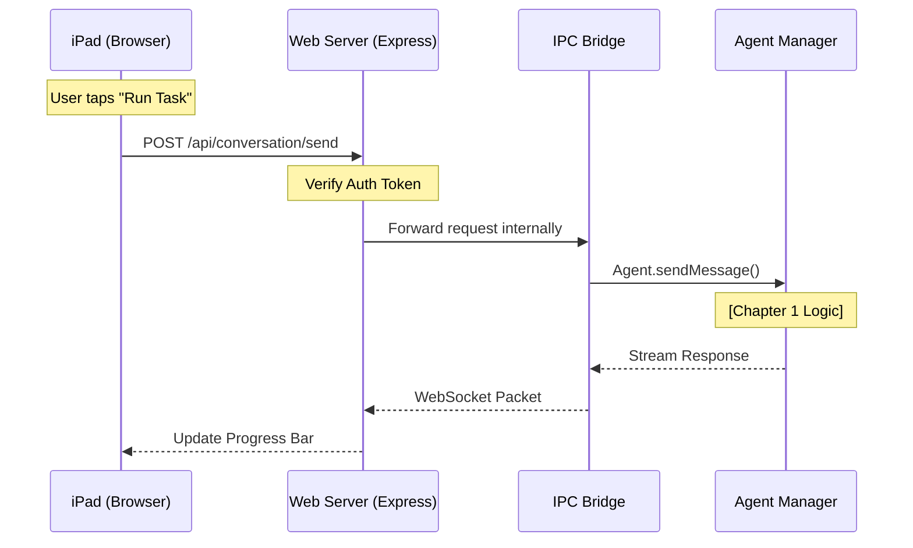

# Chapter 7: Web Server & Remote Access

Welcome to the final chapter of the **AionUi** developer guide!

In the previous chapter, [Channel & Plugin System](06_channel___plugin_system.md), we learned how to chat with our AI via apps like Telegram or Lark. That was great for text.

But AionUi is more than text. It has a rich visual dashboard with charts, file explorers, and settings. What if you want that full visual experience on your iPad while lying on the couch, or on a laptop in a meeting room?

This brings us to **Web Server & Remote Access**.

### The Motivation: The "Remote Desktop" Analogy

Normally, a desktop app lives inside your computer monitor. You have to sit in the chair to use it.

By adding a **Web Server**, we turn your computer into a tiny website host.
*   **The Desktop App:** The physical "Control Center."
*   **The Web Server:** Broadcasts that Control Center to your local network (Wi-Fi).

Now, your iPad isn't just a second screen; it becomes a remote control for your powerful AI workstation.

### The Use Case: "Tablet on the Couch"

**Scenario:** Your AI is running a long research task on your powerful desktop PC in the study. You are in the living room with an iPad.

**Goal:** You want to open Safari on the iPad, navigate to `http://192.168.1.5:3000`, login, and see the exact same progress bar that is displayed on your desktop.

---

### Key Concept 1: The Embedded Server (Express.js)

AionUi isn't just an Electron app; it actually bundles a standard **Express.js** web server inside itself. When you launch the app, it silently starts a website in the background.

This logic lives in `src/webserver/index.ts`.

#### Starting the Engine
We use a standard Node.js pattern to create the server.

```typescript
// src/webserver/index.ts (Simplified)
import express from 'express';
import { createServer } from 'http';

export async function startWebServerWithInstance(port: number) {
  // 1. Create the web app
  const app = express();
  const server = createServer(app);

  // 2. Turn on the "Open Sign" (Listen on a port)
  server.listen(port, () => {
    console.log(`🚀 WebUI started at http://localhost:${port}`);
  });
  
  return { server, app };
}
```
*   **Input:** A port number (usually 3000).
*   **Action:** The computer opens that port to traffic.
*   **Output:** A running web server waiting for browser connections.

---

### Key Concept 2: Finding the Address (LAN IP)

To connect from your iPad, typing `localhost` won't work (that refers to the iPad itself). You need the **LAN IP Address** of your desktop (e.g., `192.168.1.X`).

AionUi automatically figures this out for you so you can scan a QR code instead of typing numbers.

```typescript
// src/webserver/index.ts (Simplified)
import { networkInterfaces } from 'os';

function getLanIP(): string | null {
  const nets = networkInterfaces();
  
  // Look through all network cards (Wi-Fi, Ethernet)
  for (const name of Object.keys(nets)) {
    for (const net of nets[name]) {
      // Find the IPv4 address that isn't internal (127.0.0.1)
      if (net.family === 'IPv4' && !net.internal) {
        return net.address; // e.g., '192.168.1.5'
      }
    }
  }
  return null;
}
```
*   **Explanation:** The code asks the Operating System: "What is my address on the Wi-Fi network?" It filters out internal technical addresses to find the one your iPad can use.

---

### Key Concept 3: The Bouncer (Authentication)

Exposing your AI to the network is risky. You don't want a guest on your Wi-Fi to accidentally delete your files.

AionUi includes a strict **Authentication System**. When the server starts for the first time, it generates a random password (or uses a default Admin account).

```typescript
// src/webserver/index.ts

async function initializeDefaultAdmin() {
  // 1. Check if an admin already exists
  const existingAdmin = UserRepository.findByUsername('admin');

  if (!existingAdmin) {
    // 2. If not, generate a random password
    const password = AuthService.generateRandomPassword();
    
    // 3. Save it to the database
    UserRepository.createUser('admin', password);
    
    return { username: 'admin', password };
  }
  return null;
}
```

When the server starts, it prints these credentials (or a QR code containing a login token) to the console so the owner can log in.

---

### Under the Hood: From iPad to Agent

How does a tap on the iPad trigger a Python script on the Desktop?

It connects the **Web Server** to the **IPC Bridge** we built in [Chapter 5: IPC Bridge](05_ipc_bridge__inter_process_communication_.md).



#### The API Route Handlers

The web server acts as a translator. It accepts standard HTTP requests (JSON) and converts them into internal function calls.

This is handled in `src/webserver/routes/apiRoutes.ts`.

```typescript
// src/webserver/routes/apiRoutes.ts (Simplified)

export function registerApiRoutes(app: Express) {
  // 1. Security Check: Ensure user has a valid Token
  const validate = TokenMiddleware.validateToken();

  // 2. Define the route
  app.use('/api', validate, (req, res) => {
    
    // 3. Connect to the internal system
    // (In reality, this forwards to the Bridge)
    res.json({ message: 'Bridge integration working' });
  });
}
```

#### WebSockets for Real-Time Updates

Because AI responses are slow (streaming), we can't just use HTTP. We use **WebSockets** (via the `ws` library) to mirror the exact behavior of the desktop UI.

When the Desktop App receives a stream of text from the AI (see [Chapter 2: Agent Protocol Adapters](02_agent_protocol_adapters.md)), it broadcasts that text to both the Desktop Window **and** any connected WebSockets (i.e., your iPad).

---

### Summary of the Series

Congratulations! You have completed the **AionUi Developer Guide**. Let's recap the journey of building a full AI Operating System:

1.  **[Agent Task Orchestration](01_agent_task_orchestration.md):** We built a "Project Manager" to assign tasks and manage history.
2.  **[Agent Protocol Adapters](02_agent_protocol_adapters.md):** We built "Translators" to talk to Cloud (Gemini), Local (Codex), and CLI (ACP) models.
3.  **[Tools & Skills Framework](03_tools___skills_framework.md):** We gave the AI "Hands" to edit files and "Manuals" (Skills) to know how to use them.
4.  **[Prompt Engineering Protocols](04_prompt_engineering_protocols.md):** We gave the AI "Behaviors" (like the 3-File Planning Pattern) to keep it organized.
5.  **[IPC Bridge](05_ipc_bridge__inter_process_communication_.md):** We built the "Highway" connecting the UI to the Backend.
6.  **[Channel & Plugin System](06_channel___plugin_system.md):** We connected external chat apps like Lark and Telegram.
7.  **Web Server & Remote Access:** We opened the system to the local network, allowing full remote control.

You now understand the architecture of a modern, local-first AI workspace. You are ready to start contributing to AionUi or building your own agents!

**End of Tutorial.**

---

Generated by [Code IQ](https://github.com/adityasoni99/Code-IQ)