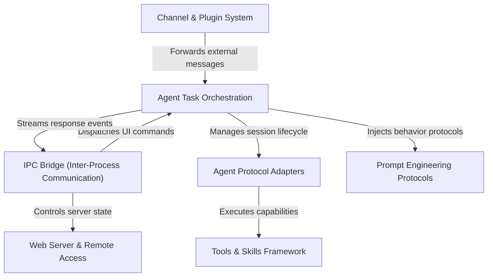

# Tutorial: AionUi

**AionUi** is a sophisticated desktop AI workspace that orchestrates complex tasks across multiple AI backends (like **Gemini**, **Codex**, and **ACP**) through a unified interface. It acts as a central hub where *Agent Task Orchestration* manages persistent sessions, enforces **Prompt Engineering Protocols** for long-term memory, and coordinates with a robust **Tools & Skills Framework** to execute filesystem operations. The system bridges a visual frontend with heavy backend logic via a typed **IPC Bridge**, supports remote access via a **Web Server**, and extends its reach to external platforms like Lark and Telegram through a **Channel System**.

**Source Repository:** [https://github.com/iOfficeAI/AionUi](https://github.com/iOfficeAI/AionUi)

## Chapters

1. [Agent Task Orchestration](01_agent_task_orchestration.md)
2. [Agent Protocol Adapters](02_agent_protocol_adapters.md)
3. [Tools & Skills Framework](03_tools___skills_framework.md)
4. [Prompt Engineering Protocols](04_prompt_engineering_protocols.md)
5. [IPC Bridge (Inter-Process Communication)](05_ipc_bridge__inter_process_communication_.md)
6. [Channel & Plugin System](06_channel___plugin_system.md)
7. [Web Server & Remote Access](07_web_server___remote_access.md)

---

Generated by [Code IQ](https://github.com/adityasoni99/Code-IQ)