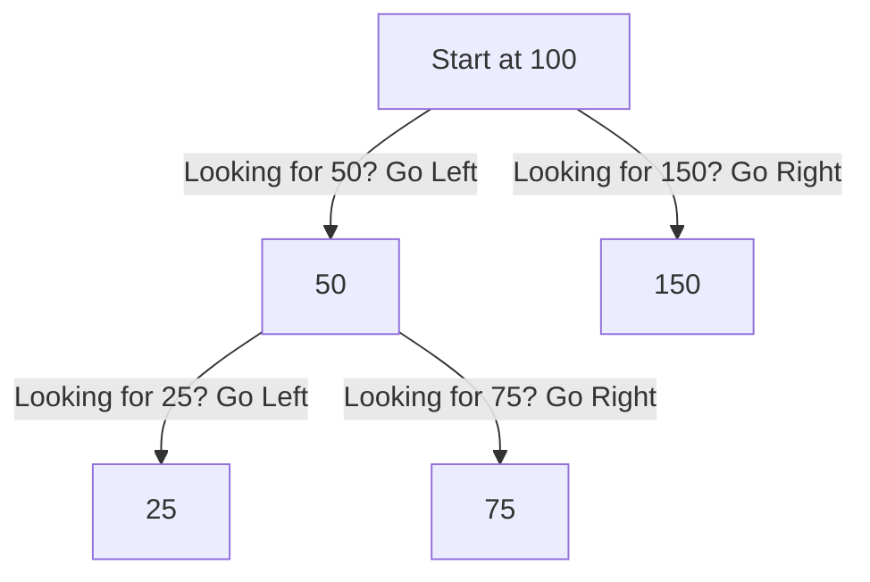
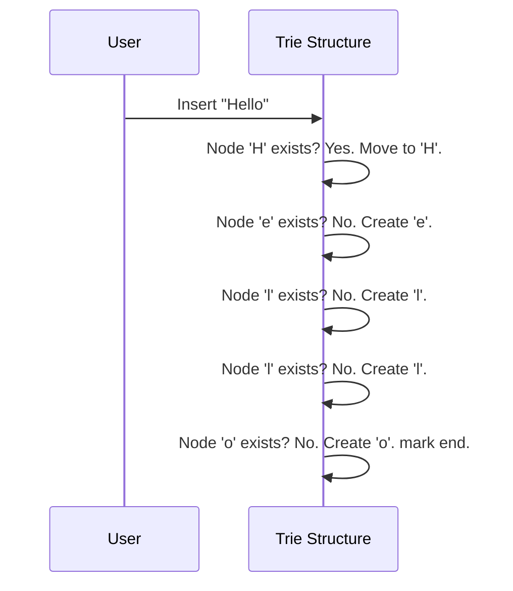

# Chapter 1: Fundamental Data Structures

Welcome to the world of efficient computing! 

If you have programmed before, you know how to store a single number in a variable. But what happens when you have a million numbers? Or a dictionary of English words? Or a map of city connections?

**Fundamental Data Structures** are the specific ways we organize data in a computer's memory so we can use it effectively. 

### The Motivation: The "Messy Room" Problem
Imagine your room is a mess. Clothes are in a pile on the floor.
*   **The Problem:** If you want to find your favorite red socks, you have to pick up every single piece of clothing until you find them. This is slow.
*   **The Solution:** You buy a dresser with drawers. You put socks in the top drawer, shirts in the middle, and pants in the bottom.
*   **The Result:** You know exactly where to look. You are efficient.

In programming, data structures are that dresser. We choose specific structures (containers) to solve specific problems, like searching, sorting, or listing items quickly.

---

## Use Case: The Digital Library
Let's build a mental model of a **Digital Library**. We need to perform three main tasks:
1.  **The Shelf:** Keep a list of books where we can easily add a new donation to the end.
2.  **The Catalog:** Find a book quickly by its ID number without checking every book.
3.  **The Search:** Type "Harry P..." and have the system auto-complete the title.

We will use three different data structures to solve these three distinct problems.

---

## Concept 1: The Linked List (The Shelf)
**Best for:** Easy additions and removals.

Think of a Linked List like a **Scavenger Hunt** or a chain of paperclips. You don't know where all the items are at once. You only hold the first item. The first item has a note (a "pointer") telling you where the second item is, and so on.

To add a book to our library shelf, we just attach a new link to the end of the chain.

### How it works in C++
We use a `link` (or node) that holds data (the book ID) and a pointer to the `next` link.

```cpp
// From data_structures/linked_list.cpp
class link {
 private:
    int pvalue;                   // The Book ID
    std::shared_ptr<link> psucc;  // Pointer to the next book

 public:
    // Constructor to set the value
    explicit link(int value = 0) : pvalue(value), psucc(nullptr) {}
    
    // Helper to get the next link
    std::shared_ptr<link>& succ() { return psucc; }
};
```

**Adding a book:**
We find the last link and tell it to point to our new book.

```cpp
// Simplified from data_structures/linked_list.cpp
void list::push_back(int new_elem) {
    if (isEmpty()) {
        // If shelf is empty, this is the first book
        first->succ() = std::make_shared<link>(new_elem);
        last = first->succ();
    } else {
        // Otherwise, attach it to the end
        last->succ() = std::make_shared<link>(new_elem);
        last = last->succ();
    }
}
```

---

## Concept 2: The Binary Search Tree (The Catalog)
**Best for:** Fast lookups (Searching).

A Linked List is slow to search (you have to walk the whole chain). A **Binary Search Tree (BST)** is like a decision flowchart.

*   **Rule:** Every "node" has a value.
*   **Left:** Everything to the left is *smaller*.
*   **Right:** Everything to the right is *larger*.

If you are looking for Book ID **50**, and the current node is **100**, you know immediately to ignore the entire right side and only look left. You eliminate half the library in one step!

### Visualizing the Logic



### Internal Implementation
Let's look at how we define a tree node in C++.

```cpp
// From data_structures/binary_search_tree.cpp
struct node {
    int val;     // Book ID
    node *left;  // Connection to smaller IDs
    node *right; // Connection to larger IDs
};
```

When we insert a new book ID, the computer asks: "Is this smaller or larger than the current node?" and moves down the tree accordingly.

```cpp
// Simplified Insert Logic
void Insert(node *n, int x) {
    if (x < n->val) {
        // Go Left
        if (n->left == NULL) {
            n->left = new node{x, NULL, NULL}; // Found empty spot!
        } else {
            Insert(n->left, x); // Keep looking left
        }
    } else {
        // Go Right (Logic is similar)
        if (n->right == NULL) {
            n->right = new node{x, NULL, NULL};
        } else {
            Insert(n->right, x);
        }
    }
}
```

---

## Concept 3: The Trie (The Autocomplete)
**Best for:** Text prefixes and dictionaries.

If you want to find all books starting with "Alg...", a normal tree is hard to use. A **Trie** (pronounced "try") is a special tree where every step down is a letter of the alphabet.

*   Root -> 'A' -> 'L' -> 'G' -> 'O' ...

This allows us to quickly check if a word exists or find all words sharing a prefix.



### Implementation Details
In the code, each node contains an array of pointers (one for each letter of the alphabet).

```cpp
// From data_structures/trie_tree.cpp
class trie {
    // Array for 26 English letters
    std::array<std::shared_ptr<trie>, 26> arr; 
    bool isEndofWord = false;

    // ... helper functions ...
};
```

To insert a word, we loop through its characters. If the path exists, we follow it. If not, we create it.

```cpp
// Simplified Insert
void insert(const std::string& str) {
    // Start at root (logic abstracted)
    for (const char& ch : str) {
        int index = char_to_int(ch); // Convert 'a' to 0, 'b' to 1...
        
        if (!current_node->arr[index]) {
            // Create path if it doesn't exist
            current_node->arr[index] = std::make_shared<trie>();
        }
        // Move down
        current_node = current_node->arr[index];
    }
    current_node->isEndofWord = true;
}
```

---

## Advanced Mention: Range Queries
Sometimes we need to do math on our data. For example, "What is the total number of pages in books 1 through 5?" 

For this, we use **Segment Trees** or **Fenwick Trees**.
*   Instead of adding book 1 + book 2 + book 3... every time we ask, these trees store *partial sums*.
*   It's like having a sub-total for every shelf row calculated in advance.
*   *See `data_structures/segment_tree.cpp` and `range_queries/fenwick_tree.cpp` for implementation details.*

---

## Conclusion
Data structures are the foundation of efficient code.
1.  **Linked List:** Great for chaining items together flexibly.
2.  **Binary Search Tree:** Great for finding items quickly using "Greater/Smaller" logic.
3.  **Trie:** Great for text and prefixes.

Once your data is organized into these structures, the next logical step is to learn how to rearrange it specifically to put things in order.

[Next Chapter: Sorting and Divide & Conquer](02_sorting_and_divide___conquer.md)

---

Generated by [Code IQ](https://github.com/adityasoni99/Code-IQ)