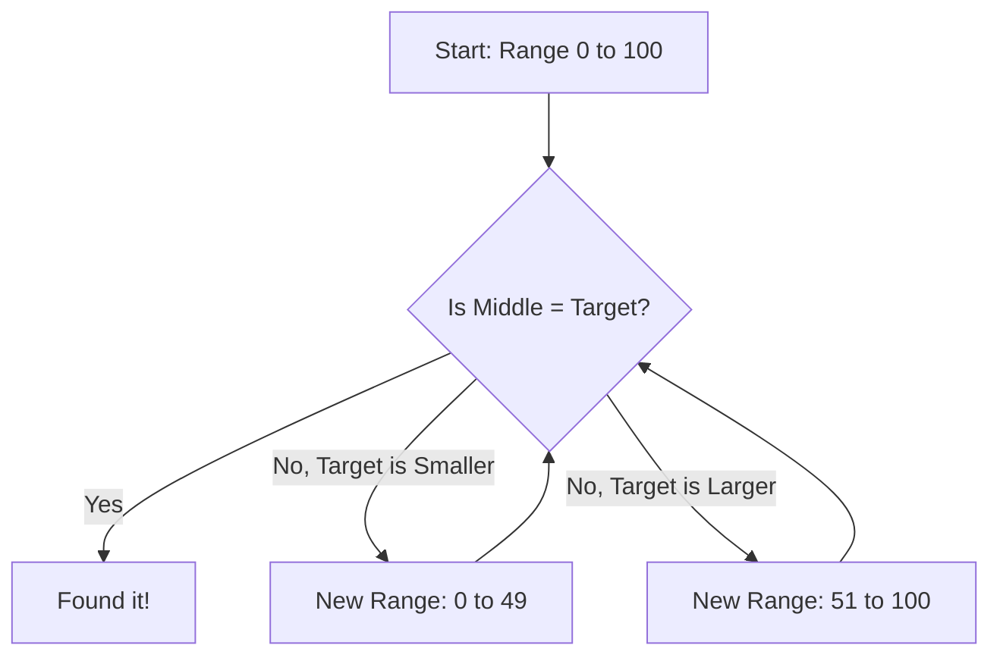
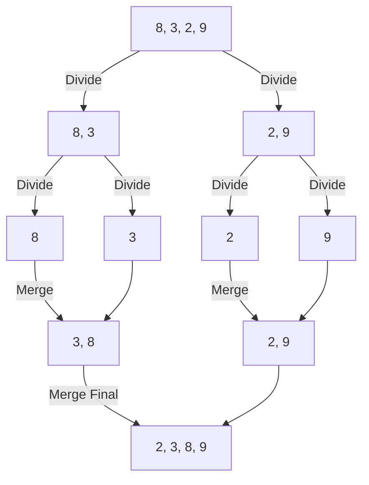
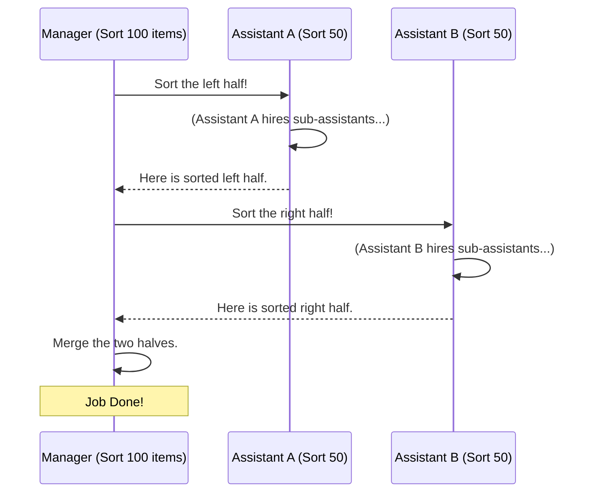

# Chapter 2: Sorting and Divide & Conquer

Welcome back! In the previous chapter, **[Fundamental Data Structures](01_fundamental_data_structures.md)**, we learned how to store data in "containers" like Linked Lists and Trees.

But storing data is only half the battle. Imagine you have a library where the books are on the shelves, but they are in completely random order. Finding "Harry Potter" would take forever!

**Sorting** is the art of organizing data (e.g., Alphabetical, Smallest to Largest).
**Divide & Conquer** is the strategy we use to do it efficiently.

---

## The Motivation: The "Guess the Number" Game

Imagine I pick a number between 1 and 1,000. You have to guess it.
*   **Strategy A (Bad):** Is it 1? Is it 2? Is it 3? ...
    *   *Result:* This could take 1,000 guesses.
*   **Strategy B (Divide & Conquer):** Is it higher or lower than 500?
    *   *Me:* "Lower."
    *   *You:* Okay, I instantly ignore 501-1000. Is it higher or lower than 250?
    *   *Result:* You will find the answer in about 10 guesses.

This logic is the core of this chapter. We solve big problems by cutting them in half repeatedly.

---

## Concept 1: Binary Search (Finding Things Fast)

**Binary Search** is the algorithm used in "Strategy B" above. However, there is one strict rule: **The data must be sorted first.**

If you have a sorted list of IDs, you check the middle. If your target is smaller, you go left. If larger, you go right.

### The Flowchart


### Simplified Code
Here is how we implement this in C++. We use `low` and `high` to track the current section of the book we are looking at.

```cpp
// Simplified from search/binary_search.cpp
uint64_t binarySearch(std::vector<uint64_t> arr, uint64_t val) {
    uint64_t low = 0;
    uint64_t high = arr.size() - 1;

    while (low <= high) {
        // Find the middle point
        uint64_t m = low + (high - low) / 2;

        if (arr[m] == val) return m;      // Found it!
        else if (val < arr[m]) high = m - 1; // Look in lower half
        else low = m + 1;                 // Look in upper half
    }
    return -1; // Not found
}
```
*   **Input:** A sorted list `{10, 20, 30, 40, 50}` and target `40`.
*   **Step 1:** Middle is `30`. `40` is larger. Ignore `{10, 20, 30}`.
*   **Step 2:** New range is `{40, 50}`. Middle is `40`. Found!

---

## Concept 2: Merge Sort (Organizing Data)

Since Binary Search requires sorted data, how do we sort a messy pile efficiently? We use **Divide & Conquer**.

**Merge Sort** follows a simple philosophy:
1.  **Divide:** A list of 1 number is already sorted. So, break the list in half until everything is individual numbers.
2.  **Conquer (Merge):** Take two small sorted lists and zip them together into one larger sorted list.

### Visualizing the Split and Merge
Imagine sorting a deck of cards. You cut the deck in half, hand one half to a friend, and say "sort this." They cut their half and hand it to another friend. Eventually, everyone holds just 1 card. Then, you start handing them back, putting them in order as you combine piles.



### Implementation Logic
The code is surprisingly short because it uses **recursion** (the function calls itself).

```cpp
// Simplified from sorting/merge_sort.cpp
void mergeSort(int *arr, int l, int r) {
    if (l < r) {
        int m = l + (r - l) / 2; // Find the middle

        mergeSort(arr, l, m);    // 1. Sort the left half
        mergeSort(arr, m + 1, r); // 2. Sort the right half

        merge(arr, l, m, r);     // 3. Combine (Zip) them together
    }
}
```
*Note: The `merge` function (not shown here for brevity) handles the logic of comparing the two halves and putting them into a temporary array in order.*

---

## Concept 3: Quick Sort (Speedy Sorting)

**Quick Sort** is another Divide & Conquer strategy. It is often faster than Merge Sort in practice and uses less memory.

Instead of splitting strictly in the middle, Quick Sort picks a "Pivot" (like a referee).
1.  **Pick a Pivot:** Let's say the last number.
2.  **Partition:** Move everyone smaller than the Pivot to the left. Move everyone larger to the right.
3.  **Repeat:** Do the same for the left side and the right side.

### The "Partition" Concept
Imagine a gym class. The coach (Pivot) stands in the middle. He yells, "If you are shorter than me, go left! Taller, go right!"
Now the class is roughly sorted relative to the coach.

```cpp
// Simplified from sorting/quick_sort.cpp
void quick_sort(std::vector<int> *arr, int low, int high) {
    if (low < high) {
        // Arrange elements around a pivot and get pivot's index
        int p = partition(arr, low, high);

        // Sort the squad to the left
        quick_sort(arr, low, p - 1);
        // Sort the squad to the right
        quick_sort(arr, p + 1, high);
    }
}
```

---

## Advanced Mention: Not just for Sorting (Karatsuba)

Divide & Conquer isn't just for ordering lists. It's also for Math!
If you try to multiply two massive numbers (like 1,000 digits long), a normal computer multiplies digit-by-digit, which is slow.

The **Karatsuba Algorithm** splits the long numbers into halves, does three smaller multiplications, and combines them. It's the same "Break it down" philosophy applied to arithmetic.
*   *See `divide_and_conquer/karatsuba_algorithm_for_fast_multiplication.cpp` for the code.*

---

## Under the Hood: Recursion

Both Merge Sort and Quick Sort rely on **Recursion**. This is when a function calls itself. To understand this, imagine a Manager delegating tasks.

### Sequence Diagram: The Manager (Merge Sort)



In the code, the "Stack" keeps track of who is waiting for an answer. If you split the data too many times without stopping (the "base case"), you get a **Stack Overflow**!

---

## Conclusion

In this chapter, we moved from storing data to **organizing** it.
1.  **Divide & Conquer:** The strategy of breaking hard problems into easy sub-problems.
2.  **Sorting:** Merge Sort and Quick Sort prepare our data.
3.  **Binary Search:** Allows us to find specific items instantly once the data is sorted.

Now that our data is stored and sorted, what happens if the data represents connections, like a map of cities or a social network? For that, we need a web-like structure.

[Next Chapter: Graph Algorithms](03_graph_algorithms.md)

---

Generated by [Code IQ](https://github.com/adityasoni99/Code-IQ)