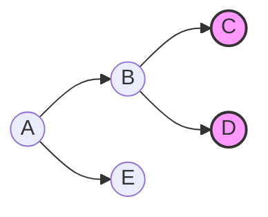
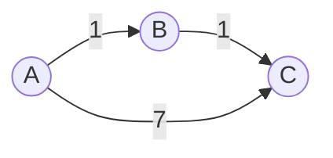
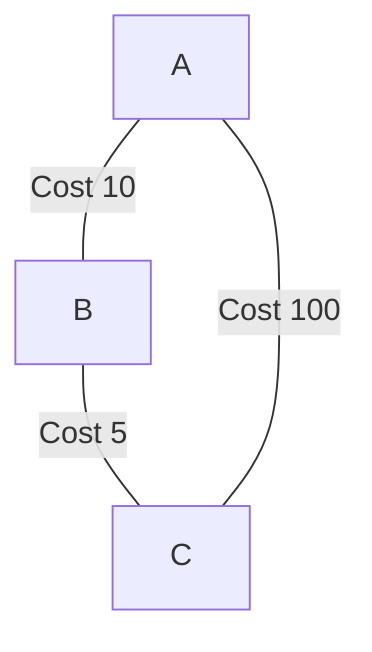
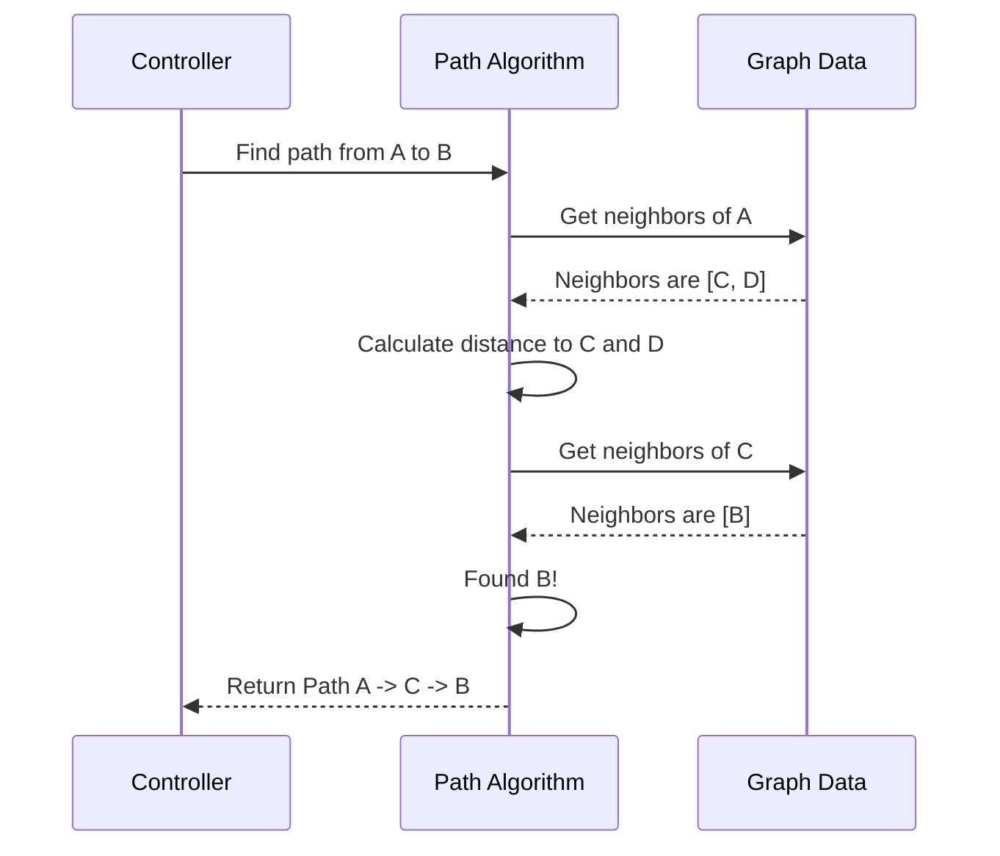

# Chapter 3: Graph Algorithms

Welcome back! In the previous chapter, [Sorting and Divide & Conquer](02_sorting_and_divide___conquer.md), we learned how to organize lists of data efficiently. 

But the real world isn't always a straight line or a neat list. 
*   Cities are connected by a web of roads.
*   The Internet is a web of computers.
*   Social media is a web of friends.

These "webs" are called **Graphs**. 

**Graph Algorithms** are the tools we use to navigate these webs. They answer questions like: "What is the fastest route to the airport?" or "How many degrees of separation are there between me and a celebrity?"

---

## The Motivation: The Pizza Delivery Drone

Imagine we are building the brain for a **Pizza Delivery Drone**. 
We have a map of the city. The map has:
1.  **Nodes (Vertices):** Intersections and houses.
2.  **Edges:** Streets connecting them.
3.  **Weights:** The time it takes to fly down a street (traffic, wind).

We need to solve three specific problems for our drone:
1.  **Exploration:** The drone is lost; it needs to map out the area.
2.  **Navigation:** The drone needs the fastest route from the Pizza Shop to the Customer.
3.  **Infrastructure:** We want to connect all our warehouses with the cheapest amount of fiber-optic cable.

---

## Concept 1: Depth First Search (Exploration)

**Problem:** The drone enters a new neighborhood. It needs to find every house to update its map.

**Solution:** **Depth First Search (DFS)**.
Think of DFS like solving a maze. You keep walking down a path until you hit a dead end. Then, you back up to the last intersection and try a different path. You explore as *deep* as possible before backtracking.

### Visualizing DFS
If the drone starts at **A**, it goes to **B**, then **C**, hits a dead end, goes back to **B**, then tries **D**.



### Simplified Code (C++)
We use **Recursion** (a function calling itself) to keep going deeper. We keep a checklist (`visited`) so we don't fly in circles.

```cpp
// Simplified from graph/depth_first_search.cpp
void explore(const vector<vector<int>> &adj, int current, vector<bool> &visited) {
    // 1. Mark current house as visited
    visited[current] = true; 
    cout << "Visiting Node: " << current << endl;

    // 2. Check all connecting streets (neighbors)
    for (int neighbor : adj[current]) {
        // 3. If we haven't been there, Go Deeper!
        if (!visited[neighbor]) {
            explore(adj, neighbor, visited);
        }
    }
}
```

---

## Concept 2: Dijkstra's Algorithm (The Shortest Path)

**Problem:** The pizza is getting cold. We know the map, but some streets are longer than others. We need the *fastest* path, not just any path.

**Solution:** **Dijkstra's Algorithm**.
Imagine pouring water onto the floor at the Pizza Shop. The water spreads to the closest spots first, then further out. Dijkstra calculates the distance to neighbors, picks the closest one, and repeats.

### Visualizing the Costs
We want to go from A to C.
*   Path A -> B -> C = Cost 1 + 1 = **2**
*   Path A -> C = Cost **7**
*   *Dijkstra finds the path with cost 2.*



### Simplified Code (C++)
We look at a node, check its neighbors, and see if we found a "shortcut."

```cpp
// Simplified from greedy_algorithms/dijkstra_greedy.cpp
// u is the current intersection, v is the neighbor
// graph[u][v] is the travel time between them

// If the time to u + time to neighbor is LESS than the known time to neighbor...
if (dist[u] + graph[u][v] < dist[v]) {
    
    // We found a faster route! Update the record.
    dist[v] = dist[u] + graph[u][v];
}
```
*Note: This process is called "Relaxation." We are relaxing the tension (distance) on the connection.*

---

## Concept 3: Kruskal's Algorithm (Minimum Connection)

**Problem:** We want to connect 5 warehouses with phone lines. Cable is expensive. We want to connect everyone using the *least total amount of wire*. We don't care about the path length between A and B, just that they are connected *somehow*.

**Solution:** **Kruskal's Algorithm** (Minimum Spanning Tree).
1.  List every possible connection by cost (cheapest to most expensive).
2.  Pick the cheapest wire.
3.  Pick the next cheapest.
4.  **Rule:** If a wire connects two buildings that are already connected (even indirectly), throw it away (to avoid loops/wasted wire).

### Visualizing the Strategy

*   **Step 1:** Pick B-C (Cost 5).
*   **Step 2:** Pick A-B (Cost 10).
*   **Step 3:** Look at A-C (Cost 100). A and C are already connected via B. **Discard.**
*   *Total Cost: 15.*

### Simplified Code (C++)
The algorithm greedily looks for the smallest number in the matrix.

```cpp
// Simplified from greedy_algorithms/kruskals_minimum_spanning_tree.cpp
// Loop to find the smallest valid edge
for (int i = 0; i < num_nodes; i++) {
    // Find smallest edge connecting a visited node to an unvisited one
    if (edge_weight < min_weight && !creates_cycle(u, v)) {
        min_weight = edge_weight;
        best_u = u;
        best_v = v;
    }
}
cout << "Build cable between " << best_u << " and " << best_v << endl;
```

---

## Under the Hood: Representing a Graph

How do we actually store a "city map" in C++ variables? We usually use an **Adjacency Matrix**.

Imagine a Grid (2D Array). 
*   Rows are Starting points.
*   Columns are Destinations.
*   The number in the box is the distance. `0` means no connection.

| | House 0 | House 1 | House 2 |
|---|---|---|---|
| **House 0** | 0 | 5 min | 0 |
| **House 1** | 5 min | 0 | 10 min |
| **House 2** | 0 | 10 min | 0 |

### Sequence Diagram: The Drone's Decision

Here is what happens inside the computer when we run a search:



---

## Advanced Mention: Max Flow

Sometimes we don't care about distance, but **Capacity**. 
Imagine a water pipe network. Some pipes are wide, some are narrow. How much water can we push from the source to the sink before it bottlenecks?

This is solved by algorithms like **Ford-Fulkerson** (see `graph/max_flow_with_ford_fulkerson...cpp`). It pushes flow through paths until no more can fit.

---

## Conclusion

Graph algorithms allow us to model complex relationships.
1.  **DFS:** Helps us explore and ensure we visit every node.
2.  **Dijkstra:** Finds the most efficient path between two points.
3.  **Kruskal:** Helps us build efficient infrastructure with minimum cost.

In DFS, when we hit a dead end, we have to "backtrack" to the last intersection. This concept of **trying a path and undoing it if it fails** is a powerful technique on its own. It can solve puzzles like Sudoku or Chess.

[Next Chapter: Backtracking](04_backtracking.md)

---

Generated by [Code IQ](https://github.com/adityasoni99/Code-IQ)