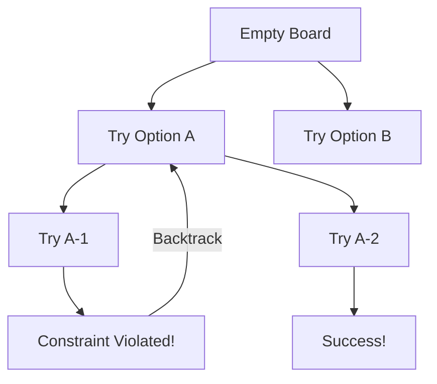
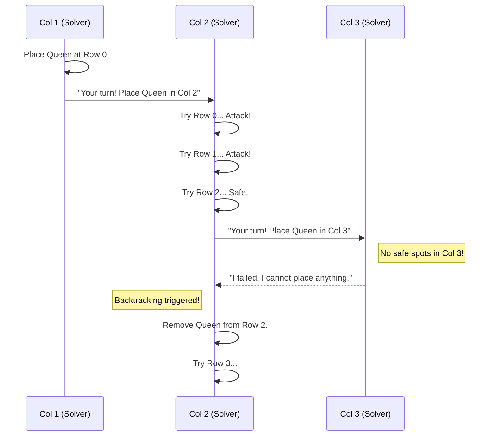

# Chapter 4: Backtracking

Welcome back! In the previous chapter, [Graph Algorithms](03_graph_algorithms.md), we learned how to navigate "webs" of data using techniques like Depth First Search (DFS). We learned how to explore a maze to find an exit.

But what if the goal isn't just to *find* a path, but to *construct* a solution according to strict rules?

**Backtracking** is a refined version of "Brute Force." It is a systematic way of trying out different solutions, and if you hit a dead end (a constraint is violated), you **backtrack** (undo the last step) and try a different option.

---

## The Motivation: Organizing a Dinner Party

Imagine you are seating guests at a dinner table.
*   **Constraint:** Aunt May cannot sit next to Uncle Ben (they are fighting).
*   **Constraint:** The teenagers want to sit together.

**How you solve it naturally:**
1.  You put Aunt May in Chair 1.
2.  You put Uncle Ben in Chair 2.
3.  **Oops!** Constraint violated.
4.  **Backtrack:** You take Uncle Ben *out* of Chair 2.
5.  You try putting the Cousin in Chair 2. Success. Move to Chair 3...

This "Try -> Check -> Undo" loop is the definition of Backtracking.

---

## The Blueprint of Backtracking

Every backtracking algorithm follows the same pattern. It is usually implemented using **Recursion** (a function that calls itself).

### The Three Keys
1.  **Choice:** What options do I have right now? (e.g., "Place a Queen here", "Write number 5 here").
2.  **Constraint:** Is this choice valid? (e.g., "Is the spot safe?", "Is the number unique?").
3.  **Goal:** Have I reached the end? (e.g., "Are all 8 Queens on the board?").

### Visualizing the Logic tree
Imagine a tree where every branch is a choice. Backtracking explores a branch. If it rots (fails), it cuts it off and goes back to the trunk.



---

## Use Case 1: The N-Queens Puzzle

**The Problem:** You have a Chessboard (let's say 4x4 for simplicity). You need to place 4 Queens so that **no Queen can attack another**.
*   Queens attack horizontally, vertically, and diagonally.

If we place a Queen at `(0,0)`, we instantly know we cannot place anything else in Row 0, Column 0, or the diagonal.

### Step 1: Is it Safe?
Before placing a Queen, we look left, up-left, and down-left to ensure no one is attacking us.

```cpp
// Simplified from backtracking/n_queens.cpp
bool isSafe(auto board, int row, int col) {
    // Check left side of the row
    for (int i = 0; i < col; i++)
        if (board[row][i]) return false; // Found a queen!

    // Check upper-left diagonal
    for (int i=row, j=col; i>=0 && j>=0; i--, j--)
        if (board[i][j]) return false; // Found a queen!

    // (Lower diagonal logic omitted for brevity...)
    return true; // Safe to place!
}
```

### Step 2: The Recursive Solver
Here is the magic. We try to place a queen. If it works, we ask the function to place the *next* queen. If that returns false, we **undo** our placement.

```cpp
// Simplified from backtracking/n_queens.cpp
bool solveNQ(auto& board, int col) {
    // Base Case: If all queens are placed
    if (col >= 4) return true;

    // Try all rows in this column
    for (int i = 0; i < 4; i++) {
        if (isSafe(board, i, col)) {
            
            board[i][col] = 1; // 1. MAKE CHOICE (Place Queen)

            // 2. RECURSE (Try to place next queen)
            if (solveNQ(board, col + 1)) return true;

            board[i][col] = 0; // 3. BACKTRACK (Undo choice!)
        }
    }
    return false; 
}
```
**The Key Line:** `board[i][col] = 0;`
This resets the board state. It's like erasing a pencil mark when you realize you made a mistake in a puzzle.

---

## Use Case 2: Sudoku Solver

**The Problem:** Fill a 9x9 grid so that every row, column, and 3x3 box contains digits 1-9 exactly once.

This is classic backtracking.
1.  Find an empty cell.
2.  Try putting '1'. Is it valid?
3.  If yes, move to the next cell.
4.  If the next cell gets stuck, go back, erase '1', and try '2'.

### The Logic

```cpp
// Simplified from backtracking/sudoku_solver.cpp
bool solveSudoku(auto& mat, int i, int j) {
    // If we reached the end of the board, we won!
    if (i == 9) return true;

    // Loop through numbers 1 to 9
    for (int no = 1; no <= 9; no++) {
        // Constraint Check
        if (isPossible(mat, i, j, no)) {
            
            mat[i][j] = no; // 1. Make Choice
            
            // 2. Recurse (Next cell)
            if (solveSudoku(mat, next_i, next_j)) return true;
            
            mat[i][j] = 0; // 3. Backtrack (Reset to empty)
        }
    }
    return false; // Trigger backtracking in previous step
}
```
*Note: `isPossible` checks the row, column, and 3x3 subgrid rules.*

---

## Under the Hood: The Call Stack

When the computer runs this, it uses a **Stack** (remember [Fundamental Data Structures](01_fundamental_data_structures.md)?). It stacks function calls on top of each other.

Let's visualize the conversation between the steps.



### Why is this better than Brute Force?
In Brute Force, we would generate **every** possible board arrangement (billions of them) and check if they are valid. 
In Backtracking, as soon as we place two Queens that attack each other, we stop. We don't bother placing the 3rd or 4th Queen because we already know this path is dead. This is called **Pruning**.

---

## Conclusion

Backtracking is a powerful way to solve complex puzzles and combinatorial problems.
1.  **Choice:** Make a tentative move.
2.  **Recursion:** Dive deeper into the problem.
3.  **Backtrack:** If you hit a wall, undo the move and try the next option.

However, Backtracking can still be slow if the problem is too big. Sometimes, we find ourselves solving the *exact same sub-problem* over and over again during our recursion. To fix that, we need to give our algorithm a "memory."

[Next Chapter: Dynamic Programming](05_dynamic_programming.md)

---

Generated by [Code IQ](https://github.com/adityasoni99/Code-IQ)