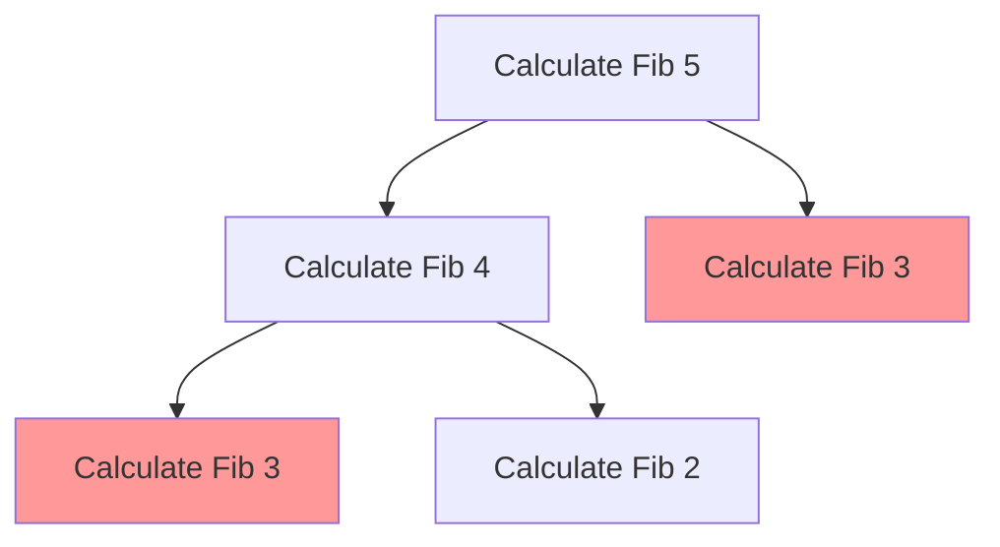
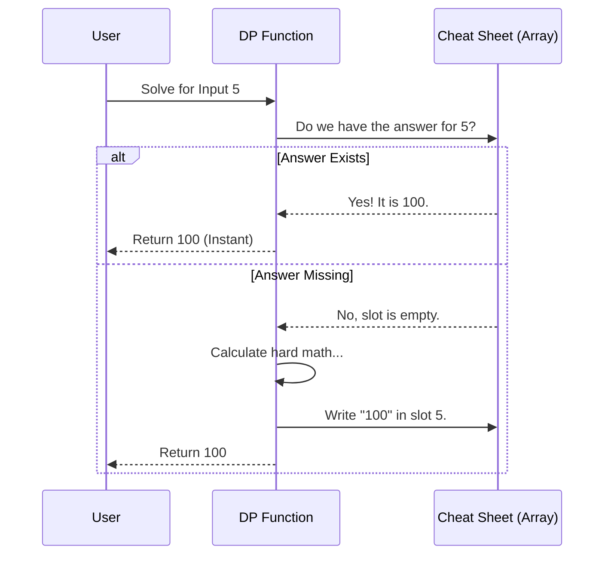

# Chapter 5: Dynamic Programming

Welcome back! In the previous chapter, [Backtracking](04_backtracking.md), we learned how to solve complex puzzles by trying every possibility and "backing up" when we hit a dead end.

While Backtracking is powerful, it has a memory problem. It often solves the exact same sub-puzzle, over and over again, forgetting that it solved it five minutes ago.

**Dynamic Programming (DP)** is the strategy of giving our algorithms a "memory." 

---

## The Motivation: The "Expensive Calculator"

Imagine I give you a math problem:
**"What is 1 + 1 + 1 + 1?"**
You count and say: "4."

Now, I add another "+ 1" to the end of that paper and ask:
**"What is 1 + 1 + 1 + 1 + 1?"**

Do you count from the very beginning? **No.**
You verify that the previous part was "4", and you simply add "1" to it to get "5".

**Why?** Because you *remembered* the answer to the smaller sub-problem.

*   **Backtracking** counts from the start every time (Slow).
*   **Dynamic Programming** remembers the previous result to solve the new step (Fast).

---

## The Concept: The Cheat Sheet (Memoization)

Dynamic Programming is simply **Recursion + A Cheat Sheet**.

In computer science, we call this cheat sheet a **Memoization Table** or a **Cache**. Whenever we calculate a hard value, we write it down in an array or a hash map. Before calculating *anything*, we check the sheet to see if we already did the work.

### Visualizing the Problem
Let's look at the **Fibonacci Sequence** (0, 1, 1, 2, 3, 5, 8...), where every number is the sum of the two before it.

To calculate **Fib(5)**, we need **Fib(4)** and **Fib(3)**.
But to calculate **Fib(4)**, we *also* need **Fib(3)**.



See the red boxes? We are solving **Fib(3)** twice! In large problems, we might solve it millions of times. DP solves it once, writes the answer in a list, and looks it up the second time.

---

## Use Case 1: The Thief's Knapsack (0/1 Knapsack)

This is the most famous DP problem.

**The Scenario:** You are a thief with a backpack (Knapsack) that can hold exactly **50 lbs**.
You are in a jewelry store with distinct items. Each item has a **Weight** and a **Value**.

| Item | Weight | Value |
|---|---|---|
| 💎 Diamond | 10 lbs | $60 |
| 🏆 Gold Cup | 20 lbs | $100 |
| 💻 Laptop | 30 lbs | $120 |

**The Goal:** Fill the bag to get the **maximum value** without the weight exceeding 50 lbs.

### The Logic (Bottom-Up Tabulation)
Instead of guessing randomly, we build a **Table**.
*   **Rows:** The items we are allowed to touch.
*   **Columns:** The capacity of our bag (from 0 to 50).

We ask a simple question for every item: **"Is it worth taking this?"**

There are only two choices:
1.  **Don't take it:** The value stays the same as it was with the previous items.
2.  **Take it:** We gain the item's value, but we lose capacity. We add this item's value to the best value we could get with the *remaining* space.

We pick the `max()` of those two options.

### Simplified Code (C++)

We use a 2D vector `maxValue[item][capacity]` to store our "Cheat Sheet."

```cpp
// Simplified from dynamic_programming/0_1_knapsack.cpp
// i = current item index, j = current bag capacity
// weight[] and value[] are our inputs

if (weight[i-1] <= j) {
    // Option 1: Take the item
    // Value = Current Item Value + Best value for the remaining weight
    int profit_take = value[i-1] + maxValue[i-1][j - weight[i-1]];

    // Option 2: Leave the item (Keep value from previous row)
    int profit_leave = maxValue[i-1][j];

    // Store the winner in our cheat sheet
    maxValue[i][j] = std::max(profit_take, profit_leave);
}
```

If the item is too heavy for the current capacity `j`, we have no choice but to leave it:

```cpp
else {
    // Item is too heavy, copy value from the row above
    maxValue[i][j] = maxValue[i-1][j];
}
```

By the time we fill the bottom-right corner of the table, we have our answer. We never had to recalculate combinations.

---

## Use Case 2: The Spell Checker (Longest Common Subsequence)

**The Scenario:** Your phone's autocorrect needs to know how similar "FISH" is to "FOSH".
It looks for the **Longest Common Subsequence (LCS)**.
*   "**F** I **S H**"
*   "**F** O **S H**"
*   Match: F-S-H (Length 3).

### The Logic
We compare two strings, `A` and `B`. We build a grid again.
1.  If characters match (e.g., 'F' == 'F'): Add 1 to the result of the previous diagonal.
2.  If they don't match: The answer is the best score found so far (either look Left or look Up).

### Simplified Code (C++)

```cpp
// Simplified from dynamic_programming/longest_common_subsequence.cpp
// Loop through both strings
for (int i = 0; i <= m; ++i) {
    for (int j = 0; j <= n; ++j) {
        
        if (a[i-1] == b[j-1]) {
            // Characters Match! Add 1 to the result from A without char and B without char
            res[i][j] = 1 + res[i-1][j-1];
        } 
        else {
            // No Match. Take the best score from either Top or Left
            res[i][j] = std::max(res[i-1][j], res[i][j-1]);
        }
    }
}
```

---

## Under the Hood: Sequence Diagram

What happens when we ask a Dynamic Programming algorithm for an answer? Let's visualize the "Memoization" (Top-Down) style, as it's easiest to understand as a conversation.



---

## Implementation Deep Dive

Let's look at how the 0-1 Knapsack initializes its memory. In C++, we often use `std::vector` of `std::vector` to create a grid.

This setup prepares the "blank paper" for our cheat sheet.

```cpp
// From dynamic_programming/0_1_knapsack.cpp

// Create a table of size (Items + 1) x (Capacity + 1)
// Initialize all values to 0
std::vector<std::vector<int>> maxValue(
    n + 1, 
    std::vector<int>(capacity + 1, 0)
);
```

### Why "Items + 1"?
We need a "Row 0" and "Column 0" to represent "Zero Items" or "Zero Capacity."
*   If your bag has 0 capacity, max value is 0.
*   If you choose 0 items, max value is 0.
This gives our logic a base to start adding onto.

---

## Summary of Techniques

There are two main ways to write DP code:

1.  **Top-Down (Memoization):** Start with the big problem. Recursively break it down. Check the cheat sheet before calculating. (Easier to think about).
2.  **Bottom-Up (Tabulation):** Start with the smallest possible problem (base case). Fill a table iteratively until you reach the answer. (Usually saves memory and avoids recursion limits).

**When to use DP?**
If you see a problem that asks for:
*   "Maximum..." (Knapsack)
*   "Minimum..." (Cheapest path)
*   "Longest..." (Subsequence)
*   "Total number of ways..."

...and the problem has overlapping sub-problems, it is a Dynamic Programming problem.

---

## Conclusion

Dynamic Programming is an optimization technique. It stops us from reinventing the wheel (or recalculating the number) every time we take a step.
1.  **Knapsack:** Maximizing value by making "Take it or Leave it" decisions based on previous results.
2.  **LCS:** Finding text similarities by building a grid of matches.

Now that we have optimized our logic, we are ready to tackle problems that involve pure numbers, equations, and approximations.

[Next Chapter: Numerical Methods & Math](06_numerical_methods___math.md)

---

Generated by [Code IQ](https://github.com/adityasoni99/Code-IQ)