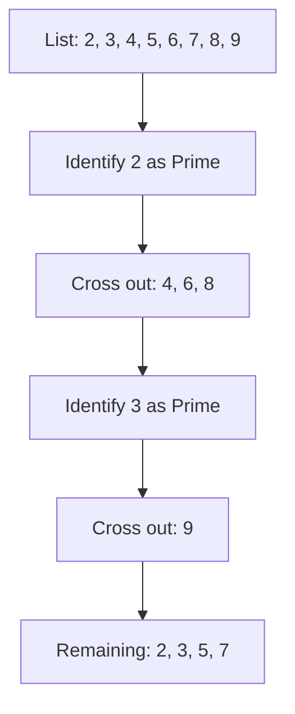
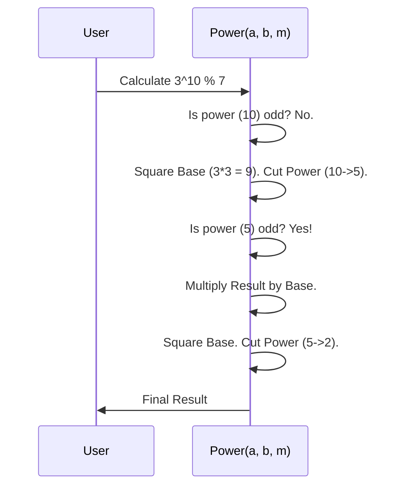

# Chapter 6: Numerical Methods & Math

Welcome back! In the previous chapter, [Dynamic Programming](05_dynamic_programming.md), we learned how to optimize code by remembering the past (memoization).

Now, we are going to dive into the very heart of the computer. At its core, a computer is just a fancy calculator. 
*   How do we perform calculations on massive numbers without crashing?
*   How do video games simulate gravity or water ripples?
*   How do we encrypt messages using prime numbers?

**Numerical Methods** are the algorithms that solve mathematical problems, from the lowest level (bits) to the highest level (calculus and physics simulations).

---

## The Motivation: The "Sci-Fi" Console

Imagine you are programming the navigation computer for a spaceship. You have three distinct problems to solve:
1.  **System Check:** You need to count how many systems are "Online" (represented by binary `1`s).
2.  **Security:** You need to generate a secret key using Prime Numbers to lock the door.
3.  **Navigation:** You need to predict where the ship will be in 10 seconds, accounting for gravity and engine thrust.

We cannot just guess. We need precise mathematical algorithms.

---

## Concept 1: Bit Manipulation (The System Check)

Computers don't see numbers like `5` or `9`. They see **Bits**: `101` and `1001`.
Sometimes, we need to work directly with these bits to save space or speed up calculations.

**The Problem:** You have a status code (an integer). Every `1` in the binary representation means a system is working. You need to count how many `1`s there are.

**The Trick:** instead of looping through all 32 or 64 slots, we can use a math trick: `n & (n - 1)`.
This operation removes the *last* `1` from a number.

### Visualizing the Magic
Let's say `n` is **6** (Binary `110`).
1.  `n - 1` is **5** (`101`).
2.  `6 & 5` (`110 & 101`) becomes `100` (We removed the bottom `1`).

```cpp
// From bit_manipulation/count_of_set_bits.cpp
std::uint64_t countSetBits(std::uint64_t n) {
    std::uint64_t count = 0;
    
    // Repeat until the number becomes 0
    while (n != 0) {
        n = (n & (n - 1)); // This line deletes the rightmost '1'
        ++count;
    }
    return count;
}
```
*   **Input:** `13` (Binary `1101`)
*   **Step 1:** `1101` becomes `1100`. Count = 1.
*   **Step 2:** `1100` becomes `1000`. Count = 2.
*   **Step 3:** `1000` becomes `0000`. Count = 3. Done.

---

## Concept 2: Number Theory (The Security)

To keep data safe, we often rely on **Prime Numbers** (numbers divisible only by 1 and themselves). 
Finding primes efficiently is critical.

**The Problem:** Find all prime numbers up to 100.
**Naive Way:** Check if 2 divides 3, 4, 5... then check if 3 divides 4, 5, 6... (Too slow!).

**The Solution:** **Sieve of Eratosthenes**.
Imagine a grid of numbers.
1.  Circle **2**. Cross out every multiple of 2 (4, 6, 8...).
2.  Circle **3** (next open number). Cross out every multiple of 3 (6, 9, 12...).
3.  The numbers left uncrossed are Primes.

### Visualizing the Sieve


### Simplified Code (C++)
We use a `vector<bool>` where `true` means "Is Prime".

```cpp
// Simplified from math/sieve_of_eratosthenes.cpp
std::vector<bool> sieve(uint32_t N) {
    // 1. Assume everyone is prime initially
    std::vector<bool> is_prime(N + 1, true); 
    is_prime[0] = is_prime[1] = false; // 0 and 1 are not prime

    // 2. Loop through numbers
    for (uint32_t i = 2; i * i <= N; i++) {
        if (is_prime[i]) {
            // 3. Mark all multiples as FALSE (Not Prime)
            for (uint32_t j = i * i; j <= N; j += i) {
                is_prime[j] = false;
            }
        }
    }
    return is_prime;
}
```

---

## Concept 3: Numerical Simulation (The Navigation)

Real life is continuous, not discrete. Things change smoothly over time (like a spaceship accelerating). 
To simulate this on a computer, we use **Differential Equations**.

**The Problem:** We know the ship's current speed and acceleration formula. Where will it be in 1 second?
*   **Euler's Method (Basic):** Current Spot + (Speed * 1 sec). This is inaccurate because speed changes *during* that second.
*   **Runge-Kutta (Advanced):** We check the slope at the start, middle, and end of the second, and take a weighted average. It's much more precise.

### The Logic (RK4)
Think of it like feeling the terrain in the dark.
1.  Feel the slope at your feet.
2.  Take a half-step, feel the slope there.
3.  Adjust and take another half-step.
4.  Take a full step.
5.  Combine these 4 "feelings" to make one perfect move.

```cpp
// Simplified from numerical_methods/rungekutta.cpp
// h is the "step size" (e.g., 0.1 seconds)
double rungeKutta(double x, double y, double h) {
    // k1, k2, k3, k4 are the 4 "slope checks"
    double k1 = h * change(x, y);
    double k2 = h * change(x + 0.5 * h, y + 0.5 * k1);
    double k3 = h * change(x + 0.5 * h, y + 0.5 * k2);
    double k4 = h * change(x + h, y + k3);

    // Combine them (Middle slopes count double)
    return y + (1.0 / 6.0) * (k1 + 2 * k2 + 2 * k3 + k4);
}
```

---

## Advanced Mention: Fast Fourier Transform (FFT)

**Use Case:** Audio processing, removing noise from recordings.

Imagine you have a fruit smoothie (a signal). You want to know exactly how much strawberry, banana, and yogurt is in it. 
**FFT** takes a complex wave (the smoothie) and breaks it down into its pure ingredients (frequencies).
*   *Time Domain:* The wobbly line you see on a voice recorder.
*   *Frequency Domain:* The equalizer bars you see on a music player.

*See `numerical_methods/fast_fourier_transform.cpp` for the complex math behind this.*

---

## Under the Hood: Modular Exponentiation

Let's look at one final essential math tool: **Modular Exponentiation**. 
This answers: `(Base ^ Exponent) % Modulo`.
Why? Because `5423 ^ 2342` is a number so big it would eat all your RAM. We need the remainder *without* calculating the massive number.

### Sequence Diagram: The "Power" Loop
We use a strategy called "Exponentiation by Squaring." We cut the work in half repeatedly.



### Implementation Deep Dive
Here is how we implement this safely in C++.

```cpp
// From math/modular_exponentiation.cpp
uint64_t power(uint64_t a, uint64_t b, uint64_t c) {
    uint64_t ans = 1;
    a = a % c; // Keep the base small from the start

    while (b > 0) {
        // If power is odd, multiply current base to answer
        if (b & 1) { 
            ans = ((ans % c) * (a % c)) % c;
        }
        
        // Divide power by 2 (b = b / 2)
        b = b >> 1; 
        
        // Square the base for the next step
        a = ((a % c) * (a % c)) % c;
    }
    return ans;
}
```
*   **Note:** `b & 1` is a bit manipulation trick to check if a number is odd.
*   **Note:** `b >> 1` is a bit shift that divides `b` by 2.

---

## Conclusion

In this chapter, we explored the mathematical engines that power computing.
1.  **Bit Manipulation:** Controlling the atomic switches of the computer.
2.  **Sieve of Eratosthenes:** Finding primes quickly (crucial for security).
3.  **Runge-Kutta:** Simulating physics with high precision.
4.  **Modular Exponentiation:** Handling massive numbers without overflow.

Mathematics is the language of secrets. Now that we understand primes and modular arithmetic, we have the keys to understand how computers keep secrets.

[Next Chapter: Cryptography & Hashing](07_cryptography___hashing.md)

---

Generated by [Code IQ](https://github.com/adityasoni99/Code-IQ)