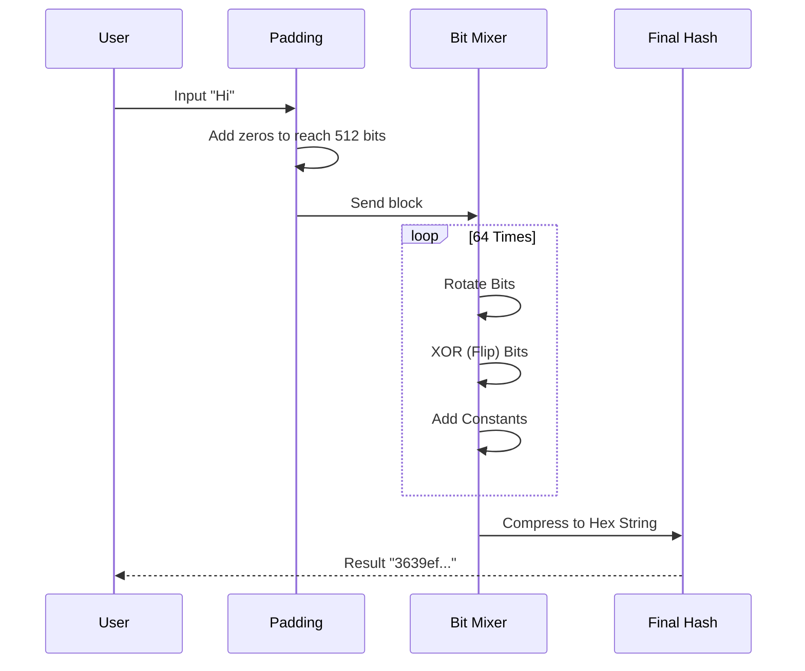

# Chapter 7: Cryptography & Hashing

Welcome back! In the previous chapter, [Numerical Methods & Math](06_numerical_methods___math.md), we explored the mathematical engines powering computers, like bit manipulation and prime numbers.

Now, we will use those mathematical tools to solve two of the most critical problems in the digital age:
1.  **Secrecy:** How do I send a message that only you can read?
2.  **Integrity & Speed:** How do I create a unique "fingerprint" for data to identify it instantly?

This is the world of **Cryptography** and **Hashing**.

---

## The Motivation: The Secret Agent's Notebook

Imagine you are a spy. You have a digital notebook containing sensitive mission details.
*   **Problem 1 (Encryption):** If you lose the notebook, you don't want enemies reading it. You need to scramble the text.
*   **Problem 2 (Hashing):** You need to verify that no one tore out a page or changed a word while you were sleeping. You need a tamper-proof seal.
*   **Problem 3 (Indexing):** You have 10,000 mission reports. You need to find "Mission Alpha" instantly without flipping through every page.

We will use **Ciphers** to solve Problem 1, and **Hashing** to solve Problems 2 and 3.

---

## Concept 1: The Caesar Cipher (Secrecy)

The simplest form of cryptography is the **Cipher**. It swaps letters to hide the meaning.

The **Caesar Cipher** is thousands of years old. To encrypt a message, you simply "shift" every letter down the alphabet by a fixed number.

If the shift is **1**:
*   `A` becomes `B`
*   `B` becomes `C`
*   `H` `E` `L` `L` `O` becomes `I` `F` `M` `M` `P`

### The Math Behind It
We treat letters as numbers (`A=0`, `B=1`... `Z=25`).
The formula is: `(Current Letter + Shift) % 26`.
*Note: The `% 26` (modulo) wraps the alphabet around, so `Z` shifts back to `A`.*

### Simplified Code
Here is how we implement the encryption loop in C++.

```cpp
// Simplified from ciphers/caesar_cipher.cpp
std::string encrypt(std::string text, int shift) {
    std::string result = "";
    
    for (char c : text) {
        // 1. Convert char to number (0-25)
        int val = c - 'A'; 
        
        // 2. Apply shift and wrap around
        val = (val + shift) % 26; 
        
        // 3. Convert back to char and append
        result += (char)(val + 'A');
    }
    return result;
}
```
*   **Input:** "ABC", Shift 2
*   **Math:** A(0)+2=2(C), B(1)+2=3(D), C(2)+2=4(E)
*   **Output:** "CDE"

---

## Concept 2: Hashing (The Digital Fingerprint)

A **Hash Function** takes any amount of data (a word, a book, a movie) and crushes it into a fixed-size string of characters.

Think of it like a **Blender**.
1.  Put "Apple" in -> Get red juice.
2.  Put "Apple" in -> Get the *exact same* red juice.
3.  Put "Appl**f**" in -> Get *completely different* green juice.

**Crucial Rule:** You cannot turn the juice back into an Apple. Hashing is a **one-way** street.

### SHA-256
**SHA-256** is a famous hashing algorithm. It generates a unique 256-bit signature. We use it to check **Integrity**. If even one bit of a file changes, the Hash changes completely.

### Simplified Code Usage
We don't usually write SHA-256 from scratch (it's complex math!), but here is how it behaves.

```cpp
// Simplified usage of hashing/sha256.cpp
#include "sha256.cpp"

int main() {
    std::string input = "Hello World";
    
    // Create the fingerprint
    std::string fingerprint = hashing::sha256::sha256(input);
    
    // Output: a591a6d40bf420404a011733cfb7b190...
    std::cout << fingerprint << std::endl; 
}
```

---

## Concept 3: Hash Tables (Speed)

Remember in [Chapter 1](01_fundamental_data_structures.md) when we talked about arrays? Arrays are fast if you know the index (`arr[5]`). But what if you only know the *name* of the data, like "John Smith"?

We can use **Hashing** to turn "John Smith" into an index number!
`Hash("John Smith")` might equal `5`. So we store John's data at `arr[5]`.

### The Collision Problem
What if `Hash("John Smith")` is `5`, and `Hash("Lisa")` is also `5`?
This is called a **Collision**. Two items want the same shelf.

**Solution: Linear Probing.**
If shelf 5 is taken, try shelf 6. If 6 is taken, try 7. Keep walking until you find an empty spot.

### Visualizing Linear Probing

```mermaid
graph TD
    Input[Insert "Lisa"] --> Hash[Hash Function returns 5]
    Hash --> Check5{Is Index 5 Empty?}
    Check5 -->|No, John is there| Check6{Is Index 6 Empty?}
    Check6 -->|No, Bob is there| Check7{Is Index 7 Empty?}
    Check7 -->|Yes| Place[Put Lisa at 7]
```

### Simplified Code
Here is how we find a spot for a key using Linear Probing.

```cpp
// Simplified from hashing/linear_probing_hash_table.cpp
void add(int key) {
    // 1. Calculate ideal spot (Hash)
    int index = hashFxn(key) % totalSize; 

    // 2. If spot is taken, keep looking (Probing)
    while (table[index].key != empty) {
        // Move to next spot
        index = (index + 1) % totalSize; 
    }

    // 3. Found empty spot!
    table[index].key = key; 
}
```

---

## Under the Hood: The Bit Mixer

How does SHA-256 actually work? It relies heavily on **Bit Manipulation** (which we learned in [Chapter 6](06_numerical_methods___math.md)).

It takes the input message and performs thousands of operations: shifting bits left, shifting bits right, and flipping bits (XOR). This "shuffles" the data so thoroughly that it creates a unique fingerprint.

### Sequence Diagram: The SHA-256 Process



### Internal Code: Bit Rotation
One of the core moves in SHA-256 is the "Right Rotate". It takes bits falling off the right side and pastes them back onto the left side.

```cpp
// From hashing/sha256.cpp
uint32_t right_rotate(uint32_t n, size_t rotate) {
    // 1. Shift right by 'rotate'
    // 2. Shift left by (32 - 'rotate')
    // 3. Combine them with OR (|)
    return (n >> rotate) | (n << (32 - rotate));
}
```
*   **Example:** `0001` rotated right by 1 becomes `1000`.

---

## Conclusion

Cryptography and Hashing allow us to trust our data.
1.  **Ciphers (Caesar):** Hide information by mathematically shifting it.
2.  **Hashing (SHA-256):** Creates unique, tamper-proof fingerprints using bit manipulation.
3.  **Hash Tables:** Use those fingerprints to store and retrieve data instantly, resolving collisions with techniques like Linear Probing.

Now that we can secure and organize data, let's look at one of the most common data types in the world: Text. How do we search inside paragraphs or verify patterns in words?

[Next Chapter: String Algorithms](08_string_algorithms.md)

---

Generated by [Code IQ](https://github.com/adityasoni99/Code-IQ)