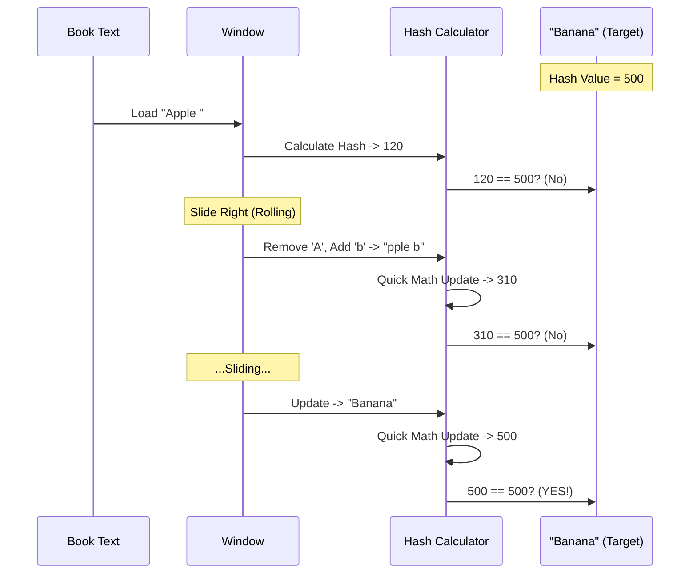

# Chapter 8: String Algorithms

Welcome back! In the previous chapter, [Cryptography & Hashing](07_cryptography___hashing.md), we learned how to turn data into a unique fingerprint (a Hash) to keep it secure or organize it.

Now, we are going to use that same "Fingerprint" concept for a totally different purpose: **Finding things.**

**String Algorithms** are the magic behind the "Search" bar. Whether you are using `Ctrl+F` in a Word document, searching for a DNA sequence in a genome, or Googling a phrase, you are using string algorithms.

---

## The Motivation: The "Ctrl+F" Problem

Imagine you have a text file containing the entire series of *Harry Potter* (about 1,000,000 words). You want to find the exact location of the phrase **"Golden Snitch"**.

**The Naive Approach (The Slow Way):**
1.  Look at the 1st letter of the book. Does it match 'G'? No? Move to the 2nd letter.
2.  ... Eventually, you match 'G'.
3.  Check the next letter. Is it 'o'? Yes.
4.  Check the next. Is it 'l'? Yes.
5.  Check the next. Is it 'd'? **No.**
6.  **Painful Step:** You have to go *all the way back* to the letter after the 'G' and start over.

This is very slow. We need a way to scan the text without constantly backtracking and re-reading letters we just looked at.

---

## Concept 1: Rabin-Karp (The Rolling Hash)

Remember in the last chapter how we turned "Hello" into a number? **Rabin-Karp** uses that to speed up searching.

**The Logic:**
Instead of comparing letter-by-letter (which is slow), let's compare **Hashes** (which is fast).

1.  Calculate the Hash of our search pattern ("Golden"). Let's say it equals `500`.
2.  Look at the first 6 letters of the book. Calculate their Hash. Is it `500`?
3.  If **No**: Slide the window over by one letter.
4.  If **Yes**: *Then* we check the letters manually to be sure.

### The "Rolling" Trick
Recalculating the hash for every set of letters would be slow. Rabin-Karp uses a **Rolling Hash**.
*   Imagine the hash is a sum.
*   To slide the window, we **subtract** the letter leaving the left side and **add** the letter entering the right side.
*   We don't need to recount the middle letters!

### Simplified Code (C++)
Here is how we update the hash as we slide across the text.

```cpp
// Simplified from strings/rabin_karp.cpp
// str_hash is the current value. We want to slide the window.
// 'old_char' is leaving, 'new_char' is entering.

int64_t recalculate_hash(char old_char, char new_char, int64_t old_hash) {
    // 1. Remove the leading character
    int64_t temp = old_hash - old_char; 
    
    // 2. Shift values (like dividing by 10 to remove a digit)
    temp /= PRIME; 

    // 3. Add the new character with its weight
    temp += new_char * pow(PRIME, pattern_length - 1);
    
    return temp;
}
```

---

## Concept 2: Knuth-Morris-Pratt (KMP) (The Smart Skip)

Rabin-Karp is great, but there is an even smarter way that doesn't use math, just pure logic. It is called **KMP**.

**The Logic:**
If you partially match a word and then fail, **don't start over completely.** Use what you already matched to skip ahead.

**Example:**
*   Pattern: **"ABABAC"**
*   Text: **"ABABAD..."**

1.  We match **A-B-A-B-A**.
2.  We fail at **C** vs **D**.
3.  **Naive way:** Go back to index 1.
4.  **KMP way:** We just saw "ABABA". The end of that ("ABA") matches the start of our pattern ("ABA"). So, we don't need to re-check those. We can slide the pattern forward instantly so the "ABA"s align.

### The Failure Table
To do this, KMP pre-calculates a "Cheat Sheet" (called a Failure Array or LPS). It tells the computer: *"If you fail at index 5, you can safely jump back to index 3 without checking."*

### Simplified Code (C++)
This is how KMP uses the cheat sheet to skip re-checking characters.

```cpp
// Simplified from strings/knuth_morris_pratt.cpp
// k is our position in the Pattern
// j is our position in the Text

while (k != npos && pattern[k] != text[j]) {
    // MISMATCH! 
    // Don't go back to 0. Look at the cheat sheet (failure array).
    // It tells us the best previous spot to resume from.
    k = failure[k]; 
}

// If characters match, move both forward
if (++k == pattern_length) {
    return "Found it!";
}
```

---

## Under the Hood: The Sliding Window

Let's visualize how the **Rabin-Karp** algorithm "slides" over the text. It behaves like a conveyor belt.

### Sequence Diagram: The Rolling Hash



### Implementation Details: The Math

How do we assign a "score" to a word? We treat letters like numbers.
Just like `123` = `1*100 + 2*10 + 3*1`, we do:
`Hash("ABC")` = `A * (Prime^0) + B * (Prime^1) + C * (Prime^2)`

In the file `strings/rabin_karp.cpp`, this is implemented here:

```cpp
// From strings/rabin_karp.cpp
int64_t create_hash(const std::string& s, int n) {
    int64_t result = 0;
    for (int i = 0; i < n; ++i) {
        // Multiply char code by Prime Number power
        result += (int64_t)(s[i] * (int64_t)pow(PRIME, i));
    }
    return result;
}
```

---

## Under the Hood: The KMP Failure Table

The hardest part of KMP is building the "Cheat Sheet" (Failure Array). Let's look at `strings/knuth_morris_pratt.cpp`.

This function looks at the pattern *before* scanning the text. It looks for prefixes that are also suffixes.

```cpp
// From strings/knuth_morris_pratt.cpp
std::vector<size_t> getFailureArray(const std::string &pattern) {
    // ... setup ...
    for (int i = 0; i < pattern_length; i++) {
        // If the current char doesn't continue the prefix chain, fall back
        while (j != std::string::npos && pattern[j] != pattern[i]) {
            j = failure[j];
        }
        // If it matches, our prefix chain is longer!
        failure[i + 1] = ++j;
    }
    return failure;
}
```
*   **Input:** "ABABAC"
*   **Logic:**
    *   'A' (Index 0): Start.
    *   'B' (Index 1): No repeat.
    *   'A' (Index 2): Matches index 0! Length 1.
    *   'B' (Index 3): Matches index 1! Length 2.
    *   'A' (Index 4): Matches index 2! Length 3.
*   **Result:** When you see the final 'C' and fail, the table tells you: "You already matched ABA (Length 3), keep that!"

---

## Conclusion

String algorithms turn slow, repetitive reading into fast, efficient scanning.
1.  **Naive Search:** Checks everything, backtracks constantly. (Slow).
2.  **Rabin-Karp:** Uses **Hashing** to weigh the pattern and "rolls" across the text.
3.  **KMP:** Uses a **Failure Table** to remember what it has already matched, allowing it to skip ahead.

These algorithms allow computers to read, search, and process massive amounts of text in milliseconds. But what if we want the computer to *understand* what it's reading, or make predictions based on data it has never seen before?

[Next Chapter: Machine Learning](09_machine_learning.md)

---

Generated by [Code IQ](https://github.com/adityasoni99/Code-IQ)