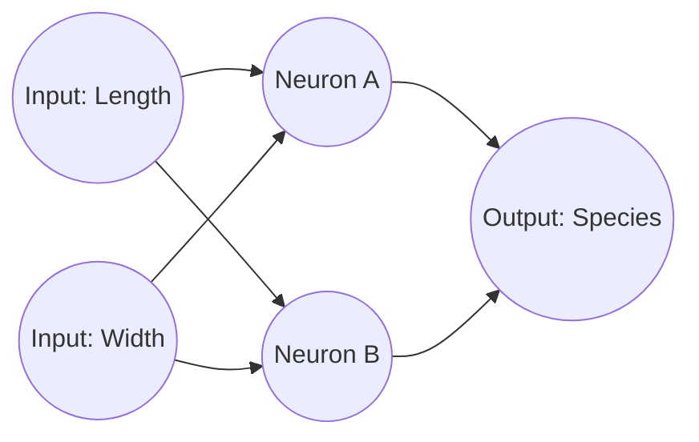
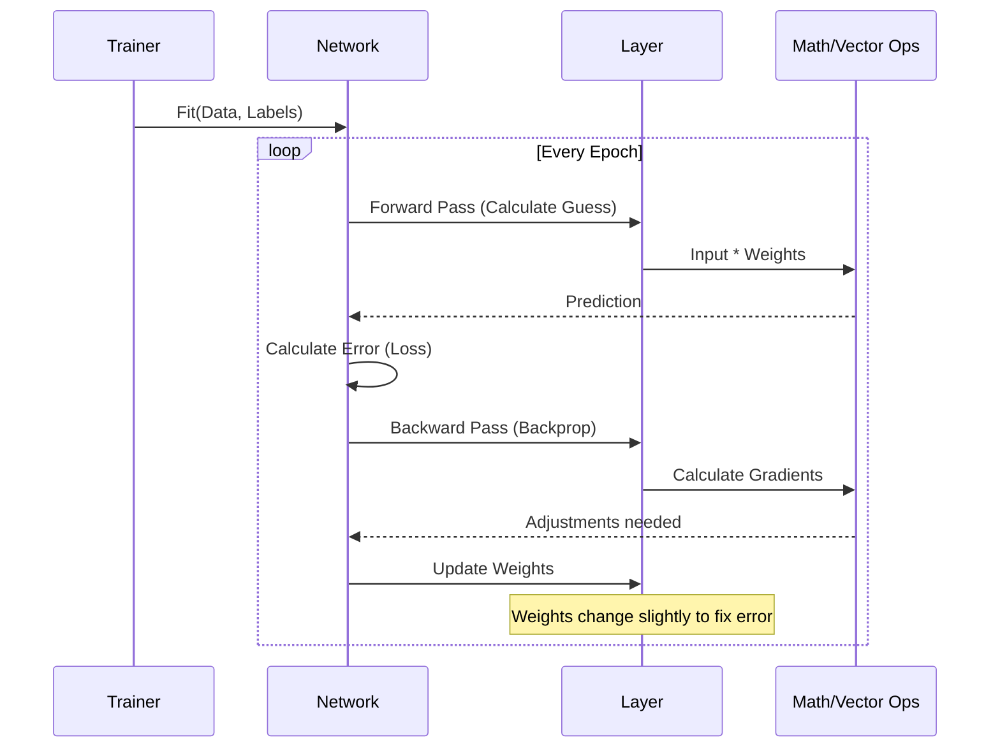

# Chapter 9: Machine Learning

Welcome to the final chapter! In the previous chapter, [String Algorithms](08_string_algorithms.md), we learned how to find exact patterns in text, like searching for a specific word in a book.

But what if the pattern isn't exact? What if you want a computer to look at a photo and say, "That's a cat," or look at a house's size and guess its price? You can't write an `if` statement for every possible cat photo.

**Machine Learning (ML)** is a paradigm shift. Instead of giving the computer strict rules, we give it **data** and let it learn the rules itself.

---

## The Motivation: The Flower Sorter

Imagine you are a botanist. You have a pile of Iris flowers. You know the **Petal Length** and **Petal Width** of each.
*   **Setosa** flowers are small.
*   **Versicolor** flowers are medium.
*   **Virginica** flowers are large.

**The Old Way:** You write code: `if (length < 2) return "Setosa";`
**The Problem:** What about the medium ones? The border is fuzzy. Your rules get complicated quickly.

**The ML Way:** You feed 100 measurements into a **Neural Network** and say: "These are the answers. Figure out the math."

---

## Concept 1: The Neural Network

A **Neural Network** is inspired by the human brain. It is made of layers of "Neurons."

1.  **Input Layer:** Takes the raw numbers (e.g., Petal Length).
2.  **Hidden Layers:** The "brain" that does the thinking.
3.  **Output Layer:** The final guess (e.g., "Setosa").

### Visualizing the Network

Each line connecting a circle is a **Weight**. Think of a weight as a "Volume Knob."
*   If a knob is turned up high, that input is very important.
*   If turned to zero, that input is ignored.



---

## Concept 2: Forward Propagation (The Guess)

How does the network make a decision?
It takes the inputs, multiplies them by the **Weights**, adds them up, and pushes the result through an **Activation Function**.

**The Activation Function** (like `Sigmoid` or `ReLU`) decides if the neuron should "fire." It's like a filter that turns the math result into a simple number between 0 and 1.

*   *Math:* `Output = Activation(Input * Weight + Bias)`

---

## Concept 3: Backpropagation (The Learning)

When the network starts, the weights are random. It knows nothing. It might guess "Setosa" for a giant flower.

**Training Loop:**
1.  **Predict:** The network makes a guess.
2.  **Loss:** We calculate how wrong the guess was (Error).
3.  **Backpropagation:** We go *backward* through the network. If the guess was too high, we turn the "Volume Knobs" (Weights) down. If too low, we turn them up.

This repeats thousands of times until the error is near zero.

---

## Usage: Building a Brain in C++

We will use the provided `NeuralNetwork` class to solve our flower problem.

### Step 1: Define the Architecture
We need to tell the system how many layers we want.
*   Layer 1: 4 Inputs (Measurements).
*   Layer 2: 6 Neurons (Hidden thinking layer).
*   Layer 3: 3 Outputs (One for each flower species).

```cpp
// From machine_learning/neural_network.cpp
using namespace machine_learning::neural_network;

// Define structure: {Neurons, Activation Function}
NeuralNetwork myNN({
    {4, "none"},     // Input Layer
    {6, "relu"},     // Hidden Layer (uses ReLU logic)
    {3, "sigmoid"}   // Output Layer (uses Sigmoid logic)
});
```

### Step 2: Train the Model (Fit)
We give the network data (`iris.csv`). We tell it to study (Epochs) 100 times.

```cpp
// Train the model
// Arguments: Filename, Last_Col_Is_Label, Epochs, Learning_Rate...
myNN.fit_from_csv(
    "iris.csv", 
    true,   // The last column contains the answer
    100,    // Study the data 100 times
    0.3,    // Learning Rate (how fast to change weights)
    false   // Normalization flag
);
```

### Step 3: Make a Prediction
Now that it has learned, we give it a new flower it has never seen before.

```cpp
// A new flower with measurements: {5.0, 3.4, 1.6, 0.4}
std::vector<std::valarray<double>> new_flower = {{5, 3.4, 1.6, 0.4}};

// Ask the network
auto result = myNN.single_predict(new_flower);

// The result is a list of probabilities, e.g., {0.9, 0.05, 0.05}
// Index 0 (Setosa) has the highest probability.
```

---

## Under the Hood: Internal Implementation

How does the C++ code actually "learn"? Let's look at the sequence of events during **one training step**.

### Sequence Diagram: The Training Step



### Code Deep Dive: Forward Pass
Inside `__detailed_single_prediction`, the code loops through layers. It multiplies the input by the kernel (weights) and applies the activation function.

```cpp
// Simplified from machine_learning/neural_network.cpp
// current_pass holds the data moving through the network
for (const auto &l : layers) {
    // 1. Matrix Multiplication: Data * Weights
    current_pass = multiply(current_pass, l.kernel);
    
    // 2. Activation: Apply Sigmoid/Relu to the result
    current_pass = apply_function(current_pass, l.activation_function);
    
    // Save state for later
    details.emplace_back(current_pass);
}
```

### Code Deep Dive: Backpropagation (The "Magic")
This is where the learning happens inside `fit()`. We calculate the `cur_error` and update `l.kernel` (the weights).

```cpp
// Simplified from machine_learning/neural_network.cpp inside fit()

// 1. Calculate how much the weights contributed to the error
// This uses the "Chain Rule" of calculus (derivative)
grad = multiply(transpose(activations[j]), cur_error);

// 2. Adjust the weights (Kernel)
// We subtract the gradient multiplied by the Learning Rate
this->layers[j].kernel = this->layers[j].kernel - (gradients[j] * learning_rate);
```

**Analogy:**
*   **Gradient:** The direction of the mistake (e.g., "You aimed too far left").
*   **Learning Rate:** How big of a step to take (e.g., "Move 1 inch right").
*   If we repeat this calculation thousands of times, the `kernel` (Weights) eventually becomes perfect at predicting the flower type.

---

## Conclusion

Congratulations! You have completed the **Machine Learning** chapter and the **C-Plus-Plus** tutorial series.

We moved from storing simple numbers in [Fundamental Data Structures](01_fundamental_data_structures.md), to sorting them, to connecting them in [Graph Algorithms](03_graph_algorithms.md), and finally, to building a mathematical brain that learns patterns from them.

**Key Takeaways from this chapter:**
1.  **Neural Networks** are layers of math operations that simulate a brain.
2.  **Forward Propagation** is the act of guessing.
3.  **Backpropagation** is the act of learning from mistakes by adjusting weights.

You now possess the foundational knowledge of algorithms in C++. From here, you can build search engines, secure communication tools, or intelligent AI systems. Happy coding!

---

Generated by [Code IQ](https://github.com/adityasoni99/Code-IQ)