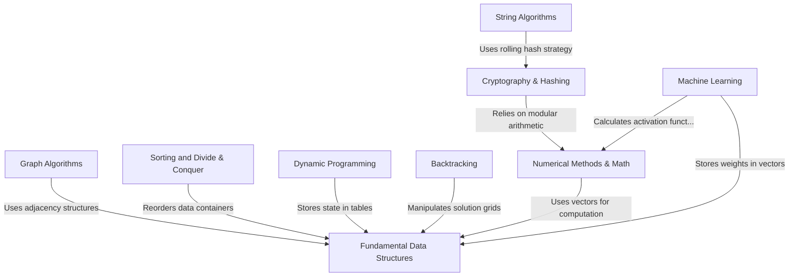

# Tutorial: C-Plus-Plus

This project is a versatile collection of **C++ implementations** that spans core computer science domains. It provides efficient examples of **fundamental data structures** and **algorithms**, such as sorting and graph traversal, while also exploring advanced topics like **cryptography**, **numerical analysis**, and **machine learning**, demonstrating how theoretical concepts are translated into working code.

**Source Repository:** [https://github.com/TheAlgorithms/C-Plus-Plus](https://github.com/TheAlgorithms/C-Plus-Plus)

## Chapters

1. [Fundamental Data Structures](01_fundamental_data_structures.md)
2. [Sorting and Divide & Conquer](02_sorting_and_divide___conquer.md)
3. [Graph Algorithms](03_graph_algorithms.md)
4. [Backtracking](04_backtracking.md)
5. [Dynamic Programming](05_dynamic_programming.md)
6. [Numerical Methods & Math](06_numerical_methods___math.md)
7. [Cryptography & Hashing](07_cryptography___hashing.md)
8. [String Algorithms](08_string_algorithms.md)
9. [Machine Learning](09_machine_learning.md)

---

Generated by [Code IQ](https://github.com/adityasoni99/Code-IQ)