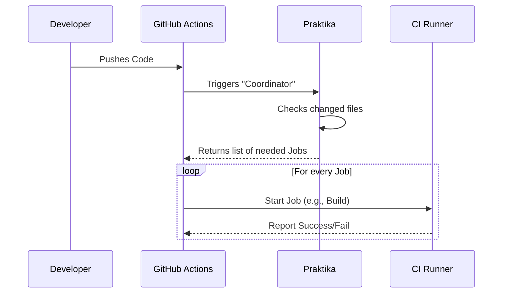

# Chapter 1: Praktika Framework

Welcome to the ClickHouse development tutorials! If you are looking to contribute to ClickHouse or understand how this massive project ensures stability, you are in the right place.

We start our journey not with the database code itself, but with the **Praktika Framework**—the brain behind our Continuous Integration (CI) system.

## The Problem: The "All or Nothing" Trap

Imagine you are working in a car factory. You just updated the text in the "Owner's Manual" to fix a typo.

In a traditional, simple setup, the factory manager might order the team to:
1.  Rebuild the entire engine.
2.  Crash test the car.
3.  Check the paint.
4.  Finally, print the manual.

This is a waste of time and money! You only changed the manual, so you should only check the manual.

**The Challenge:** ClickHouse is huge. Running *every* test for *every* small change (like a documentation fix) would cost a fortune and take hours. We need a way to say, "If I change file X, only run test Y."

## The Solution: Praktika

**Praktika** is our custom framework located in `ci/praktika/`. It is written in Python.

Think of Praktika as a smart **Traffic Controller**. Instead of blindly running every test, it looks at what you changed in your code and dynamically decides which tests are actually necessary.

### Central Use Case: Smart Scheduling

Let's look at the central use case we want to solve:

**Scenario:** You submit a Pull Request that modifies a Python script.
**Goal:** Praktika should detect this and run Python linting checks, but *skip* the heavy C++ build and integration tests.

## Key Concepts

Praktika relies on a few simple building blocks to organize work.

### 1. The Workflow
The **Workflow** is the big plan. It represents the entire pipeline of work that needs to be done for a specific commit. It is a collection of jobs connected together.

### 2. The Job
A **Job** is a single unit of work. For example, "Build ClickHouse" is a job. "Run Unit Tests" is another job.

### 3. Dependency Graph
Jobs don't run in random order. They depend on each other. You cannot "Run Tests" before you "Build ClickHouse." Praktika manages these relationships.

## How to Use Praktika

In the ClickHouse repository, CI isn't defined by static YAML files. It is defined by Python code. This gives us the power of a programming language to define our logic.

### Defining a Simple Job

Here is a simplified example of how a Job is defined in Praktika. We define a class that tells the system what to do.

```python
from praktika.result import Result

class HelloWorldJob:
    name = "Hello World"
    
    # Where does this run? (e.g., on a small linux machine)
    tags = ["runner-small"]

    def run(self):
        print("Hello from Praktika!")
        return Result.OK
```
*Explanation:* This Python class defines a job named "Hello World". It asks to run on a small runner and prints a message.

### configuring Dependencies

To make the workflow smart, we link jobs together.

```python
# Pseudo-code logic inside Praktika
workflow = Workflow()

build_job = BuildJob()
test_job = TestJob()

# The test job waits for the build job
workflow.add_dependency(build_job, test_job)
```
*Explanation:* This logic ensures that `TestJob` will not start until `BuildJob` has finished successfully.

## Under the Hood: How It Works

When you push code to GitHub, how does Praktika take over?

1.  **Trigger:** GitHub Actions sees your code push.
2.  **Bootstrapping:** GitHub starts a generic "Coordinator" script.
3.  **Calculation:** Praktika analyzes your changed files.
4.  **Generation:** Praktika generates a JSON list of jobs specifically for your PR.
5.  **Execution:** GitHub receives this list and spins up the actual runners.

Here is a sequence diagram of the process:



### Implementation Details

The core logic resides in `ci/praktika/`. Here is a peek at how Praktika decides if a job should run based on file changes.

```python
# Simplified concept from ci/praktika/
def should_run(changed_files, requirements):
    for file in changed_files:
        # If a changed file matches the job's requirements
        if file.startswith(requirements):
            return True
    return False
```
*Explanation:* Praktika compares the list of files you changed (`changed_files`) against what the job cares about (`requirements`). If there is a match, the job is added to the workflow.

## Why This Matters

By using Praktika, we ensure that:
1.  **Fast Feedback:** You don't wait for unrelated tests.
2.  **Cost Efficiency:** We don't waste server resources.
3.  **Clean Config:** We manage CI in Python, not messy YAML.

This framework is the foundation for everything that follows. It decides when to trigger [CI Workflows](02_ci_workflows.md), how to set up the [Build Configuration](03_build_configuration.md), and which [Docker Server Image](05_docker_server_image.md) to use.

## Summary

In this chapter, you learned that **Praktika** is a custom Python framework used by ClickHouse to intelligently manage Continuous Integration. Instead of running everything all the time, it calculates exactly what needs to be tested based on your code changes.

In the next chapter, we will see the actual workflows this framework generates and how they appear in GitHub.

[Next Chapter: CI Workflows](02_ci_workflows.md)

---

Generated by [Code IQ](https://github.com/adityasoni99/Code-IQ)