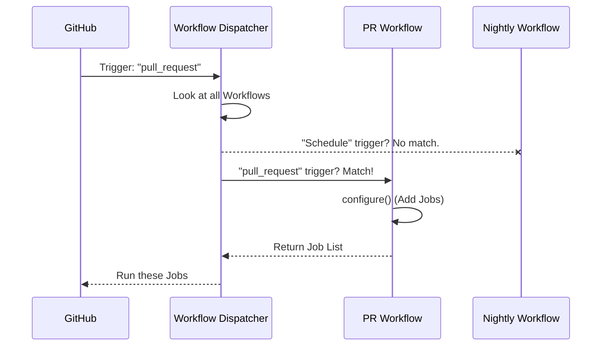

# Chapter 2: CI Workflows

In the previous chapter, we introduced the [Praktika Framework](01_praktika_framework.md) as the brain behind our CI system. We learned that it acts as a "Traffic Controller," deciding what work needs to be done.

But how does the controller know *when* to start working? And does it do the exact same work for a simple code check as it does for a major software release?

This brings us to **CI Workflows**.

## The Problem: One Size Does Not Fit All

Imagine you run a restaurant kitchen.

1.  **Lunch Rush:** You need to serve food fast. You skip the fancy garnishes and focus on speed.
2.  **State Dinner:** You are serving a king. You cook everything slowly, check every detail, and polish the silverware.

**The Challenge:** In software, a "Pull Request" (PR) is like the Lunch Rush—we want fast feedback. A "Release" is like the State Dinner—we need deep, thorough testing. We cannot use the same checklist for both.

**Central Use Case:**
We want to define two different plans:
1.  **PR Workflow:** Runs only when a developer pushes code to a branch. It runs fast tests.
2.  **Nightly Workflow:** Runs every night at 2:00 AM. It runs slow, heavy tests.

## Key Concepts

To solve this, Praktika divides the work into **Workflows**.

### 1. The Trigger
A **Trigger** is the event that wakes up the CI.
*   **Pull Request (PR):** Someone wants to merge code.
*   **Push:** Code was merged into the main branch (`master`).
*   **Schedule:** A timer (e.g., "Every night").

### 2. The Workflow Class
This is a Python class that groups jobs together. It says: "If Trigger X happens, execute Job List Y."

## How to Define a Workflow

In ClickHouse, we define workflows using Python code. We create a class that inherits from `Workflow`.

### Step 1: Naming the Workflow

First, we define the workflow and give it a name.

```python
from praktika import Workflow

class PullRequestWorkflow(Workflow):
    # This name appears in GitHub checks
    name = "PR Workflow"
    
    # This configures WHEN this workflow runs
    triggers = ["pull_request"]
```
*Explanation:* We created a blueprint called `PullRequestWorkflow`. It listens specifically for "pull_request" events.

### Step 2: Adding Jobs

A workflow is empty without jobs. We need to add the jobs (like building and testing) to it.

```python
    def configure(self):
        # We create the jobs we need
        build = BuildJob()
        test = TestJob()
        
        # We add them to this workflow
        self.add_job(build)
        self.add_job(test)
```
*Explanation:* Inside the `configure` method, we create job instances and register them. Now, when a PR is opened, these two jobs will be queued.

### Step 3: Connecting Jobs (Review)

Just like we learned in [Praktika Framework](01_praktika_framework.md), we must define the order.

```python
        # Ensure 'test' runs AFTER 'build'
        self.add_dependency(build, test)
```
*Explanation:* This ensures the workflow flows logically: Build first, then Test.

## Under the Hood: The Selection Process

When an event happens (like a PR creation), the system has to pick the right workflow.

1.  **Event:** GitHub sends a signal (e.g., `event_name: pull_request`).
2.  **Dispatcher:** The main script looks at all available Workflow classes.
3.  **Match:** It finds the class where `triggers = ["pull_request"]`.
4.  **Execution:** It runs that specific workflow's `configure()` method.

Here is how the selection process looks:



## Internal Implementation

The actual code for these workflows is located in directories like `ci/workflows/`.

Praktika uses a `Config` object to manage the triggers more precisely. Instead of just a string, we might see code like this:

```python
from praktika import Workflow, Config

class NightlyWorkflow(Workflow):
    # Configure to run on a schedule (cron)
    conf = Config(
        trigger="schedule",
        cron="0 2 * * *"  # Run at 2:00 AM
    )
```
*Explanation:* Here, the `Config` object gives us fine-grained control. We aren't just saying "Run on schedule," we are specifying exactly "2:00 AM".

### Filtering Logic

Sometimes, even if the trigger matches, we might want to skip the workflow based on other criteria (like the branch name).

```python
    @classmethod
    def is_enabled(cls, branch_name):
        # Only run nightly tests on the master branch
        if branch_name == "master":
            return True
        return False
```
*Explanation:* Before running `configure()`, Praktika checks `is_enabled()`. This acts as a final gatekeeper. If this returns `False`, the workflow aborts immediately, saving resources.

## Summary

In this chapter, we learned that **CI Workflows** organize our tasks based on **Triggers**.
*   We use **PR Workflows** for fast feedback on code changes.
*   We use **Scheduled Workflows** for deep, nightly testing.
*   We define these in Python classes that tell Praktika *when* to run and *what* jobs to include.

Now that we have a Workflow running, the very first thing it usually needs to do is compile the code.

In the next chapter, we will look at how we define the recipe for compiling ClickHouse in the [Build Configuration](03_build_configuration.md).

---

Generated by [Code IQ](https://github.com/adityasoni99/Code-IQ)