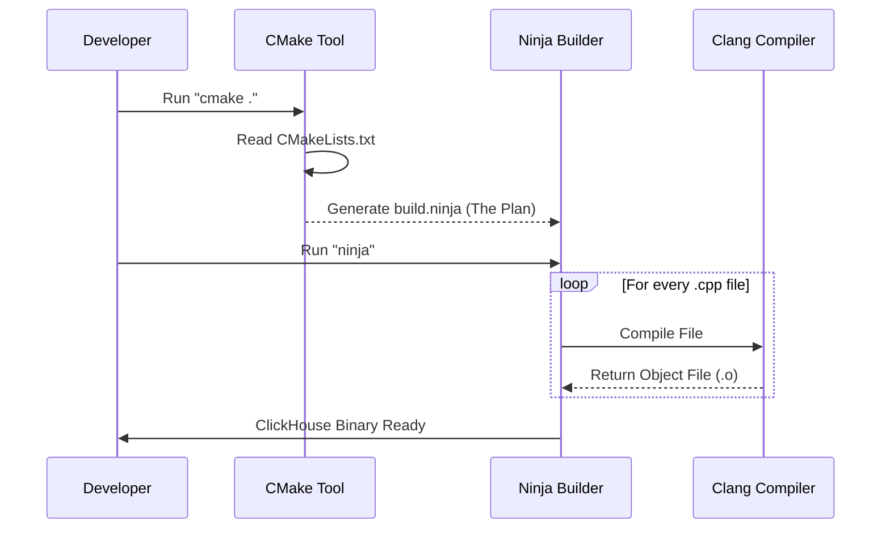

# Chapter 3: Build Configuration

In the previous chapter, [CI Workflows](02_ci_workflows.md), we learned how Praktika schedules work based on events like Pull Requests. The first and most important task in almost any workflow is compiling the code.

But simply saying "Compile ClickHouse" is not enough. Are we building it for Linux or macOS? Do we want it to run fast (Release) or do we want to hunt for bugs (Debug)?

This brings us to the **Build Configuration**.

## The Problem: The Complexity of C++

Imagine you are building a LEGO castle.
1.  **The Bricks:** These are your C++ source files (`.cpp`).
2.  **The Instructions:** This is the **Build Configuration**.

If you just have a pile of bricks without instructions, you cannot build the castle. C++ is similar. You have thousands of files, and the compiler (the tool that turns code into software) needs to know exactly how to fit them together.

**The Challenge:** ClickHouse is massive. We cannot type a manual command to compile 5,000 files every time. We also need different "flavors" of the database:
*   **Release:** Optimized for speed (for users).
*   **ASan (AddressSanitizer):** Optimized for detecting memory leaks (for developers).

**Central Use Case:**
We want to define a "Recipe" that allows us to switch between a **Release build** and a **Sanitizer build** by changing just one setting, without rewriting the whole build script.

## Key Concepts

To manage this complexity, ClickHouse uses **CMake**.

### 1. CMakeLists.txt
This is the master file found at the root of the project. Think of it as the **Table of Contents** for the build. It tells the system: "Here is the project name, and here are the folders you need to look into."

### 2. The `cmake/` Directory
This folder contains specialized logic. It holds smaller configuration files that handle specific tasks, like "Find the Linux libraries" or "Setup the Clang compiler."

### 3. Compiler Flags
These are small switches passed to the compiler.
*   `-O3`: "Optimize this code to run as fast as possible."
*   `-g`: "Add debug information so I can read the crash logs."

### 4. Sanitizers
Sanitizers are like X-ray glasses for code. When enabled (e.g., AddressSanitizer), they make the program slower, but if the program touches memory it shouldn't, it crashes immediately with a detailed report.

## How to Configure the Build

The configuration is primarily handled in `CMakeLists.txt`. We use CMake commands to define our logic.

### Defining the Project

At the very top of the file, we set up the basics.

```cmake
# Root CMakeLists.txt
cmake_minimum_required (VERSION 3.20)

project (ClickHouse)

# Tell CMake where to look for extra modules
set (CMAKE_MODULE_PATH ${CMAKE_MODULE_PATH} "${CMAKE_CURRENT_SOURCE_DIR}/cmake")
```
*Explanation:* We declare the project name "ClickHouse" and tell CMake to look inside the `cmake/` folder for helper scripts.

### Adding an Option (The Use Case)

Here is how we solve our **Central Use Case**: allowing a switch for Sanitizers.

```cmake
# Define an option that users can toggle (ON or OFF)
option (SANITIZE "Enable address sanitizer" OFF)

if (SANITIZE)
    # If the option is ON, add these special flags
    add_compile_options(-fsanitize=address)
    add_link_options(-fsanitize=address)
endif ()
```
*Explanation:*
1.  We create a toggle called `SANITIZE`.
2.  `if (SANITIZE)` checks if the user turned it on.
3.  `add_compile_options` tells the compiler to inject the "X-ray" code into the binary.

### Including Source Code

Finally, we tell CMake where the actual C++ code lives.

```cmake
# Go into the 'src' folder and process its CMakeLists.txt
add_subdirectory (src)

# Go into the 'programs' folder (where the main server code is)
add_subdirectory (programs)
```
*Explanation:* `add_subdirectory` tells CMake to descend into those folders and look for more `CMakeLists.txt` files, recursively building the whole tree.

## Under the Hood: How It Works

When you run the build command, CMake does not actually compile the code itself. It is a **Generator**.

1.  **Configuration:** CMake reads `CMakeLists.txt`.
2.  **Generation:** It generates "Native Build Files" (usually `Ninja` or `Makefiles`). These are the actual step-by-step instructions for the computer.
3.  **Build:** A tool like `ninja` reads those generated files and runs the compiler (`clang++`).

Here is the flow:



### Implementation Details: The `cmake/` Folder

ClickHouse is very strict about which compiler it uses (usually specific versions of Clang). This logic is hidden in `cmake/`.

For example, looking inside `cmake/find_ccache.cmake` (simplified):

```cmake
# Try to find the 'ccache' program (speeds up recompilation)
find_program (CCACHE_FOUND ccache)

if (CCACHE_FOUND)
    # If found, wrap the compiler with it
    set_property (GLOBAL PROPERTY RULE_LAUNCH_COMPILE ccache)
    message (STATUS "Using ccache to speed up build")
endif ()
```
*Explanation:* This script checks if the developer has `ccache` installed. If yes, it configures CMake to use it, which makes rebuilding the project much faster by caching previous results.

### Platform Specifics

We also handle OS differences here. In `cmake/linux.cmake`:

```cmake
if (OS_LINUX)
    # Linux needs the 'pthread' library for threading
    set (CMAKE_CXX_FLAGS "${CMAKE_CXX_FLAGS} -pthread")
    
    # We might want static linking on Linux for portability
    set (CMAKE_FIND_LIBRARY_SUFFIXES ".a")
endif ()
```
*Explanation:* If CMake detects we are on Linux (`OS_LINUX`), it automatically adds the `-pthread` flag. This ensures the developer doesn't need to know the specific requirements of the OS—the Build Configuration handles it.

## Summary

In this chapter, we learned that **Build Configuration** acts as the blueprint for our software.
*   We use **CMake** to manage thousands of files.
*   We use **Options** to toggle features like Sanitizers without changing code.
*   We use the **`cmake/` folder** to hide complex logic for compilers and platforms.

Now that we have the recipe (Build Configuration), we need a robot to actually cook it in our CI environment.

In the next chapter, we will look at the **Build Job Script**, which is the actual shell script that runs these CMake commands inside our CI runners.

[Next Chapter: Build Job Script](04_build_job_script.md)

---

Generated by [Code IQ](https://github.com/adityasoni99/Code-IQ)