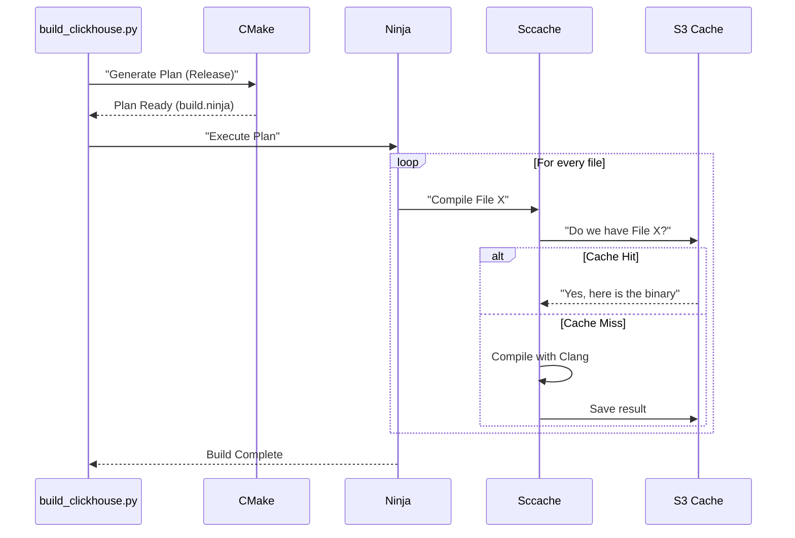

# Chapter 4: Build Job Script

In the previous chapter, [Build Configuration](03_build_configuration.md), we created the "Instruction Manual" (CMake) for our project. We defined how to switch between a fast "Release" version and a detailed "Debug" version.

However, having an instruction manual isn't enough. You still need someone (or something) to pick up the tools and do the actual work.

In this chapter, we will examine the **Build Job Script** (`build_clickhouse.py`). This is the tireless robot that reads the manual and constructs the software.

## The Problem: "It Works on My Machine"

Imagine a professional kitchen. The Head Chef (you) writes a recipe (CMake).
1.  **Junior Cook A** tries to cook it, but forgets to preheat the oven.
2.  **Junior Cook B** tries to cook it, but uses the wrong kind of pot.

The result? The food tastes different every time.

**The Challenge:** In CI, we cannot rely on manual commands. If a developer types `cmake ..` on their laptop, it might work. But on the CI server, we need absolute consistency. We also need speed—building C++ is slow!

**Central Use Case:**
We want a single command that:
1.  Sets up the environment exactly right.
2.  Builds the "Release" version.
3.  Uses a "Shared Cache" (so we don't rebuild files that haven't changed).
4.  Packages the result for testing.

## Key Concepts

To solve this, we use a Python script to wrap the complexity. Here are the tools it manages:

### 1. The Wrapper Script (`build_clickhouse.py`)
This is a Python script located in `docker/packager/`. It is the "Manager." It doesn't compile code itself; it tells other tools what to do. It ensures every build happens exactly the same way.

### 2. Ninja
`Ninja` is our "Builder." While CMake draws the blueprints, Ninja lays the bricks. It is a build tool designed to be extremely fast by running many tasks in parallel.

### 3. Sccache (Shared Cache)
`Sccache` is our "Recycler." Compiling C++ takes a lot of CPU power.
*   **Without Sccache:** If you change one line of code, the system might rebuild huge chunks of the project.
*   **With Sccache:** The system checks a cloud database. "Has anyone compiled `Vector.cpp` with these exact settings before?" If yes, it downloads the result instead of compiling it. This saves massive amounts of time.

## How to Use the Script

In our CI environment (Praktika), we don't type manual commands. The CI calls this script for us.

### The Entry Point

The script is designed to be run from the command line with arguments.

```python
# usage: build_clickhouse.py --build-type=Release

import argparse

def main():
    parser = argparse.ArgumentParser()
    # We define the flavor of the build
    parser.add_argument("--build-type", default="Release")
    
    args = parser.parse_args()
    build(args)
```
*Explanation:* This standard Python code accepts arguments. The most important one is `--build-type`, which corresponds to the configurations we learned about in the previous chapter (Release, Debug, ASan).

### Setting Up the Environment

Before we build, the script sets up environment variables to enable the "Recycler" (Sccache).

```python
import os

def setup_sccache():
    # Tell the compiler to use sccache wrapper
    os.environ["CC"] = "sccache clang"
    os.environ["CXX"] = "sccache clang++"
    
    # Where to store/fetch the cache (e.g., S3 bucket)
    os.environ["SCCACHE_BUCKET"] = "clickhouse-builds"
```
*Explanation:* By setting `CC` and `CXX`, we trick CMake. Instead of calling the compiler directly, it calls `sccache`. Sccache then decides whether to download the result or call the actual compiler.

## Under the Hood: The Build Process

When the CI triggers a build job, a specific sequence of events occurs.

1.  **Configure:** The script asks CMake to generate the build plan.
2.  **Build:** The script asks Ninja to execute the plan.
3.  **Pack:** The script gathers the resulting files into a bundle.

Here is the flow:



### Implementation Details

Let's look at how the script actually executes the commands. We use Python's `subprocess` module to run shell commands.

#### Step 1: generating the Plan

First, we translate our Python arguments into a CMake command.

```python
import subprocess

def run_cmake(build_dir, build_type):
    cmd = [
        "cmake", "-S", ".", "-B", build_dir,
        f"-DCMAKE_BUILD_TYPE={build_type}",
        "-GNinja" # Use Ninja generator
    ]
    
    # Execute the command
    subprocess.check_call(cmd)
```
*Explanation:* This runs `cmake`.
*   `-S .`: Source is the current directory.
*   `-B build_dir`: Put temporary files in `build_dir`.
*   `-GNinja`: Generate a plan for the Ninja tool.

#### Step 2: Executing the Build

Once the plan is generated, we run Ninja.

```python
def run_ninja(build_dir):
    cmd = ["ninja", "-C", build_dir]
    
    print(f"Building in {build_dir}...")
    
    # This starts the heavy compilation process
    subprocess.check_call(cmd)
```
*Explanation:* `ninja -C build_dir` tells Ninja to go into the build directory and start working. This is the step that takes 90% of the time (or less, thanks to sccache!).

#### Step 3: Handling Architectures (ARM vs x86)

The script is smart enough to know what hardware it is running on.

```python
import platform

def get_architecture():
    # Returns 'aarch64' (ARM) or 'x86_64' (Intel/AMD)
    arch = platform.machine()
    
    if arch == "aarch64":
        return "arm64"
    else:
        return "amd64"
```
*Explanation:* ClickHouse runs on standard Intel servers and ARM chips (like in newer Macs or AWS Graviton). The script detects the CPU so it can label the final package correctly.

## Why This Abstraction Matters

By wrapping the build in a Python script, we gain:
1.  **Portability:** The same script runs on a developer's machine and the CI server.
2.  **Speed:** We enforce the use of `Ninja` and `Sccache` automatically.
3.  **Simplicity:** CI workflows (from Chapter 2) don't need to know complex CMake flags. They just call `build_clickhouse.py --build-type=Release`.

## Summary

In this chapter, we learned about the **Build Job Script**.
*   It acts as the **Manager** that orchestrates the build.
*   It uses **Ninja** for speed and **Sccache** to recycle previous work.
*   It ensures that "Release" and "Debug" builds are created consistently every time.

Now that the script has successfully compiled the code, we have a binary file (the executable). But a raw binary is hard to move around. We need to package it into a standard format that we can easily deploy and test.

In the next chapter, we will see how we wrap this binary into a **Docker Server Image**.

[Next Chapter: Docker Server Image](05_docker_server_image.md)

---

Generated by [Code IQ](https://github.com/adityasoni99/Code-IQ)