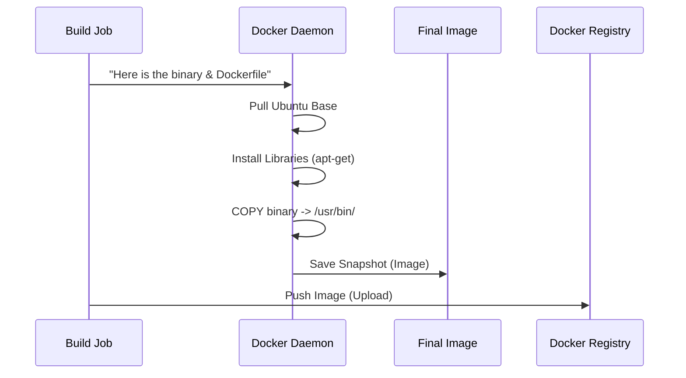

# Chapter 5: Docker Server Image

In the previous chapter, [Build Job Script](04_build_job_script.md), we successfully compiled the ClickHouse source code into a binary executable. We have the "brain" of the database.

However, a brain cannot function without a body. If you try to run that raw binary on a different computer, it might fail because it is missing system libraries, configuration files, or the correct folder structure.

This brings us to the **Docker Server Image**.

## The Problem: "Missing Parts"

Imagine you built a custom engine for a car.
1.  **The Binary:** This is the engine.
2.  **The Environment:** This is the chassis, wheels, fuel tank, and steering wheel.

If you send just the engine to a friend, they can't drive it. They need the whole car.

**The Challenge:** In Continuous Integration, we need to spin up ClickHouse thousands of times to run tests. We cannot manually install libraries and create folders every single time. We need a pre-packaged "box" that contains the binary *and* everything it needs to run.

**Central Use Case:**
We want to create a standard **Docker Image** that takes our compiled binary and wraps it in a lightweight Linux environment (Ubuntu). This ensures that whether we run ClickHouse on a developer's laptop or a massive CI server, it behaves exactly the same.

## Key Concepts

To solve this, we use **Docker**.

### 1. The Dockerfile
Think of this as the "Recipe." It is a text file that tells Docker how to build the image. It says things like: "Start with Ubuntu," "Copy our binary here," and "Open port 9000."

### 2. The Docker Image
Think of this as the "Frozen Blueprint." Once the recipe is cooked, you get an Image. It is read-only. You can save it, upload it, and share it.

### 3. The Docker Container
Think of this as the "Running Machine." When you actually start an Image, it becomes a Container. It's alive, processing data and accepting connections.

## How to Define the Image

The definition lives in `docker/server/Dockerfile`. Let's look at how we construct this recipe to solve our use case.

### Step 1: The Foundation

Every image starts from a base. We usually use a standard version of Ubuntu.

```dockerfile
# docker/server/Dockerfile

# We start with a clean Ubuntu system
FROM ubuntu:22.04

# We set up environment variables for the language
ENV LANG=en_US.UTF-8 \
    TZ=UTC
```
*Explanation:* `FROM` tells Docker to download a basic Ubuntu operating system. This ensures we have standard tools like `ls`, `cd`, and system libraries.

### Step 2: Installing Dependencies

Our binary needs certain system tools to run (like time zone data or debugging tools).

```dockerfile
# Install necessary system tools
RUN apt-get update && apt-get install -y \
    ca-certificates \
    tzdata \
    gdb \
    && rm -rf /var/lib/apt/lists/*
```
*Explanation:* `RUN` executes shell commands inside the image during the build process. We install `tzdata` (for timezones) and `gdb` (for debugging crashes).

### Step 3: Copying the Binary

This is the most critical step. We take the binary we built in [Chapter 4](04_build_job_script.md) and put it inside the image.

```dockerfile
# We expect the binary to be provided in this folder
ARG REPO_PATH=clickhouse

# Copy the server binary into the standard path
COPY ${REPO_PATH}/clickhouse /usr/bin/clickhouse

# Create a symlink (shortcut)
RUN ln -s /usr/bin/clickhouse /usr/bin/clickhouse-server
```
*Explanation:* `COPY` takes files from your computer (where you built the code) and places them inside the Docker image. Now the image actually contains the database software.

### Step 4: The Startup Command

Finally, we tell Docker what to do when the container starts.

```dockerfile
# Create directories for data and logs
RUN mkdir -p /var/lib/clickhouse /var/log/clickhouse-server

# Tell Docker to run this command when starting
ENTRYPOINT ["/usr/bin/clickhouse-server"]
CMD ["--config-file=/etc/clickhouse-server/config.xml"]
```
*Explanation:* `ENTRYPOINT` is the main application. When you run `docker run clickhouse-image`, it automatically starts the ClickHouse server using the configuration file specified.

## Under the Hood: The Build Process

When the CI system builds this image, it combines the context (your compiled files) with the recipe (Dockerfile).

1.  **Context:** The CI runner gathers the binaries produced by the build job.
2.  **Build:** Docker reads the `Dockerfile` line by line.
3.  **Layering:** Each command (`RUN`, `COPY`) creates a new layer.
4.  **Output:** A final Image ID is generated (e.g., `clickhouse/server:latest`).

Here is the flow:



### Implementation Details: Flexible Installation

The actual `docker/server/Dockerfile` is smart. It supports two ways of installing ClickHouse:
1.  **From Binary:** Copying the raw executable (as shown above).
2.  **From Deb:** Installing `.deb` packages (like a standard Linux install).

It uses **Build Arguments** (`ARG`) to decide which path to take.

```dockerfile
# A switch to decide the install method
ARG INSTALL_DEB="no"

# Conditional logic (simplified concept)
RUN if [ "$INSTALL_DEB" = "yes" ]; then \
      dpkg -i /packages/*.deb; \
    else \
      # If not using Debs, we assume raw binaries are present
      cp /manual/clickhouse /usr/bin/clickhouse; \
    fi
```
*Explanation:* This logic allows the same `Dockerfile` to be used for different types of testing. Sometimes we want to test the raw binary (faster), and sometimes we want to test the full package installation process (more realistic).

### Configuration Management

The image also needs configuration files (`config.xml`, `users.xml`).

```dockerfile
# Copy standard configuration files
COPY docker/server/config.xml /etc/clickhouse-server/config.xml
COPY docker/server/users.xml /etc/clickhouse-server/users.xml

# Ensure the 'clickhouse' user owns the data folders
RUN useradd -ms /bin/bash clickhouse && \
    chown -R clickhouse:clickhouse /var/lib/clickhouse
```
*Explanation:* We copy default settings so the server can start immediately without the user needing to write XML files. We also create a specific user `clickhouse` for security, so the database doesn't run as `root`.

## Why This Matters

By wrapping our work in a Docker Image:
1.  **Isolation:** Tests won't interfere with the host machine.
2.  **Consistency:** Every test runs in the exact same environment.
3.  **Portability:** Developers can pull the exact same image used in CI to debug issues locally.

## Summary

In this chapter, we learned about the **Docker Server Image**.
*   It acts as the **Delivery Box** for our application.
*   We defined a **Dockerfile** to combine Ubuntu, system libraries, and our compiled binary.
*   We created a portable artifact that can run anywhere.

Now that we have a running database inside a container, we can finally start asking it questions.

In the next chapter, we will look at **Stateless Queries**, which are the simplest form of tests we run against this image to ensure it works correctly.

[Next Chapter: Stateless Queries](06_stateless_queries.md)

---

Generated by [Code IQ](https://github.com/adityasoni99/Code-IQ)