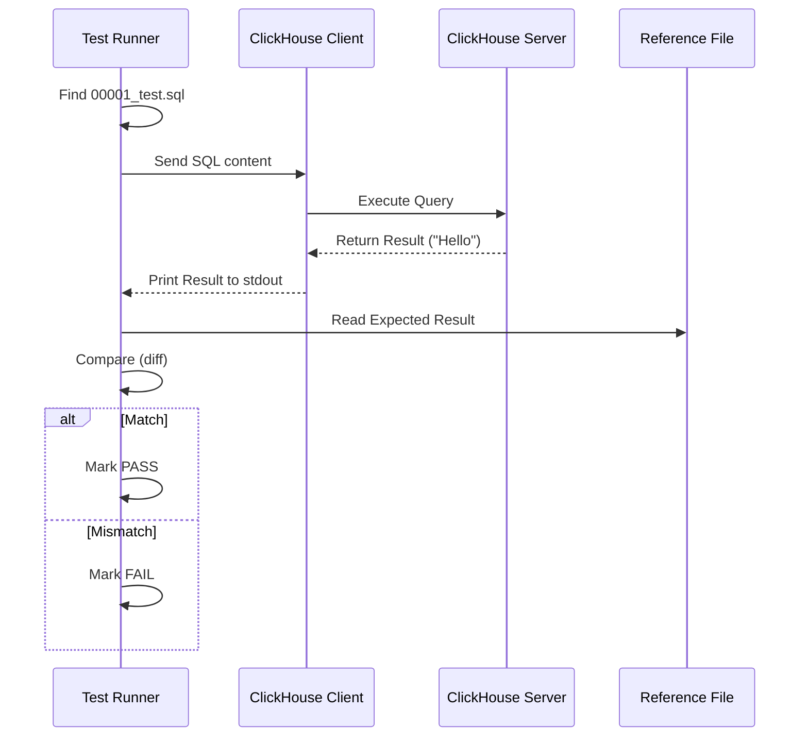

# Chapter 6: Stateless Queries

In the previous chapter, [Docker Server Image](05_docker_server_image.md), we successfully packaged our compiled binary into a portable container. We have a running database engine.

But having an engine that *runs* is not enough. We need to know if it calculates *correctly*. If you ask for `1 + 1`, does it return `2`? Or does it crash?

This brings us to **Stateless Queries**.

## The Problem: The "Calculator" Verification

Imagine you are building a calculator app. You just wrote the code for the "Square Root" button. Before you release the app, you need to check if it works.

You would probably do this:
1.  **Input:** Type `√9`.
2.  **Expected Output:** You know the answer should be `3`.
3.  **Actual Output:** You look at the screen.
    *   If it says `3`, the test **Passes**.
    *   If it says `4.5` or `Error`, the test **Fails**.

**The Challenge:** ClickHouse supports thousands of functions (JSON handling, spatial geometry, dynamic types). We cannot manually type these checks every time. We need an automated way to feed questions to the database and verify the answers.

**Central Use Case:**
We want to write a simple SQL file (the "Question") and a text file (the "Answer Key"). The system should run the SQL, capture the result, and compare it to the Answer Key.

## Key Concepts

To solve this, ClickHouse uses a testing system located in `tests/queries/0_stateless/`.

### 1. The Query File (`.sql`)
This is the test itself. It contains the SQL commands we want to run.
*   **Example:** `SELECT 1 + 1;`

### 2. The Reference File (`.reference`)
This is the "Answer Key." It contains exactly what the output *should* look like.
*   **Example:** `2`

### 3. Statelessness
"Stateless" means these tests generally assume they are independent. While they run on the same server, Test A should not break Test B.
*   **Rule:** If you create a table, use a unique name (usually including the test number) so you don't overwrite another test's data.

## How to Write a Stateless Test

Let's walk through creating a test case for a hypothetical scenario: verifying that ClickHouse can handle basic text.

### Step 1: Create the SQL File

We create a file named `00001_hello_world.sql` inside the test directory.

```sql
-- tests/queries/0_stateless/00001_hello_world.sql

-- Ask the database to print a string
SELECT 'Hello, ClickHouse!';

-- Ask the database to do math
SELECT 10 * 10;
```
*Explanation:* We are sending two commands. We expect two specific lines of output.

### Step 2: Create the Reference File

We create a matching file named `00001_hello_world.reference`. This must match the output **exactly** (including spaces).

```text
Hello, ClickHouse!
100
```
*Explanation:* The first line matches the first query. The second line matches the math result.

### Step 3: Running the Test (Conceptually)

When the test runner sees these files, it does the logic shown below:

```python
# Pseudo-code of the test logic
output = run_sql_on_server("00001_hello_world.sql")
expected = read_file("00001_hello_world.reference")

if output == expected:
    print("PASS")
else:
    print("FAIL: Output did not match reference")
```

## Handling Complex Features

Stateless queries aren't just for math. They verify complex engine behaviors.

### JSON Handling
We can test if ClickHouse parses JSON correctly.

```sql
-- 00002_json_test.sql
-- Check if we can extract 'name' from a JSON string
SELECT visitParamExtractString('{"name": "Clicky", "type": "DB"}', 'name');
```

**Reference:**
```text
Clicky
```

### Table Manipulation
We can create tables, insert data, and query it. To stay "Stateless," we drop the table when done.

```sql
-- 00003_table_test.sql
DROP TABLE IF EXISTS test_table_00003;
CREATE TABLE test_table_00003 (id UInt64) ENGINE = Memory;

INSERT INTO test_table_00003 VALUES (1), (2), (3);
SELECT sum(id) FROM test_table_00003;

DROP TABLE test_table_00003;
```

**Reference:**
```text
6
```

## Under the Hood: The Test Runner

How does the system run thousands of these files quickly? It uses a custom tool called `clickhouse-test`.

1.  **Discovery:** The tool scans `tests/queries/0_stateless/` for `.sql` files.
2.  **Execution:** It pipes the content of the `.sql` file into the `clickhouse-client`.
3.  **Comparison:** It captures the standard output (`stdout`) and compares it to the `.reference` file using the `diff` tool.

Here is the flow:



### Implementation Details: The Shell Runner

The core logic is often wrapped in a script (like `clickhouse-test`). It essentially performs a loop over the files.

```bash
# Simplified representation of clickhouse-test logic

for query_file in tests/queries/0_stateless/*.sql; do
    # 1. Determine the reference file name
    # Replace .sql with .reference
    ref_file="${query_file%.sql}.reference"

    # 2. Run the query and save output to a temporary file
    clickhouse-client --multiquery < "$query_file" > result.txt

    # 3. Compare result with reference
    if diff -q result.txt "$ref_file"; then
        echo "$query_file: OK"
    else
        echo "$query_file: FAIL"
        # Show the difference to the developer
        diff result.txt "$ref_file"
    fi
done
```
*Explanation:*
1.  We loop through every `.sql` file.
2.  We feed the file into `clickhouse-client`. The `--multiquery` flag allows multiple SQL statements in one file.
3.  `diff -q` checks if the files are identical. If not, it prints the failure.

### Testing Shell Scripts (`.sh`)

Sometimes SQL isn't enough. We might need to test how the command-line client handles arguments or special inputs. In these cases, we can use a `.sh` file instead of `.sql`.

The runner detects the extension. If it is `.sh`, it executes it as a script. The script is responsible for printing output to stdout, which is then compared to the `.reference` file just like a SQL test.

## Why This Matters

Stateless queries are the **first line of defense**.
1.  **Speed:** They run very fast (milliseconds per test).
2.  **Coverage:** There are thousands of them covering almost every function.
3.  **Simplicity:** If you break something basic, these tests will catch it immediately.

## Summary

In this chapter, we learned about **Stateless Queries**.
*   They verify logic by comparing **SQL Output** against a **Reference File**.
*   They cover everything from simple math to complex JSON and spatial functions.
*   They run against a single instance of the [Docker Server Image](05_docker_server_image.md).

However, real-world databases don't live in a vacuum. They talk to other servers, they use ZooKeeper/ClickHouse Keeper for coordination, and they sometimes crash or restart. Stateless queries run on a single, stable server. They cannot test complex cluster interactions.

To test those scenarios, we need a more powerful setup. In the next chapter, we will prepare the job script to run **Integration Tests**.

[Next Chapter: Integration Test Job Script](07_integration_test_job_script.md)

---

Generated by [Code IQ](https://github.com/adityasoni99/Code-IQ)