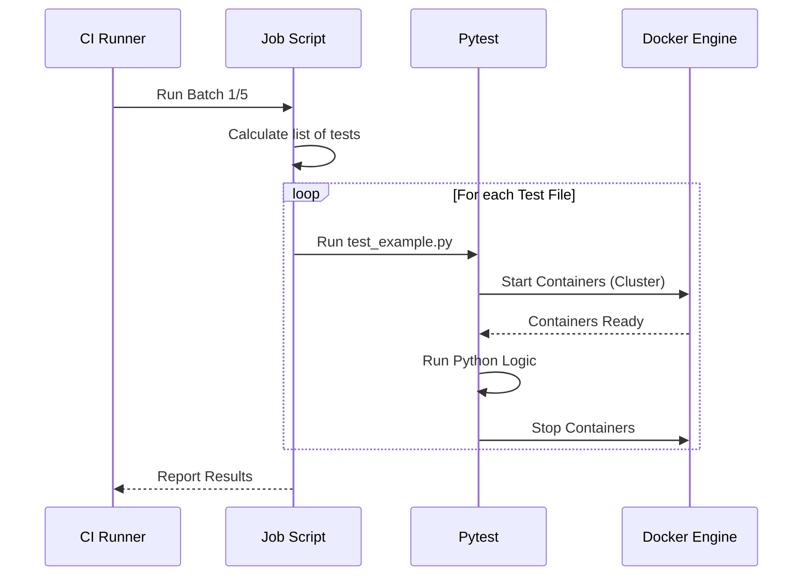

# Chapter 7: Integration Test Job Script

In the previous chapter, [Stateless Queries](06_stateless_queries.md), we learned how to check if ClickHouse can answer simple questions like `1 + 1`. We ran these tests against a single, isolated [Docker Server Image](05_docker_server_image.md).

But ClickHouse is rarely used alone. It is designed to work in clusters, replicate data between servers, and talk to external systems like Kafka or S3.

How do we test what happens if a server crashes? Or if the network fails? A simple SQL query cannot simulate a crashing server.

This brings us to the **Integration Test Job Script**.

## The Problem: Simulating the Real World

Imagine you are testing a new car.
1.  **Stateless Test:** You check if the radio turns on. (Easy, done in the garage).
2.  **Integration Test:** You drive the car on a highway, in the rain, while towing a trailer.

**The Challenge:** To run an "Integration Test" for a database, you need a complex environment. You might need:
*   Three ClickHouse servers (to test copying data).
*   One ZooKeeper server (to coordinate them).
*   A simulated network that can "break."

Setting this up manually for every test would take hours. We need a script that can create this entire "virtual world," run the test, and then destroy it—all in a few minutes.

**Central Use Case:**
We want a script that can:
1.  Take a list of Python test files (e.g., `test_replication.py`).
2.  Automatically spin up the required Docker containers for each test.
3.  Run the test logic.
4.  Clean everything up.

## Key Concepts

To solve this, we use a Python script named `integration_test_job.py`. It uses the following tools:

### 1. Pytest
**Pytest** is a standard framework for testing in Python. While our Stateless queries were just SQL files, Integration tests are actual Python programs. This allows us to write logic like: *"Start Server A, insert data, kill Server A, check if data is on Server B."*

### 2. The Runner Script
The script `integration_test_job.py` is the manager. It doesn't write the tests; it *organizes* them. It prepares the Docker environment and tells Pytest which files to execute.

### 3. Test Batching (Sharding)
We have hundreds of integration tests. Running them one by one would take too long (10+ hours).
**Batching** means we split the tests into groups (e.g., 5 groups).
*   Runner 1 runs Group 1.
*   Runner 2 runs Group 2.
This allows us to run everything in parallel.

## How to Use the Script

The CI system (Praktika) invokes this script. It tells the script which "slice" of tests to run.

### Defining the Arguments

The script accepts arguments to know which batch of tests it is responsible for.

```python
# integration_test_job.py (Simplified)
import argparse

def parse_args():
    parser = argparse.ArgumentParser()
    # Which "slice" of tests to run? (e.g., 1/5)
    parser.add_argument("--shard", type=int, default=1)
    parser.add_argument("--shards", type=int, default=1)
    
    # Where is the ClickHouse binary?
    parser.add_argument("--binary", required=True)
    
    return parser.parse_args()
```
*Explanation:*
*   `--shard 1` and `--shards 5` means: "I am worker #1 out of 5 total workers." The script uses this math to pick only 20% of the tests to run.

### Finding the Tests

The script scans the directory `tests/integration/` to find all available test files.

```python
import os

def get_all_tests(test_dir):
    # Find all files starting with "test_" and ending with ".py"
    all_files = os.listdir(test_dir)
    tests = [f for f in all_files if f.startswith("test_") and f.endswith(".py")]
    
    # Sort them to ensure every runner sees the same list
    return sorted(tests)
```
*Explanation:* We look for files like `test_replicated_merge_tree.py`. Sorting is crucial: if Runner 1 and Runner 2 have different lists, they might skip a test or run it twice.

## Under the Hood: The Execution Flow

When this script runs, it acts as a bridge between the **Test Code** and the **Docker Environment**.

1.  **Setup:** The script prepares the Docker images (using the image created in [Chapter 5](05_docker_server_image.md)).
2.  **Selection:** It calculates which tests belong to this runner.
3.  **Execution:** It loops through the tests and calls `pytest`.
4.  **Teardown:** It kills any leftover containers to save memory.

Here is the flow:



### Implementation Details: Invoking Pytest

The core of the script is simply building a command line string to launch `pytest`.

```python
import subprocess

def run_test(test_name):
    # Construct the command
    cmd = [
        "pytest",
        "-v",               # Verbose output
        f"tests/integration/{test_name}"
    ]
    
    print(f"Running {test_name}...")
    # Execute the command and wait for it to finish
    subprocess.check_call(cmd)
```
*Explanation:*
*   We use `subprocess.check_call` to run Pytest as if we typed it in the terminal.
*   If Pytest fails (returns an error code), the script will catch it and mark the CI job as failed.

### Passing the Image

How does the test know which version of ClickHouse to use? The Job Script passes this information via Environment Variables.

```python
import os

def set_environment(clickhouse_binary_path):
    # Tell the integration tests where the binary is
    os.environ['CLICKHOUSE_BINARY'] = clickhouse_binary_path
    
    # We can also pass the Docker Image tag here
    os.environ['CLICKHOUSE_IMAGE'] = "clickhouse/server:latest"
```
*Explanation:* When the Python test runs, it reads `os.environ['CLICKHOUSE_BINARY']`. This ensures that the test uses the exact binary we just built in [Chapter 4](04_build_job_script.md), not some old version installed on the machine.

## Why This Matters

The **Integration Test Job Script** is the "Site Manager" for our construction work.
1.  **Automation:** It handles the complexity of Docker without the developer needing to worry about it.
2.  **Parallelism:** By using "sharding" (batches), we can run 500 slow tests in the time it takes to run 100.
3.  **Consistency:** It ensures every test gets a fresh, clean environment.

## Summary

In this chapter, we learned about the **Integration Test Job Script**.
*   It is a Python script that orchestrates the testing process.
*   It uses **Pytest** to run the actual test logic.
*   It splits work into **Batches** so multiple runners can work at the same time.
*   It sets up the environment so tests use the correct **Docker Image** and **Binary**.

Now that we have the "Manager" script ready to run our tests, we need to look at the tests themselves. What does an actual Integration Test look like? How do we write Python code to make a database crash on purpose?

In the next chapter, we will write our first real **Integration Test**.

[Next Chapter: Integration Tests](08_integration_tests.md)

---

Generated by [Code IQ](https://github.com/adityasoni99/Code-IQ)